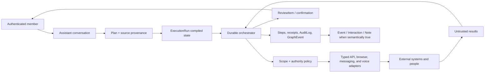

# LifeOS Assistant Execution Layer Plan

**Status:** Backlog - planning only; no implementation has started  
**Owner:** Unassigned  
**Linear project:** [`LifeOS · Assistant Execution Layer`](https://linear.app/josephfryer/project/lifeos-assistant-execution-layer-633ec35732d6/overview), Backlog, issues `JF-214` through `JF-231`  
**Purpose:** Give the LifeOS Assistant durable, proactive, externally capable execution while preserving LifeOS semantics, provenance, least privilege, and explicit authority.

## Decision

Build an execution layer around the existing LifeOS graph, domain commands, automation engine, review inbox, and Assistant. Do not create a ninth primitive and do not let a language model directly own credentials, irreversible side effects, or unbounded background loops.

The execution layer has one job:

> Turn a user-authorized intention into a durable, observable sequence of bounded actions, while keeping the LifeOS graph honest about what was intended, attempted, completed, and learned.

The target is not unrestricted autonomy. It is a chief-of-staff experience with deterministic authority boundaries: the Assistant can research and prepare freely within its scopes, safely perform reversible actions, and request a precise confirmation immediately before consequential external actions.

## Why this belongs in LifeOS

LifeOS already has most of the semantic and governance foundation:

- `Plan` represents declared intent; a separate `Task` or `AgentTask` primitive would be dishonest.
- `Event` records what actually happened, including the outcome of an external execution.
- `Interaction` connects the result to People, Places, Items, Groups, and Events when something truly occurred.
- `Note` preserves raw instructions, observations, summaries, and source provenance.
- `State` can record timestamped conditions discovered during monitoring without becoming mutable task state.
- `GraphEvent`, `AuditLog`, automation runs, and workflow runs already provide append-only operational receipts.
- `ReviewItem` is the natural human decision surface for proposed actions and ambiguous outcomes.
- Assistant tools already enforce member scopes, classify read/write capability, limit writes per turn, and block untrusted file evidence from authorizing writes.

Execution-support records may be added to coordinate work, but they are infrastructure records, not new life primitives. The graph remains the meaning; execution records explain how the system acted.

## Product promise

The Assistant should eventually be able to accept requests such as:

- "Find three in-network dermatologists who can see me this month, then ask before booking."
- "Watch for two adjacent seats under $150 each and tell me when you find them."
- "Prepare replies for the conversations I have dropped, but do not send anything without me."
- "Sort out the airline schedule conflict and give me the safest resolution."
- "Call the contractor, collect the available dates, and bring me the choice."

The user should not have to keep a chat open. Every accepted request must have a durable status, an intelligible next step, a clear authority envelope, and a complete receipt trail.

## Non-goals

- Do not copy high-risk products that grant blanket authority over email, credentials, purchases, or contracts.
- Do not make arbitrary web content part of the Assistant's control instructions.
- Do not store plaintext passwords, one-time codes, recovery codes, or payment credentials in prompts, chat history, logs, or LifeOS graph records.
- Do not automatically infer legal, financial, medical, or communication authority from a broad request.
- Do not use browser automation where a scoped, documented API or existing LifeOS integration is more reliable.
- Do not market a demonstration as general autonomy. Each supported workflow must have explicit reliability and safety evidence.

## Core concepts

### 1. Plan is the user intention

An execution begins from an existing or newly captured `Plan`. The original words and provenance remain available through a source `Note` or Assistant message. The Plan describes the desired outcome, not a brittle list of browser clicks.

### 2. ExecutionRun is operational state

Add a support record for one attempt to fulfill a Plan. A run should minimally hold:

- workspace, Plan, requester, and initiating Assistant message;
- adapter/workflow type and version;
- status: proposed, authorized, running, waiting, needs-review, needs-confirmation, succeeded, failed, canceled;
- normalized objective and active constraints;
- granted scopes, authority ceiling, and expiry;
- current checkpoint, wake condition, retry budget, and deadline;
- idempotency key, parent/child run links, and concurrency lease;
- timestamps, cost/resource totals, and terminal result summary.

This is compiled operational memory. It should contain current constraints and references to evidence, not an ever-growing transcript dump.

### 3. ExecutionStep is a bounded attempt

Every external observation or action is one typed step with an idempotency key, input/output references, capability classification, start/end timestamps, retry metadata, and a scrubbed receipt. Steps are append-only. Corrections create new steps; they do not rewrite history.

### 4. AuthorityGrant is explicit and expiring

Authorization is separate from the model's reasoning. A grant names:

- who granted it;
- the exact run or narrowly defined recurring workflow;
- allowed capabilities, targets, limits, and channels;
- maximum financial amount when applicable;
- whether drafting, sending, booking, purchasing, or signing is permitted;
- expiry and revocation state.

The executor checks this deterministic record immediately before each side effect. Prompt text never substitutes for a grant.

### 5. ActionProposal and ConfirmationToken govern consequential work

Review-tier work creates a workspace-scoped `ReviewItem` with the proposed action, supporting evidence, alternatives, and expected consequence. Confirm-tier work additionally requires a short-lived, single-use token bound to the exact action payload. If price, recipient, time, terms, or target changes, the token is invalid and the user must see the new proposal.

### 6. ExecutionReceipt proves the outcome

A successful tool call or HTTP status is not enough. Receipts should capture the authoritative external result: confirmation number, sent-message ID, final amount, reservation state, downloaded artifact checksum, or a screenshot/DOM assertion where no structured result exists. Sensitive values are encrypted or redacted.

## Authority model

Reuse and complete the existing four tiers:

| Tier | Meaning | Examples |
|---|---|---|
| `observe` | Read-only inspection | Search, compare, extract, monitor availability |
| `safe_auto` | Reversible or internal action within an existing scope | Update run state, save a draft, create a LifeOS Note, refresh research |
| `review` | Prepare a consequential action for human selection | Draft an email, propose an appointment, recommend a purchase |
| `confirm` | Execute one exact consequential action after just-in-time confirmation | Send, book, buy, cancel, sign, disclose private data |

Destructive graph operations retain their existing explicit-confirmation and backup rules. External financial, legal, medical, credential, privacy, and representational actions default to `confirm` even when a connector technically permits automatic execution.

## Trust boundaries

The system must maintain hard separation among:

1. **Control:** system policy, typed workflow definitions, tool registry, authority grants.
2. **User intent:** direct authenticated requests and exact confirmations.
3. **Untrusted evidence:** email, files, messages, websites, call transcripts, search results, and tool output.
4. **Secrets:** brokered credentials and tokens that are never exposed to model context.
5. **Execution:** deterministic adapters that validate scope and authority before side effects.

Untrusted evidence may inform a proposal. It may never enlarge authority, change a recipient, authorize a write, or introduce a new executable instruction.

## Architecture

The orchestrator should be durable and resumable, but provider-specific workflow code must remain behind a small interface so LifeOS can move between Vercel Workflow, local Mac workers, or another runtime without changing domain semantics.

## Compiled operational memory

Do not solve long-running work by sending the last N chat messages forever. After each meaningful step, compile a new run-state snapshot containing:

- objective and success test;
- current facts with source and observed-at time;
- user constraints and their provenance;
- decisions already made;
- permissions granted and remaining authority;
- completed work and verified receipts;
- unresolved questions, blockers, deadlines, and wake conditions;
- invalidated facts retained as history but excluded from active state.

Compilation must be schema-validated. Model-generated summaries are proposals until consistency checks pass. Critical constraints such as recipient, dates, maximum price, cancellation policy, identity, and medical/legal status should use typed fields rather than prose alone.

## Adapter strategy

Prefer adapters in this order:

1. Existing LifeOS domain command.
2. Scoped provider API or installed connector.
3. Authenticated browser automation.
4. Human-facing messaging or voice.

Every adapter declares capabilities, required scopes, authority tier, idempotency behavior, retry safety, sensitive-data classes, supported evidence receipts, and known failure modes. Browser automation is not a universal tool exposed raw to the model; the model selects a typed workflow and the adapter owns navigation, assertions, and recovery.

## Credential architecture

- Use just-in-time credential brokering from the user's password manager or provider OAuth connection.
- Give each run the narrowest usable token and revoke or expire it promptly.
- Keep authentication and payment entry outside model-visible logs and screenshots where technically possible.
- Require an explicit connection screen explaining read, write, send, purchase, and deletion capabilities separately.
- Revoking a connection must stop new work immediately and offer a separate, explicit data-retention/deletion control.
- Record access receipts without recording secret material.

No general external execution should ship until this architecture has passed a dedicated threat-model review.

## Proactive loop

Proactivity is a scheduler over declared interests and active Plans, not an unconstrained model daemon.

Each monitor has:

- a user-visible purpose and stop condition;
- source and polling cadence;
- cost and retry budgets;
- notification policy;
- bounded lifetime or renewal date;
- deduplication and quiet-hours behavior;
- an authority ceiling that cannot exceed observation unless separately granted.

The default behavior is quiet while nothing actionable changes. A meaningful change creates a notification or ReviewItem; it does not silently transact.

## User experience

Home should eventually provide one Execution surface showing:

- **Needs you:** exact choices or confirmations blocking progress.
- **Working:** active runs with next checkpoint and last verified result.
- **Watching:** monitors, cadence, stop condition, and notification policy.
- **Finished:** concise outcomes with receipts and graph links.
- **Failed safely:** what failed, whether anything changed externally, and the recovery choice.

The Assistant remains the conversational entry point. Home is the control plane and audit surface. Users can pause, resume, cancel, narrow authority, and revoke access without writing a prompt.

## Delivery sequence

### Phase 0 - Contracts, threat model, and evaluation harness

- Write ADRs for execution records, authority grants, credential brokering, and runtime portability.
- Enumerate high-risk actions and enforce fail-closed defaults.
- Define typed adapter contracts, receipt requirements, and error taxonomy.
- Build a replayable fixture environment with malicious email/web/file content.
- Establish evaluation cases for stale constraints, duplicate execution, partial success, prompt injection, changed prices, wrong recipients, expired authority, and cancellation.

**Exit gate:** architecture and threat model are approved; a failing or duplicated step cannot create an unrecorded external side effect in fixtures.

### Phase 1 - Durable internal execution kernel

- Add `ExecutionRun`, `ExecutionStep`, `AuthorityGrant`, and receipt/support records.
- Create an idempotent run state machine with leases, retries, wake conditions, cancellation, and checkpoint compilation.
- Integrate `GraphEvent`, `AuditLog`, workflow run telemetry, and workspace scopes.
- Add read-only Assistant tools to create, inspect, pause, and cancel proposed runs.
- Prove the kernel using internal LifeOS-only workflows.

**Exit gate:** a run survives process restart, resumes exactly once, exposes its current truth in Home, and terminates without exceeding its authority or retry budget.

### Phase 2 - Review and confirmation system

- Route review-tier proposals into `ReviewItem`.
- Implement exact-payload, expiring, single-use confirmation tokens.
- Generalize the existing Person duplicate confirmation pattern without relying on chat history alone.
- Add compensating undo where a domain operation is reversible.
- Build Home's Needs You and execution-detail views.

**Exit gate:** no confirm-tier adapter can execute without a valid token, and any material payload change invalidates prior approval.

### Phase 3 - Proactive monitors and outbound notifications

- Add bounded monitors over existing LifeOS sources first: relationship cadence, dropped commitments, calendar conflicts, stale inbox threads, file-processing outcomes.
- Add notification preferences, quiet hours, deduplication, escalation, and expiry.
- Deliver through the existing Home/WhatsApp surfaces before adding more channels.
- Separate notification permission from permission to reply, send, or transact.

**Exit gate:** monitors remain quiet when unchanged, notify once for meaningful changes, can be stopped immediately, and never escalate authority themselves.

### Phase 4 - Messaging execution

- Add draft-first email and messaging adapters.
- Resolve recipients against canonical People and external identifiers.
- Show exact recipient, channel, content, attachments, and disclosed data at confirmation.
- Capture provider message IDs and delivery state as receipts.
- Add reply/thread correlation and safe handling of inbound responses.

**Exit gate:** the system cannot send to an unconfirmed or newly substituted recipient; malicious inbound content cannot induce an outbound action.

### Phase 5 - Browser execution for narrow workflows

- Provision isolated, persistent browser sessions with encrypted state, expiry, and per-run network restrictions.
- Start with two low-risk, high-value workflows, such as appointment availability research and administrative form preparation.
- Use typed workflow adapters with DOM assertions, visual fallback, checkpoints, and operator takeover.
- Store scrubbed evidence and final authoritative receipts.
- Add bot-detection, rate-limit, ambiguous-page, and changed-terms failure handling.

**Exit gate:** each supported workflow passes its reliability target over a representative fixture suite and fails safely on unsupported or changed states.

### Phase 6 - Voice and human coordination

- Add transcription/synthesis and outbound calling only after messaging safety is proven.
- Disclose that the caller is an AI acting for the user.
- Provide call objective, disclosure boundaries, prohibited commitments, and escalation conditions.
- Record consent-aware transcript provenance and structured outcomes.
- Never permit a voice worker to accept contracts, disclose sensitive information, or make payments without separately bound authority.

**Exit gate:** calls follow the exact disclosure and authority policy, surface uncertain outcomes for review, and produce verifiable receipts.

### Phase 7 - Bounded transactions

- Add purchasing or booking only for explicitly supported adapters.
- Bind confirmation to merchant, item/service, quantity, final price, taxes/fees, cancellation terms, payment instrument alias, and deadline.
- Reconfirm on every material change.
- Reconcile the external confirmation with LifeOS Plan/Event/Interaction records.
- Add incident response, dispute evidence export, and immediate global execution pause.

**Exit gate:** zero unconfirmed charges in adversarial tests and controlled real-use trials; every attempted transaction has an authoritative outcome and complete receipt trail.

## Suggested first vertical slice

Build **appointment research and proposal**, not automatic booking:

1. The user states the need, constraints, insurance/network requirement, and time window.
2. LifeOS records or links the Plan.
3. A durable run searches approved sources and monitors availability if necessary.
4. The run returns two or three evidence-backed options through a ReviewItem.
5. The user chooses one.
6. A later, separately approved milestone may submit or call to request that exact appointment.

This slice exercises durable state, changing availability, sensitive information, browser/API adapters, proactive notification, review, provenance, and receipts without beginning with autonomous payment or contract authority.

## Backlog issue map

Create these as unassigned Linear issues under the `Assistant Execution Layer` project. Add an `Agent/*` label only when Joseph deliberately hands an issue to that agent.

| Order | Suggested issue | Depends on |
|---:|---|---|
| 1 | Execution-layer ADR and threat model | None |
| 2 | Adversarial execution evaluation harness | 1 |
| 3 | ExecutionRun and ExecutionStep schema/contracts | 1 |
| 4 | Durable run state machine, leases, retries, cancellation | 2, 3 |
| 5 | Compiled operational-state snapshots | 3, 4 |
| 6 | AuthorityGrant policy engine | 1, 3 |
| 7 | ReviewItem action proposals | 4, 6 |
| 8 | Exact-action confirmation tokens | 6, 7 |
| 9 | Home execution control plane | 4, 7, 8 |
| 10 | Proactive monitor scheduler and notification policy | 4, 9 |
| 11 | WhatsApp proactive delivery adapter | 10 |
| 12 | Draft-first external messaging adapter | 6, 8 |
| 13 | Credential broker spike and security review | 1, 2 |
| 14 | Isolated persistent browser-worker spike | 2, 13 |
| 15 | Appointment research and proposal vertical slice | 5, 7, 9, 10, 14 |
| 16 | Browser-workflow reliability and takeover UI | 14, 15 |
| 17 | Voice-worker threat model and prototype | 12, 13, 16 |
| 18 | Bounded transaction design; no implementation approval implied | 8, 13, 16 |

## Project-level acceptance criteria

The execution layer is not complete when a demo works once. It is complete for a supported workflow only when:

- the request, constraints, authority, current state, and next step survive restarts;
- retries and concurrent workers cannot duplicate the side effect;
- every external action is workspace-scoped, capability-scoped, and auditable;
- untrusted content cannot enlarge authority or invoke an action;
- every consequential action has review or exact just-in-time confirmation;
- revocation and cancellation stop future work predictably;
- partial success and unknown outcomes are represented honestly;
- external results have authoritative receipts, not merely model assertions;
- graph writes preserve the Plan/Event/Interaction distinction and provenance;
- the Home control plane can explain what is happening without reading logs;
- adversarial, restart, timeout, changed-constraint, and duplicate-delivery tests pass;
- a controlled real-use trial meets a documented reliability target before expanding scope.

## Pickup protocol for an agent

When Joseph activates this project:

1. Run the repository agent-start protocol and read the catch-up brief.
2. Confirm the Linear issue is assigned to that agent through its `Agent/*` label.
3. Read `docs/MANIFESTO.md`, `docs/ENGINEERING_STRATEGIES.md`, this plan, `docs/PERSONS_ARCHITECTURE.md`, and the nearest app/package instructions.
4. Reconcile this plan with current code and update stale assumptions before implementation.
5. Work on a branch or isolated worktree; preserve concurrent changes.
6. Implement only the selected issue and its explicit prerequisites. Later phases do not authorize credentials, outbound messages, browser actions, calls, bookings, purchases, or production deployment.
7. Update the living architecture documentation with any changed inputs, outputs, APIs, command flow, data models, integrations, or runtime shape.
8. Validate against the phase exit gate, leave evidence in Linear, and write the agent-finish handoff.

## Decisions deliberately deferred

- Durable runtime provider and local/cloud split.
- Password-manager or credential-broker provider.
- Browser infrastructure vendor versus a LifeOS-operated sandbox.
- Additional communication channels beyond Home and WhatsApp.
- Whether any recurring workflow may receive standing transactional authority.
- Commercial/multi-user policy, liability, and insurance requirements.
- Specific reliability targets for each external workflow.

Those choices should be earned during Phase 0 and the relevant spike. This backlog does not authorize implementation, external account creation, credential connection, outbound communication, or financial transactions.
