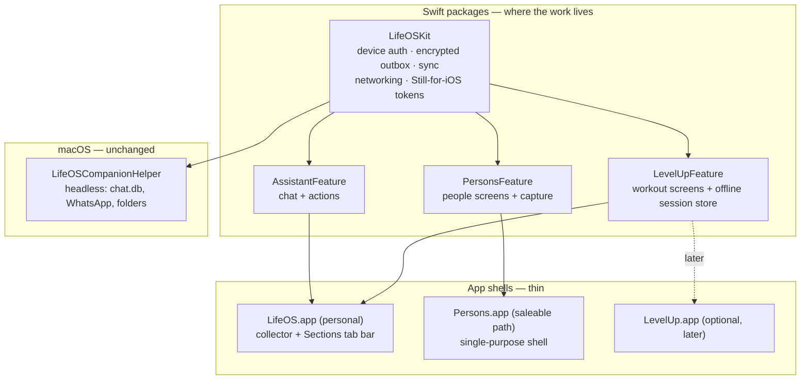

# LifeOS iOS Platform Plan

Status: implementation in progress — two signed iOS shells run on a physical device; connector and Persons feature depth remain underway
Date: 2026-08-12
Supersedes the app-topology portions of `docs/COMPANION_ARCHITECTURE.md` and
`docs/LEVEL_UP_ADAPTIVE_WORKOUT_PLAN.md`. The engineering content of both documents
survives; only the framing of what the iOS binary *is* changes.

**One section of this plan has been superseded.** [ADR 0004](adr/0004-customer-life-vault.md)
replaces the "Backend model: one backend, strict subset API" decision in §7 with a customer-owned
local Life Vault, staged behind proof gates. `docs/LIFE_OS_ECOSYSTEM_STRATEGY.md` explains the
product reasoning; the ADR is what governs.

Scope of that supersession, precisely:

- **Superseded:** where a *customer's* graph lives, and the assumption that customers reach it
  through `apps/api` over the shared cloud database (§7, first three paragraphs).
- **Still current:** everything else in §7, including all five real blockers for a saleable
  Persons and the Mesh competitive read. None of them are affected by the storage change.
- **Still current:** §1's two-product-line split and the feature-package topology. The Life Vault
  changes what `LifeOSKit` talks to, not whether screens live in Swift packages.
- **Unchanged:** Joseph's personal LifeOS stays on the cloud-backed Postgres graph while the vault
  is built and proven. Every section describing the personal line remains accurate.

---

## 1. Product topology

There are two product lines with different economics, and they must not be conflated.

**LifeOS (personal).** One app, mine, never submitted for sale in any near timeframe.
It owns the device-collection plumbing — device authorization, encrypted outbox,
HealthKit, location, Photos metadata, connections, and automations. People and
relationship-management surfaces belong to Persons rather than this collector.

**Persons (saleable).** A standalone App Store product, shipped later, aimed at
replacing Mesh (`me.sh`) as a personal CRM. Sold to customers, so it carries
self-serve signup, subscription billing, App Review constraints, and a privacy
posture that LifeOS does not need.

As of 2026-08-15, this split exists in Xcode and on a physical iPhone. The
`LifeOS Companion iOS` target installs as **LifeOS**
(`com.lacollecteur.lifeos.companion.ios`) and owns HealthKit, significant
location visits, Photos metadata, the encrypted outbox, and connector health.
The `Persons iOS` target installs separately as **Persons**
(`com.lacollecteur.persons.ios`) and imports only `PersonsFeature` plus the
shared API client. Persons requests none of the Health, Location, or Photos
entitlements or usage permissions.

The Photos connector starts its checkpoint at the time access is granted. It
syncs metadata for subsequent photos and videos—capture time, media type,
favorite flag, and optional coordinates—while original bytes stay on-device.
Historical-library ingestion remains deliberately unavailable until the UI can
show a bounded preview and ask for explicit confirmation.

The decision that makes both affordable for one developer: **screens live in Swift
feature packages; apps are thin shells.**

Consequences worth stating plainly:

- `LifeOSCompanionIOS` **becomes** `LifeOS.app`. It is not a collector that grew a
  tab; it is a product that also collects. That raises the craft bar on navigation,
  typography, and motion, but does not invalidate the ingestion engineering already
  built.
- The macOS helper stays a separate headless collector. iMessage `chat.db` reading is
  Mac-only and always will be — iOS exposes no iMessage API.
- `Persons.app` is a thin shell rather than a rewrite. Its current development
  build proves the split; sale adds product infrastructure and feature depth
  without moving the screens back into LifeOS.
- The discipline tax is real: a feature package may not reach for app-specific
  globals or singletons. Dependencies enter through initializers or an environment
  protocol defined in `LifeOSKit`.

### Rejected alternatives

| Option | Why not |
|---|---|
| Three independent Xcode projects, no shared feature code | Every screen forces a copy-or-omit choice. The People section of the personal app either duplicates `Persons.app` or is worse than it. Compounds badly for a solo developer. |
| One app, no package split, extract later | Extraction here means de-personalizing and multi-tenanting under launch pressure — the hardest possible time to do it. |
| Expo / React Native | Reuses TypeScript, but adds a second runtime beside the existing Swift collector and compromises exactly the things the gym surface needs: background timers, haptics, Live Activities. |

---

## 2. Current state — verified

**What exists and is real**

- `apps/companion` Xcode project with four targets: macOS app
  (`com.lacollecteur.lifeos.companion`), macOS helper (`.helper`), LifeOS iOS
  (`.ios`), and Persons iOS (`com.lacollecteur.persons.ios`). Deployment targets
  iOS 17.0 / macOS 14.0.
- `Packages/LifeOSCompanionCore` — 268 lines: `APIClient`, `Connector`,
  `EncryptedOutbox`, `KeychainStore`, `Models`. PKCE device authorization, AES-GCM
  encrypted outbox, credential rotation. This is the seed of `LifeOSKit`.
- Server-side device stack: `apps/api/app/v1/device/{auth,ingest,heartbeat}`,
  `apps/api/lib/device-ingest.ts`, `packages/access/device.ts`, five `Device*`
  Prisma models, and a migration. Contracts in `packages/contracts`.
- `apps/level-up` — complete pure TypeScript rating engine (`lib/engine/*`), workout
  store and actions (`lib/workout/*`), programs, exercises, sessions, sets, body
  metrics, combines.
- `apps/persons` — 26 routes under `/api/v1` and ~25 pages.
- Full workspace scoping: every `LevelUp*` model carries `workspaceId` with a
  cascade relation. `WorkspaceMember`, roles, and a scope list already exist in
  `packages/access`.
- Both iOS targets have been automatically provisioned, signed, installed, and
  launched on a physical iPhone. LifeOS has guided Health, Location, and Photos
  setup; Persons has a separate Keychain credential and exact
  `persons://auth/callback` web-authorization redirect.

**What does not exist**

| Gap | Impact |
|---|---|
| Native surfaces are still early slices | LifeOS has connector setup/status and Persons has read-only People list/detail; broader product surfaces remain to build. |
| **Level Up has zero API routes** (only `auth/[...nextauth]`) — it is entirely RSC + server actions | A native client has nothing to talk to. This is the single largest backend item for the Workout section. |
| Persons `/api/v1` lives in `apps/persons`, not the shared `apps/api` | Native clients would depend on a product app's internal API. Needs consolidating. |
| **No dark mode in `packages/ui/still-tokens.css`** — zero `prefers-color-scheme` or `[data-theme]` rules across 110 lines | A gym app opened at 6am and any modern iOS app need this. Dark Still must be designed, not derived mechanically. |
| App Store distribution is not configured | Physical development signing works; TestFlight, StoreKit, App Review metadata, and release provisioning remain. |

---

## 3. `LifeOSKit` — the shared foundation

Grow `LifeOSCompanionCore` into `LifeOSKit`, keeping what works.

**Carried forward unchanged:** PKCE device authorization against
`home.lacollecteur.com/device/authorize`, Keychain storage with
`AfterFirstUnlockThisDeviceOnly`, AES-GCM encrypted outbox with the key held outside
SQLite, ordered retry upload, heartbeat.

Home owns the signed-in approval screen, but it does not write device records to
its own database. Its `POST /api/device/authorize` handler forwards the validated
request, signed with Home's server-only API key, to the canonical
`POST /v1/device/auth/authorize` endpoint in `apps/api`. The canonical API resolves
the signed-in email inside the API key's workspace and creates the short-lived
authorization code and device record in the same database used by exchange,
refresh, heartbeat, and ingest. This prevents the browser approval flow and device
sync flow from splitting across separately configured application databases.

The LifeOS Health connector requests every standard quantity and category type
that the installed OS makes available, rather than maintaining a narrow fixed
list. Sleep uses immediate HealthKit background delivery and a source-aware
union (one wearable, wake-day attribution) so overlapping Watch/iPhone/Oura
samples cannot become a 30-hour night. Activity, nutrition, and vitals wait
for a scheduled ~11:50 PM local `BGAppRefresh` so the day is nearly complete;
iOS does not guarantee that exact minute. Sleep stages and category
durations/counts join quantity sums/averages in bounded daily `health.daily`
summaries, with units retained as provenance; workouts remain separate
`health.workout` records. Granular HealthKit samples, clinical records
requiring separate capabilities, ECG waveforms, and workout routes remain
local. Sync is serialized and the UI reports collection, upload,
completed-record count, pending retry count, and heartbeat-only failures.
Oura Readiness, Sleep Score, Activity Score, and Stress are not HealthKit
types — they arrive through the Oura API (Home Connections), per
`docs/LEVEL_UP_ADAPTIVE_WORKOUT_PLAN.md`.

**Added:**

- **Offline command queue, distinct from the observation outbox.** The existing
  outbox carries *observations* (health aggregates, visits, messages) through
  `POST /v1/device/ingest`. Logging a training set is a *command* — it must be
  idempotent, ordered within a session, and replayable after force-quit. This is a
  refinement of `LEVEL_UP_ADAPTIVE_WORKOUT_PLAN.md`, which routes set logging through
  device contracts. Recommendation: dedicated command endpoints reusing device
  auth, each taking a client-generated idempotency key, with the same encrypted
  durable queue underneath.
- **Local store.** SwiftData or plain SQLite via GRDB for cached bundles and unsynced
  writes. Must survive force-quit mid-session with timers, selection, and unsynced
  sets intact.
- **Still for iOS.** A Swift translation of `still-tokens.css` — semantic colors in an
  asset catalog with light *and* dark variants, `Newsreader` and `Inter` bundled as
  app fonts, Dynamic Type ramps, corner radii, and the pill button shape. Not a
  mechanical hex port: dark Still needs design judgment about what cognac and camel
  become against a dark ground.
- **Sync engine.** Bundle fetch, conflict policy, freshness display, and an explicit
  offline state that the UI can show rather than hide.

---

## 4. Section one — Workout

The product content of `docs/LEVEL_UP_ADAPTIVE_WORKOUT_PLAN.md` stands: readiness
inputs, Full/Adjust/Recover bands, Oura via direct OAuth, FoodNoms nutrition through
HealthKit, verified-ceiling invariants, shadow-mode rollout gates, and the rule that
readiness may suggest but never block. Read that document for the science and the
acceptance criteria. This section records only what the topology change alters.

**Backend to build (none of it needs an Apple account):**

- `GET /v1/level-up/workout/today` → a versioned session bundle: program day,
  exercises with prescriptions, substitutions, previous-set history, readiness inputs
  and snapshot, recommended adjustment. The TypeScript engine stays authoritative;
  Swift renders and logs the bundle and does not reinterpret the science.
- Idempotent session and set command endpoints (`start`, `log set`, `complete`),
  keyed so replay after a partial batch failure or a cross-device collision converges.
- Body metric and flare-flag writes.
- Consolidation of `apps/api/app/v1/health/samples` onto the shared health commands,
  per the existing plan, so there is not a third ingestion pipeline.

**Native to build:**

Readiness explanation with freshness and named missing inputs · original vs. suggested
session with one-tap override · knee and lumbar flare controls with existing
substitutions · large one-handed weight/reps/duration controls · session and rest
timers surviving backgrounding, with haptics · previous-set defaults · immediate local
PR/RANK/BALANCE feedback with no blocking spinner between a set and rest · offline
queue state and force-quit recovery.

**Platform affordances that make it feel native:** Live Activity and Dynamic Island for
the rest timer, lock-screen widget for the next session, Shortcuts/App Intents for
"start today's workout", HealthKit workout write-back reconciled to its originating
Level Up session so one Event exists, not two.

Apple Watch stays deferred until the iPhone flow has survived repeated real gym use.

---

## 5. Section two — Persons

**Scope decision:** parity with what the Persons web app does today is the north
star, refined over time rather than narrowed up front. The saleable launch is not
near, so v1 does not need a competitive wedge chosen in advance. **Every surface gets
a phone-native version** — designed for the phone, not ported from the web layout.

Today's Persons surface and its native shape:

| Surface | Native design |
|---|---|
| `today`, `inbox` | Card stack, swipe to accept/dismiss. Dead-time triage. |
| `people`, `people/[id]`, `contacts`, `contacts/[id]` | Local-first search, instant. Person detail as timeline. |
| Capture | Voice, share sheet, lock-screen widget, App Intent. Barely exists on web; the phone's unique advantage. |
| `places`, `places/[id]` | Location-aware, "you are here" affordance. |
| `people/merge`, `people/clean`, `contacts/merge` | **One pair at a time**, full-screen, swipe to merge or keep-both. Better than the web's wide comparison table — the phone's constraint forces a single decision per screen, which is what merge review actually is. |
| `import/*`, `places/import/*` | Connect-and-go sheets, background progress, results as a review queue. See §6. |
| `admin` | Settings-style grouped lists — a natural iOS form idiom. |

The merge surface deserves emphasis: this is not a compromise on a phone. Reviewing
"are these two the same person?" is inherently one decision at a time, and it is
perfectly suited to dead time. Done well, it is the feature that resolves Mesh's
loudest complaint.

**Backend:** consolidate the 26 `/api/v1` routes out of `apps/persons` into
`apps/api/app/v1` so native clients depend on a shared API rather than a product
app's internals. Contracts go in `packages/contracts` alongside the device ones.

---

## 6. Contact ingestion — what "one-tap sync" actually takes

The ask is a single tap that pulls in contacts from everywhere. That is achievable for
some sources, partly achievable for others, and impossible for one. The connectors are
also the easy 20% — identity resolution is the other 80%.

### 6.1 Source tiers

**Tier 1 — genuinely one tap**

**Device contacts** via `CNContactStore`. This is the big one, and it is broader than
it sounds: iCloud, Exchange, and any Google or other account the user has configured in
iOS Settings all surface through the same store. For most people, one permission grant
covers several accounts at once.

iOS 18+ nuances that materially change the design:

- `CNAuthorizationStatus` gained a `.limited` case. `requestAccess` now triggers a
  two-stage flow: the usual Allow/Don't Allow alert, then a sheet asking "How do you
  want to share contacts?" with *Select Contacts* or *Share All*.
- **Under limited access, `CNChangeHistoryFetchRequest` always returns a reset.** There
  is no incremental sync — every refresh is a full re-scan. This is the single most
  important constraint for a contacts app, and it argues for earning full access with a
  genuine pre-permission explanation screen rather than firing the system prompt cold.
- Apple expects `ContactAccessButton` and `contactAccessPicker` to be the normal path
  for limited access. Both need supporting, and the app must be honest and useful at
  either level rather than nagging.
- Under full access, `CNChangeHistory` (iOS 13+) gives proper incremental sync.
- Gotcha: `CNContact.identifier` is **not stable across devices**. External-ID mapping
  must tolerate the same person carrying different identifiers on iPhone and Mac.

**Tier 2 — OAuth**

**Google Contacts.** Already built — `fetchGoogleContacts` in
`apps/persons/server/domain/gmail.ts` pages through People API
`people/me/connections` at 1,000 per page.

Closed on 2026-08-12 (see §6.4): multi-value email and phone capture,
`otherContacts`, `contactGroups` labels, and stable `resourceName`/`etag` source IDs.

Still open: **`syncToken`**. `requestSyncToken=true` plus a stored token turns the
full re-fetch into a delta query. Deliberately *not* done yet, for two reasons —
`GmailConnection` has no metadata column to hold a cursor, so it needs a migration;
and today's only consumer is a manual preview-and-review import, where a full fetch
is the correct behavior. It becomes necessary when iOS does continuous background
sync, so it is sequenced to **M5**, not before.

**A costly detail in the current OAuth design.** `GMAIL_SCOPE` bundles
`gmail.readonly` and `contacts.readonly` into one consent
([gmail.ts:21](apps/persons/server/domain/gmail.ts:21)). Those two scopes sit in
different Google verification tiers: `contacts.readonly` is **sensitive** — verification
required for a public app, but no third-party security audit. `gmail.readonly` is
**restricted** — verification *plus* an annual CASA security assessment, which is a
recurring cost and a multi-week process.

For personal use this is irrelevant. For a saleable Persons it means every customer who
just wants contact sync drags the app into the expensive tier. **Recommendation: split
the consent** into a contacts-only connection and a separate Gmail connection, so the
restricted-scope path is only triggered by customers who actually opt into mail
scanning. Doing this now costs little; retrofitting it after launch means re-consenting
every user.

**Microsoft / Outlook.** Graph API `Contacts.Read`, with native delta query support.
The most straightforward connector of the set.

**CardDAV.** Generic fallback for Fastmail and similar. Low priority — the device store
already covers most of these.

**Tier 3 — export file, no API**

**LinkedIn.** There is no legitimate API path. Open access ended in 2015; today it is
five partner-gated tiers, approval takes four weeks to four months, and **connection-level
data is not exposed for non-personal use cases at any tier**. Scraping violates the
user agreement.

The realistic path is the user's own data export: Settings → Data Privacy → Get a copy
of your data → Connections, which produces a CSV of name, profile URL, company,
position, and connected-on date. That is genuinely useful enrichment data. Build it as a
first-class, well-instructed import flow — a phone-native "here's how to request your
export, then drop the file here" sheet — rather than pretending an integration exists.

**X / Twitter.** Paid API tiers with limited and expensive follow-list access. Same
treatment: archive import, not integration.

**Tier 4 — not possible**

**Facebook.** The friend graph has been closed since Graph API v2.0 in 2015.
`user_friends` returns only friends who *also use your app* — for a personal CRM that
is effectively zero. There is no partner tier that reopens it.

The Download Your Information export does contain a friends list, but it carries names
and connection dates only — no emails, no phone numbers. Without contact details its
matching value is low; it can corroborate a name you already have, not introduce
someone new. Any competitor advertising "Facebook integration" is doing profile-link
enrichment or this, not friend sync. **Plan for Facebook to contribute nothing, and
don't put it on a connect screen** — an integration that silently returns nothing is
worse than an absent one.

### 6.2 The actual hard part: identity resolution

Three sources at a few thousand contacts each produce a merge problem, not a contact
list. This is where "one tap" is won or lost, and it is the complaint that Mesh's
reviews return to most often.

The repo is well positioned — `dedupe`, `dedupe/merge`, and `people/[id]/merge` already
exist as domain commands. What the sync flow needs on top:

- **Match keys, captured properly at import.** Normalized email (lowercased, `+tag`
  stripped, Gmail dots collapsed), E.164 phone, then fuzzy name-plus-company. This is
  blocked on fixing the first-email-only bug above — the multi-value fields *are* the
  match keys.
- **Two confidence tiers.** Exact strong-key match (shared email or phone) auto-merges
  silently. Everything fuzzier goes to the review queue. Never auto-merge on name alone;
  that is how a contacts app destroys trust in one sync.
- **Stable external IDs per source**, so re-running converges instead of duplicating:
  Google `resourceName` + `etag`, `CNContact.identifier` (with the cross-device caveat),
  Microsoft item ID.
- **Provenance retained**, so any merge can be undone and every field can be traced to
  the source that asserted it. The existing provenance-Note pattern fits directly.
- **Continuous, not one-shot.** Contacts change. Incremental sync via Google `syncToken`,
  `CNChangeHistory`, and Graph delta queries — with the honest exception that limited
  iOS access forces a full re-scan every time.

### 6.3 What makes it *feel* like one tap

The honest version of the promise: one tap to start, and a well-designed queue for what
cannot be decided automatically.

1. Connect a source → immediate count. "4,182 contacts across 3 sources."
2. Auto-merge the unambiguous ones in the background, then report: "3,610 people.
   1,204 merged automatically."
3. Surface only the genuinely ambiguous pairs, as the swipeable review queue from §5 —
   the phone-native merge surface *is* the payoff for the sync flow.
4. Incremental sync thereafter, quietly, with a visible last-synced timestamp.

The number in step 2 is the product moment. It is also entirely dependent on the match
keys being captured at import, which is why the multi-value fix was upstream of
everything else here.

### 6.4 Import pipeline hardening — done 2026-08-12

Shared server-side work, so the native client inherits a correct pipeline rather than
these bugs.

**New:** `apps/persons/lib/contact-values.ts` — one canonical normalization used by
every importer, matcher, and dedupe path. Sub-addressing (`joe+tag@`) and Gmail dot
insensitivity are now handled; neither was before, so the same mailbox written two
ways produced two people.

**`ParsedContact` carries `emails[]` and `phones[]`**, primary first, alongside the
existing `email`/`phone`. Populated across all five importers — vCard, Google People
API, Google/LinkedIn/generic CSV, spreadsheet, and AI column mapping. Making the
fields required rather than optional is what surfaced `lib/csv-contacts.ts`, an
importer that had been missed.

**Two vCard parser bugs**, both of which silently corrupted match keys:

- Property parameters leaked into values. `EMAIL;TYPE=WORK:a@b.com` parsed as
  `TYPE=WORK:a@b.com` — so *every typed email and address* in an export was garbage.
  Content lines are now split at the first unquoted colon.
- Quoted-printable decoding ran on any value containing `=`, mangling ordinary data
  such as a URL ending `?ref=1b`. It is now driven by the line's `ENCODING` parameter
  and decodes as UTF-8 rather than per-byte.

Also: Apple's `item1.EMAIL` group prefixes now resolve, and preferred/mobile entries
sort into the primary slot while the rest survive as match keys.

**CSV multi-value.** `colNumberedValue` returned the first of ten numbered slots;
it now returns all. Google's ` ::: ` in-cell separator is now split — previously
`a@x.com ::: b@y.com` was imported as one unusable address.

**Matching** compares *any* identifier on either side rather than the primary only,
and tolerates a payload carrying only `email`/`phone`, since the import preview
crosses a network boundary. `computeFillableFields` now offers the first address the
person genuinely lacks, which may be a secondary one.

**Google connector:** `contacts.other.readonly` added to the requested scope, with
`otherContacts` and `contactGroups` failing soft — an existing connection keeps
working and simply improves after a reconnect, with no forced re-consent. Contacts
now carry `sourceId`/`sourceEtag` so a future re-sync converges instead of duplicating.

Coverage: 16 new tests in `apps/persons/tests/contact-identifiers.test.ts`, several
of them regression tests for the parser bugs above. Full suite 69 passing, typecheck
clean.

**Historical data checked and clean.** `scripts/db/audit-vcard-import-corruption.ts`
is a read-only audit for Person rows damaged by the old parser — leaked property
parameters, Latin-1/UTF-8 mojibake, and control characters left by the misfired
quoted-printable decode. Run 2026-08-12 against `default-workspace`: **7,376 people,
24,608 values examined, 0 issues.** The bugs were real in the parser but never reached
stored data, most likely because the production import paths were Google People API
and CSV rather than `.vcf` files.

The audit reports `valuesScanned` and warns loudly when it is zero, because a broken
field selection and a clean database otherwise produce identical output. It writes a
JSON report to `archive/` and never modifies data; a repair pass would be separate and
reviewed.

**Deferred deliberately:** the OAuth consent split (§7) — it belongs with the saleable
Persons work, and doing it now would churn the connection model and force a reconnect
for no present benefit.

---

## 7. The saleable path — what Persons.app will need

Not now, but these constrain choices made now.

> **Superseded — backend model only.** The three paragraphs immediately below were the accepted
> answer until 2026-08-12. [ADR 0004](adr/0004-customer-life-vault.md) replaces them: a customer's
> graph lives in a local encrypted Life Vault, not in the shared cloud database, and customers do
> not reach it through `apps/api`. They are kept here because the reasoning is still the honest
> case *for* the shared-database option, which ADR 0004 preserves as its fallback if the vault
> fails a proof gate. The rest of §7, starting at "Real blockers," is current and unaffected.

**Backend model: one backend, strict subset API.** `apps/api` serves both audiences.
Customer workspaces see a deliberately narrow `/v1` surface. LifeOS-only
capabilities — iMessage ingest, synthesis, life-model, theory, admin, automations —
never appear in it.

The data bones are in good shape: every primitive and every `LevelUp*` model is
workspace-scoped with cascade deletes, and `WorkspaceMember` plus the scope list in
`packages/access` already exist. The gap is not the schema.

The risk this accepts is that a tenancy bug has blast radius across both audiences.
Mitigation is non-optional and should be built with the API consolidation, not after:
workspace isolation tests as a standing suite, and a deny-by-default rule where the
customer-facing surface enumerates permitted capabilities rather than excluding
forbidden ones.

**Real blockers for a saleable Persons, none of which are the data model:**

1. `ApprovedEmail` is an allowlist. Customers need self-serve signup.
2. **Sign in with Apple is mandatory** if any other social login is offered — and
   Google SSO is the current mechanism.
3. StoreKit 2 subscriptions, plus a server-side entitlement check.
4. Privacy nutrition labels and a data-deletion path.
5. **A customer's input set is thinner than mine.** My Persons is fed by iMessage
   `chat.db`, Gmail sync, Krisp transcripts, and a Mac watcher. A customer on iOS
   gets Contacts, Calendar, Gmail OAuth, and manual/voice capture. The capture and
   enrichment UX must carry weight that my setup gets free from scraping. Design for
   this when building `PersonsFeature`, so the saleable shell is not a stripped
   carcass.

**Competitive context (Mesh).** Native on Mac, iOS, iPadOS, Windows, web, visionOS.
Relationship-strength scoring, Nexus AI navigator, auto-enrichment from email,
calendar, address book, LinkedIn, X, iMessage. Free to 1,000 contacts. Its reviews
consistently name four weaknesses: slow search and syncing, confusing onboarding,
duplicate contacts, and limited filtering. Three of those four — dedupe, search,
filtering — are things the LifeOS graph and its existing merge/dedupe commands are
already built to do better. Worth remembering when the wedge is eventually chosen.

`docs/PERSONS_MESH_PARITY_PLAN.md` (2026-08-13) is a full screenshot-sourced
feature audit of Mesh for iOS against Persons' actual current state — Home
feed signal types, the Reconnect cadence system, meeting-lifecycle reminders,
Daily Brief/Weekly Digest, automatic dedupe, public profile, per-contact
source badges, and integration granularity — with a gap table and a
recommended build order. Headline finding: Persons' relationship-cadence
logic (`apps/persons/lib/person-list-presentation.ts`) already matches or
exceeds Mesh's Reconnect, it just isn't surfaced proactively (pull via a
filter view, not push via a feed/notification) — that's the highest-leverage
item, not new engineering.

---

## 8. Apple Developer Program

**Decision: enroll as an individual now; form the entity and migrate later.**

- Individual enrollment, $99/yr, typically days. Unblocks signing, device testing,
  TestFlight, push, and HealthKit on device immediately.
- Trade-off accepted: personal legal name appears as the App Store seller. Irrelevant
  while nothing is published.
- In parallel, and on a longer clock: legal entity, then a **D-U-N-S number** (one to
  two weeks on its own), then organization enrollment. Migrating individual →
  organization is a real chore, so it must be finished before any paid launch, not
  after.

Until enrollment completes, all of the following proceeds unblocked: API routes,
contracts, engine work, `LifeOSKit`, feature packages, and Simulator builds.

---

## 9. Sequencing

| Milestone | Content | Blocked by Apple account? |
|---|---|---|
| **M0** | Start individual enrollment. Start entity/D-U-N-S in parallel. | — |
| **M1** | `LifeOSKit`: extract from `LifeOSCompanionCore`, add local store, command queue, Still-for-iOS with dark mode. `LifeOS.app` shell with section navigation and settings-level collector surfaces. Simulator only. | No |
| **M2** | Backend: `workout/today` bundle + idempotent session/set commands + contracts + tests. Native Workout section: offline logging, timers, previous-set recall, force-quit recovery. Synthetic neutral readiness. | No |
| **M3** | HealthKit anchored incremental queries, sleep + FoodNoms nutrition aggregation, real readiness inputs, workout write-back with duplicate reconciliation. Three real gym sessions before adaptation is enabled. | Device testing yes |
| **M4** | Oura OAuth via Home connections, 35-day backfill, webhooks, source-priority readiness. Seven days of shadow mode before suggestions pre-adjust the UI. Implementation note (2026-08-15): connect/callback/sync and webhook ingest are in `apps/api` + Home Connections; readiness assembly records Oura evidence but does not change prescriptions yet. | No |
| **M5** | Persons `/api/v1` consolidation into `apps/api` + workspace isolation test suite. `PersonsFeature`: capture, today, inbox triage, person detail. | No |
| **M6+** | Remaining Persons parity · Places · Assistant · saleable `Persons.app` shell, Sign in with Apple, StoreKit. | Yes |

M5's backend half can run in parallel with M2–M4 — it is server work with no Apple
dependency, and it is the long pole for anything saleable.

Implementation note (2026-08-12): M2's backend slice is complete. M5 now has
canonical People, Interaction, Plan, Rule, Event, audit-log, and stored-file
verticals in `apps/api`: `/v1/people`, `/v1/people/:id`, `/v1/plans`,
`/v1/plans/:id`, `/v1/rules`, `/v1/rules/:id`, `/v1/rules/:id/test`,
`/v1/interactions`, `/v1/interactions/:id`, `/v1/events`, `/v1/events/:id`,
`/v1/audit-log`, and `/v1/files/:id`, with shared request/response contracts
where a JSON wire shape exists, keyset pagination, and cross-workspace read
and mutation isolation tests. Audit-log reads use an `(createdAt, id)`
cursor and bounded filters. The central file route serves only
database-backed content; it does not attempt to read a legacy path on the
API host. Plan parent references are workspace-validated at the shared
command boundary. Interaction writes likewise validate Person, Event, and
source-file references inside the caller's workspace, and atomically create
the backing Event, participant edges, Interaction, and GraphEvent.

Rules reuses the existing `rules.manage` scope rather than introducing a
read/write split not backed by the seeded permission catalog. The Event
*primitive* (a calendar/meeting occurrence — `packages/domain/event-primitive.ts`,
already extracted in an earlier Track C phase) needed new scopes instead:
the existing `events.read` was already seeded for the GraphEvent ledger
before the primitive had a canonical API, and renaming it would silently
revoke ledger access from anyone already granted it. Added
`life-events.read`/`life-events.write` instead, leaving `events.read`
untouched, and granted the new pair everywhere a role already had
equivalent primitive access (admin, editor, viewer, automation).

Contacts and Inbox are decided as permanent app-local surfaces, not a queued
forwarding slice — see docs/PERSONS_ARCHITECTURE.md for why (different
consumption pattern for Contacts; Inbox's presentation enrichment has no
place in a cross-primitive canonical resource, and both already read the
same underlying data as their canonical counterparts). Dedupe, merge, and
people-merge stay app-local and destructive — not moved. Gmail sync,
imports, and ingest are now workspace-personalized (each workspace's own
owner name is resolved and substituted into the AI analysis prompt, no
longer hardcoded to Joseph Fryer) but still live in `apps/persons`; moving
them to `apps/api` remains a separate step from fixing their multi-tenant
correctness.

Implementation note (2026-08-15): the first native M5 feature slice now exists
as `apps/companion/Packages/PersonsFeature`. The personal iOS shell mounts its
People tab after device sign-in. It supports bounded cursor pagination,
debounced canonical-API search, pull-to-refresh, and read-only person detail.
Signed-in device credentials now carry `people.read`; `people.write` remains
absent and is pinned by integration coverage. Capture, Today, Inbox, local
cache/offline behavior, and the standalone saleable shell remain future slices.

---

## 10. Open questions

- Dark Still: does it get designed as a full second palette, or does the iOS app ship
  light-only for M1–M2 and gain dark before real gym use? A 6am gym argues for the
  latter being a short-lived compromise at most.
- Local store: SwiftData versus GRDB. SwiftData is less code and iOS 17-native;
  GRDB gives precise control over the crash-safe replay semantics the session logger
  needs. Decide during M1 against the force-quit recovery requirement.
- Whether `LevelUp.app` ever ships as its own shell, or Workout stays a LifeOS
  section permanently. Deferred at no cost under the package split.
- Assistant on iOS: which model surface, and whether it gets tool access to the graph
  or stays read-only at first.

---

## 11. Related documents

- `docs/adr/0004-customer-life-vault.md` — **the governing decision** for where customer
  data lives. Supersedes §7's backend model; status `proposed`, staged behind proof gates.
- `docs/LIFE_OS_ECOSYSTEM_STRATEGY.md` — the product reasoning behind ADR 0004: ecosystem
  framing, customer-owned Life Vault, Apple sync, company data boundary, the two AI
  paths, and third-party data obligations. Explanatory; the ADR is what governs.
- `docs/LEVEL_UP_ADAPTIVE_WORKOUT_PLAN.md` — readiness science, Oura/HealthKit/FoodNoms
  detail, test plan, rollout gates. Still authoritative for all of it.
- `docs/ADAPTIVE_DAY_PLAN.md` (2026-08-13) — the Home-first Capacity Brief: deterministic
  recommendation engine over existing Plans/State/Level Up data, routed through the
  existing ReviewItem confirmation boundary. References this doc's M3/M4 health work
  rather than restating it, and absorbs `scripts/brief`'s daily-assembly role.
- `docs/COMPANION_ARCHITECTURE.md` — device trust, ingestion protocol, privacy
  boundary, connector lifecycle. Still authoritative; the "one collector app"
  framing is superseded here.
- `docs/STILL_DESIGN_SYSTEM.md` — visual language to translate to iOS.
- `docs/PERSONS_ARCHITECTURE.md` — Persons inputs, front doors, plumbing, memory.
- `docs/LIFE_OS_APP_ARCHITECTURE.md` — web app topology and shared package rules.
