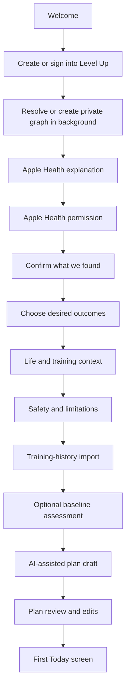
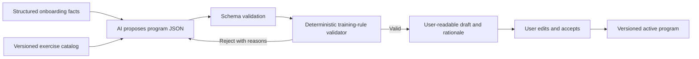

# Level Up Native Product and User Flows

Status: product flow specification for native implementation

Date: 2026-08-20

Primary product: standalone Level Up for iPhone

Underlying system: one LifeOS graph per authenticated person

## 1. Product position

Level Up is a standalone app for improving a whole person, beginning with
fitness and health. It must be useful to someone who has never heard of LifeOS.
Behind the scenes, however, every Level Up account is backed by the same LifeOS
graph architecture. A new user starts a private graph automatically; an existing
user is attached to their existing graph automatically. LifeOS must not appear
as a prerequisite, workspace concept, or setup burden in the Level Up experience.

The promise is:

> A training plan that fits the body you have, the life you live, and the person
> you are trying to become.

The app is not an AI chat window that happens to output exercises. It is a
carefully constrained training product with an evidence model, a versioned
exercise library, deterministic safety and program rules, and an AI-assisted
conversation that makes setup feel personal rather than bureaucratic.

## 2. Standalone account model

Every Level Up user receives a private Level Up account and an isolated backend
workspace/graph behind the scenes. The word `workspace` never appears in the
consumer experience.

There are three account paths:

1. **New Level Up user** — creates an account; the system atomically creates a
   private workspace, canonical self `Person`, membership, and Level Up profile,
   then begins adding onboarding evidence to that graph.
2. **Returning Level Up user** — signs in; the system resolves the authenticated
   identity to the existing user, self `Person`, and graph, then resumes from the
   last durable state.
3. **Existing LifeOS user opening Level Up for the first time** — signs in with
   the same authenticated identity and is attached to the existing graph without
   a connection wizard or a second store of Level Up data.

The graph connection is infrastructure, not an optional product integration.
Fitness-relevant evidence already in that graph can be used according to its
existing provenance and permissions. Separate provider connections such as
Apple Health, Oura, calendars, or nutrition still require their own consent.

For Joseph, Level Up should resolve the existing account and graph immediately,
load the existing Level Up program/history and relevant health evidence, and ask
only for missing provider permissions or stale/ambiguous facts. There is no
“connect to LifeOS” decision because Joseph is already the same person in the
same graph.

### Graph bootstrap and identity invariants

- Use the stable authenticated provider identity as the primary account key.
- A unique verified email may bridge an existing account during migration, but
  never attach graphs based on name, an unverified address, or fuzzy similarity.
- If identity resolution is ambiguous, stop and request account recovery/review;
  never create a second graph and never merge two graphs silently.
- Creating a new user's `User`, workspace, owner membership, canonical self
  `Person`, `User.personId`, and initial Level Up profile must be atomic and
  idempotent.
- Replaying bootstrap returns the same identifiers and cannot create duplicate
  self Persons or memberships.
- The self Person is a real `Person` primitive. Goals become `Plan` records;
  workouts/assessments become `Event` records; body/recovery observations become
  source-backed `State` records; explanations and raw bounded evidence become
  provenance `Note` records as appropriate.
- Level Up infrastructure tables may support rating/program behavior, but graph
  projection begins at onboarding rather than at some later LifeOS connection.

## 3. Navigation model

The four native tabs remain correct:

- **Today** — what matters now: readiness, next workout, active session, or
  recovery action.
- **Skills** — Fitness first, then future capabilities. Inside Fitness: program,
  exercise library, body, assessments, and goals.
- **Journey** — evidence of progress: exercise ranks, PRs, combines, milestones,
  consistency, and reflections.
- **You** — profile, training context, connections, permissions, privacy, units,
  sync health, and account.

Onboarding is a temporary full-screen flow. The tab bar appears only after a
first plan has been accepted or the user chooses to explore without one.

## 4. First-run flow, screen by screen

### Screen 1 — Welcome

Purpose: establish the product without mentioning infrastructure.

- Mark and name: Level Up.
- Headline: “Training for your whole life.”
- Supporting line: “A plan built around your body, schedule, recovery, and the
  person you want to become.”
- Primary action: **Get started**.
- Secondary action: **I already have an account**.
- Quiet footer links: privacy, health-data policy, terms.

Do not put “Connect your LifeOS workspace” on this screen. That makes a
standalone product look like a remote control for another product.

### Screen 2 — Account

Purpose: create durable identity with minimal interruption.

- New and returning users authenticate through the same native account flow.
- Explain that the account protects plan history and allows recovery on a new
  phone.
- If authentication is interrupted, preserve the exact onboarding step locally.
- Do not request Apple Health access before the user has an account and has seen
  why the data is useful.

On return, route by durable state:

- No accepted plan: resume the first unanswered onboarding question.
- Accepted plan and no active workout: Today.
- Active workout: recovery sheet, then resume session.
- Pending offline commands: enter the app normally and show a quiet sync state;
  never block the workout.

### Background transition — Resolve or create the graph

Purpose: establish continuity without adding a user-facing setup screen.

After authentication, the app briefly shows **Preparing your starting point**
while the server resolves or creates the graph idempotently. An existing user
receives their existing graph. A new user receives a private graph and canonical
self Person. The app then checks which fitness-relevant facts already exist and
routes directly to Apple Health or the first genuinely unanswered question.

This transition is silent when fast. It becomes a repair screen only when the
authenticated identity is ambiguous or graph bootstrap cannot complete safely.

### Screen 4 — Why Apple Health

Purpose: earn permission before showing Apple's system sheet.

Copy should be concrete:

> “Level Up can use measurements and recent recovery data already on your phone
> so you do not have to type them again. You choose each category. Missing data
> never counts against you.”

Requested at first fitness setup:

- Characteristics needed for norms: date of birth and biological sex, where
  available and relevant to the selected comparison model.
- Latest height and body mass.
- Optional body-fat percentage and lean body mass.
- Sleep analysis, resting heart rate, HRV, VO2 max, steps, active energy, and
  workouts for readiness and training-history context.

Do not request the Companion's current broad list of all supported HealthKit
quantity, symptom, reproductive, clinical, and environmental categories. Each
additional category must earn a feature-specific explanation and just-in-time
request.

Apple Health permission is a provider grant layered onto the graph. A user gets
the complete core Level Up experience even if Apple Health is declined.

### Screen 5 — Confirm what we found

Purpose: turn passive health data into trustworthy profile inputs.

The screen is a short review, not a blank form:

| Field | Behavior |
|---|---|
| Age/date of birth | Prefill from HealthKit characteristics; ask only if unavailable |
| Norm sex | Explain that this selects the comparison model; allow review |
| Height | Use the freshest plausible HealthKit sample and show its date/source |
| Bodyweight | Show the latest value and trend freshness; allow correction |
| Units | Default from HealthKit/locale; always user-changeable |
| Standing reach | Ask only when a jump/dunk goal makes it relevant |

Every imported value has three actions: **Use this**, **Change**, and **Do not
use**. Conflicting sources are not averaged. The chosen value and source remain
inspectable later.

Because HealthKit protects read privacy, “no value found” must never be phrased
as “permission denied.” It can mean no sample, a stale sample, or unavailable
read access. The UI simply offers manual entry or **Skip for now**.

### Screen 6 — What do you want to become capable of?

Purpose: collect intent in the user's language.

Start with selectable outcomes, not body-part categories:

- Become stronger.
- Build muscle.
- Lose fat while preserving performance.
- Move without pain or fragility.
- Improve endurance.
- Become more explosive or athletic.
- Prepare for a sport or event.
- Feel and function better day to day.
- Write my own goal.

The user selects one primary outcome and up to two supporting outcomes, then can
add a sentence in natural language. The next screen reflects the goal back in a
measurable form. For example:

> “Jump higher and become more explosive while reducing bodyweight without
> losing strength.”

The AI may clarify ambiguity, but it must not convert appearance language into
an aggressive weight-loss target without confirmation.

### Screen 7 — What must the plan fit around?

Purpose: capture what HealthKit cannot know.

Ask one focused question per screen, with the ability to answer “not sure”:

1. Days per week realistically available.
2. Typical session duration, including a “20 minutes on bad weeks” minimum.
3. Equipment and training locations.
4. Training age and confidence with major movements.
5. Current program, favorite movements, and movements the user dislikes.
6. Work pattern, travel frequency, caregiving, and schedule volatility.
7. Preferred training days and any immovable commitments.
8. Sleep target only if the available health history cannot establish a useful
   personal pattern.

If calendar context is connected to the graph, propose available windows and ask
the user to confirm them. Never silently read calendar titles into an AI prompt;
send only bounded availability facts unless the user grants more.

### Screen 8 — Safety and physical constraints

Purpose: avoid treating incomplete data as permission for arbitrary training.

Ask about:

- Current pain or injury and movements that aggravate it.
- Recent surgery or clinician-imposed restrictions.
- Concerning symptoms during exercise.
- Pregnancy/postpartum context only when voluntarily relevant.
- Movements the user cannot safely perform alone.

Answers become explicit constraints, not diagnoses. A concerning response pauses
automatic prescription of the affected activity and recommends appropriate
professional clearance; it does not offer medical conclusions. Ordinary joint
flares remain day-of-workout inputs with visible substitutions.

### Screen 9 — Training history

Purpose: use evidence already available before asking for estimates.

- Summarize recent Apple Health workouts by type, frequency, and duration.
- If prior graph or Level Up history exists, show the program and recent sets.
- Let the user import an existing plan by selecting prior workouts, choosing a
  template, or describing it in natural language.
- Ask the user to confirm what the app inferred: “This looks like two strength
  days and one basketball session most weeks—is that representative?”

Apple Health workout records usually do not contain reliable exercise-by-exercise
sets and loads. Do not pretend that a generic strength workout reveals the
actual program. Ask for the missing structure or use a conservative calibration
week.

### Screen 10 — Baseline

Purpose: start honestly without making onboarding exhausting.

New users begin **Unranked**, not at C rank. A rank appears only after defensible
evidence exists.

Offer three paths:

- **Start with a calibration week** — recommended. Conservative loads and RPE/RIR
  prompts establish working values during normal sessions.
- **Enter recent performance** — clearly labeled self-report with wide confidence.
- **Run a baseline combine** — verified protocols for users who want a fuller
  player card now.

Skipping assessment never blocks a plan. The app can prescribe effort ranges and
learn, but it cannot display invented capability.

### Screen 11 — Building your plan

Purpose: make a short wait feel legible, not magical.

Show the bounded inputs being considered:

- Primary and supporting outcomes.
- Realistic weekly schedule.
- Available equipment.
- Experience and known performance.
- Pain/restriction constraints.
- Recent training load and recovery-data freshness.
- Exercise preferences.

The progress language is “checking movement balance,” “fitting sessions to your
week,” and “setting a conservative starting point,” not “AI is thinking.”

### Screen 12 — Your first plan

Purpose: make the generated result understandable and editable before commitment.

The top of the screen contains:

- Plan name and length.
- The primary outcome in the user's words.
- Weekly schedule and expected time.
- A short explanation of why this structure fits the whole person.
- Confidence/missing-evidence note.

Each day expands into exercises, sets, reps or duration, effort target, rest, and
estimated session time. Every exercise supports **Why this?**, **Swap**, and
**View exercise**. The user can move days, change session length, remove an
exercise, or ask for a revised draft.

Primary action: **Start this plan**.

Secondary actions: **Adjust it** and **Save as draft**.

Acceptance freezes a versioned program proposal, its input summary, validation
result, and user edits. Future AI changes create a new version; they never mutate
the accepted program invisibly.

## 5. How AI creates a workout program

AI is the conversational planner and explainer. It is not the final safety or
science authority.

### Input envelope

The model receives a bounded, structured `ProgramDesignContext`:

- Goal hierarchy and time horizon.
- Availability, session-duration range, equipment, and location patterns.
- Training experience, recent program, exercise preferences, and confidence.
- Explicit injuries, pain triggers, restrictions, and excluded movements.
- Latest confirmed body measurements with freshness and source labels.
- Bounded health summaries: recent sleep, resting-heart-rate/HRV baseline,
  workout frequency/duration, steps/activity, and VO2 max where available.
- Existing Level Up performances, exercise ranks, combines, and current program.
- Graph-derived availability or goal context only when its source connection and
  permission allow this Level Up use.

Raw HealthKit samples, unrelated LifeOS notes, calendar titles, messages, and
other private data do not enter the prompt merely because the app can access
them.

### Generation pipeline

The AI can:

- Ask the smallest useful next question.
- Summarize the user's intent and constraints.
- Select and arrange exercises from the canonical library.
- Propose a progression model and calibration approach.
- Explain tradeoffs and generate alternative drafts.

The deterministic validator must enforce:

- Every exercise and substitution exists in a versioned catalog.
- Equipment and restriction compatibility.
- Session duration and weekly-frequency limits.
- Conservative starting loads or effort ranges when history is sparse.
- Movement-pattern and recovery-spacing rules appropriate to the goal/template.
- Volume/intensity bounds by experience level.
- Pain constraints and hard exclusions.
- No invented measurement, rank, injury diagnosis, calorie burn, or certainty.

If a draft fails, the model receives machine-readable rejection reasons and may
try again within a bounded attempt count. It cannot ask the validator to waive a
hard safety constraint. If no valid plan can be produced, the user sees the
specific conflict and chooses which non-safety constraint to change.

### Program adaptation after onboarding

There are three distinct mechanisms:

1. **Daily adaptation** — deterministic Full/Adjust/Recover recommendation based
   on freshness-labeled recovery and pain inputs. The user can override it.
2. **Progression** — deterministic load/rep/set changes from completed evidence,
   effort, success, and deload rules.
3. **Program redesign** — AI-assisted proposal when the goal, schedule,
   equipment, adherence, or repeated feedback materially changes.

The app must never regenerate an entire program because of one poor night's
sleep. It changes today's dose first; it changes the plan only when the evidence
supports a durable change and the user accepts it.

## 6. Daily-use flow, screen by screen

### Today — training day

The first viewport answers four questions:

1. What am I doing today?
2. Why is this the right dose today?
3. How long will it take?
4. What do I tap to begin?

Show:

- Readiness as Full, Adjust, or Recover with freshness and a one-line reason.
- Today's planned session, duration, and main purpose.
- Material differences from the original prescription.
- A compact pain/flare check.
- **Start workout** as the dominant action.

Diagnostics, source reconciliation, engine versions, and missing-signal details
live under **Why this recommendation?**.

### Today — non-training day

Do not manufacture a workout to increase engagement. Show the next scheduled
session, useful recovery context, and at most one optional action such as a walk,
mobility block, measurement, or plan review when supported by the user's goals.

### Workout preview

- Exercise order with static imagery, prescriptions, and rankable/unranked state.
- Expected session time and equipment checklist.
- Original versus adjusted values when readiness changed the session.
- Reorder, substitute, or remove with a visible consequence note.
- Downloaded/offline indicator only when there is a problem; normal readiness is
  quiet.

### Active exercise

This is the most important screen in the product.

- One exercise at a time.
- Large load/reps or duration controls reachable with one hand.
- Previous set and last-session values adjacent to the inputs.
- Current set number and total sets.
- Static exercise image plus two or three form cues; full detail one tap away.
- Large **Complete set** action.
- Persistent session timer and unobtrusive sync state.
- Swipe/tap to another exercise without losing the current draft.

Completing a set writes locally first, gives haptic confirmation immediately,
starts the rest timer, and queues synchronization. Network latency never blocks
the physical flow.

### Rest state

- Large countdown with +15, +30, skip, and pause.
- Next-set prescription and previous result.
- Immediate PR, Rank, or Balance feedback only when defensible.
- “Unranked—building evidence” when it is not.
- A short cue or substitution option, never an interruptive tutorial.

### Exercise detail

- Name, image, setup, execution cues, common mistakes, and range of motion.
- Current exercise rank or explicit unranked/Balance-only explanation.
- Next evidence-based rank threshold.
- Confidence, freshness, and source.
- PRs, small useful trends, and session-grouped history.
- Current-program prescription and substitutions.

### Substitution flow

The sheet starts with the reason: equipment unavailable, pain/flare, preference,
or temporary variation. Results are ordered by matching movement intent, safety
constraints, equipment, and program role. Each result explains what changes.
The swap defaults to today only; changing the whole program requires an explicit
second action.

### Finish workout

- Completed exercises/sets and elapsed time.
- Session RPE and optional short note.
- Honest PR/rank/balance changes.
- Planned versus completed volume and meaningful substitutions.
- HealthKit write status, with a repair action if write permission is unavailable.
- **Finish** returns to a calm completed Today state.

Do not force social sharing, confetti, currency, streak repair, or a lengthy
survey. A restrained milestone moment is appropriate when the evidence actually
supports one.

### Interrupted workout recovery

On reopen:

> “Workout in progress — 3 sets saved on this phone.”

Actions: **Resume**, **Finish now**, or **Discard draft**. Discarding an unsynced
session is destructive and requires confirmation. Synced evidence is never
silently deleted.

## 7. Skills, Journey, and You

### Skills > Fitness

- Active plan and next phase.
- Exercise library with search, filters, favorites, and recent movements.
- Exercise-level ranks and evidence gaps.
- Body measurements and trends.
- Combines/assessments.
- Goals and plan history.

Future non-fitness skills appear only when they have a real practice, evidence,
assessment, and progression model. They do not borrow strength ranks or fake XP.

### Journey

The default view is a chronological, calm narrative of meaningful change:

- Verified combines and attribute changes.
- Exercise rank changes and PRs.
- Program phases completed or revised.
- Consistency and training-volume patterns.
- User reflections and important interruptions.

Capability and consistency remain separate. A long streak cannot inflate a
strength rank.

### You

- Confirmed profile values and sources.
- Goals and current life/training context.
- Apple Health categories and freshness.
- Graph identity, connected evidence providers, and per-capability grants.
- Units, plates/equipment, notifications, and accessibility.
- Sync/offline status and repair tools.
- Privacy, export, account deletion, and sign out.

Advanced source and engine diagnostics are available here but do not dominate
the main experience.

## 8. Joseph's intended walkthrough

This is the target behavior for the first real account, without hardcoding
Joseph-specific facts into the product:

1. Sign into Level Up and automatically resume the existing LifeOS graph.
2. Grant any narrow Apple Health categories not already available to Level Up.
3. See height, current bodyweight, age/norm inputs, recent sleep, activity, and
   workouts prefilled with dates and sources; confirm or correct only what is
   missing or stale.
4. See the existing goal reflected back: improve vertical jump/explosiveness
   while losing bodyweight without sacrificing strength.
5. Confirm three realistic gym days, available equipment, knee/lumbar flare
   behavior, session duration, and current training experience.
6. Import the existing three-day Vertical program as the starting draft rather
   than generating unrelated exercises from scratch.
7. Review why jumps are first, strength work uses longer rests, and trunk work is
   last; change anything that does not fit real life.
8. Begin with existing set evidence where it is trustworthy and remain unranked
   where it is not.
9. On each gym day, receive a freshness-labeled Full/Adjust/Recover suggestion,
   preserve one-tap override, and log offline without waiting on the network.
10. Use the resulting history to progress the program and to propose revisions
    only when schedule, goals, adherence, or performance actually changes.

The repository does not itself confirm Joseph's current height, weight, or
HealthKit permission state. Those values must be read and confirmed on device;
the product must not substitute old database values and present them as current.

## 9. Required contracts and data changes

The current native workout endpoints support today, start, set log, completion,
and body-metric writes. The flows above additionally require versioned APIs for:

- Standalone Level Up identity plus atomic graph/self-Person bootstrap and
  automatic existing-graph resolution.
- Onboarding state and resumable answers.
- Confirmed profile values with source/freshness and manual override.
- Bounded health-summary availability without raw sample exposure.
- Exercise catalog, filters, aliases, art manifest, instructions, provenance,
  and substitutions.
- Program-design context, AI proposal, deterministic validation result, edits,
  acceptance, and version history.
- Training-history summary and prior-set defaults.
- Active-session recovery and encrypted command reconciliation.
- Exercise detail, current-rank derivation, PRs, and keyset-paginated history.
- Journey timeline, combines, builds, body history, and connection health.

The shared access layer already has part of the required graph behavior: an
existing user with one active membership resolves to that workspace, while an
approved standalone signup receives a new isolated workspace and owner role.
It is not yet the complete Level Up bootstrap because public signups remain
approval-gated and workspace creation does not guarantee a canonical self
`Person` linked through `User.personId`.

Extract one shared idempotent graph-bootstrap command rather than implementing a
Level Up-specific account silo. It must return the resolved user, workspace, and
self-Person IDs; create all missing new-user records transactionally; repair an
unambiguous partially completed bootstrap; and refuse ambiguous identity or
cross-workspace links. Device authorization and future native account exchange
must call this command before issuing Level Up credentials.

Do not add a universal `Skill` primitive as part of this work. Fitness program
records remain Level Up infrastructure and always project meaningful user
activity onto the underlying LifeOS graph.

## 10. Native implementation sequence

### Slice A — Correct the standalone first impression

- Replace the current LifeOS-connection landing screen with Welcome and Account.
- Resolve or create the underlying graph immediately after authentication,
  without a LifeOS connection step.
- Add resumable onboarding state.
- Add narrow, purpose-specific HealthKit authorization and profile confirmation.

Exit: a new user can create a Level Up account, receive an idempotent private
graph/self Person, connect or skip Apple Health, and reach goals without seeing
infrastructure language; an existing user resumes the existing graph without a
duplicate.

### Slice B — Whole-person onboarding

- Build the goal, schedule, equipment, experience, preference, and safety flows.
- Import bounded Apple Health workout context and existing Level Up/LifeOS
  context where granted.
- Start every unsupported capability as unranked.

Exit: the app has a complete structured design context with explicit missing
fields and provenance.

### Slice C — Program generator and review

- Expand the canonical exercise library and substitution metadata.
- Add provider-agnostic structured AI proposal generation.
- Add deterministic validation, bounded retries, rationale, plan editing, and
  versioned acceptance.
- Seed the current Vertical program as a real template, not a hardcoded universal
  default.

Exit: the same context always produces a schema-valid, constraint-valid draft or
a clear explanation of why no valid draft exists.

### Slice D — Complete workout loop

- Finish offline set logging, timers, rest state, exercise detail, substitutions,
  completion, HealthKit write-back, and force-quit recovery.
- Add static exact/close exercise art and honest no-image states.
- Prove the full loop on a physical iPhone across at least three gym sessions.

### Slice E — Progression and whole-person adaptation

- Add deterministic progression and deload rules.
- Run readiness suggestions in shadow mode before enabling them.
- Add exercise-level current rank and next-threshold derivation.
- Add AI-assisted program redesign only after durable evidence or a user-requested
  goal/context change.

Only after these native flows reach parity should the authenticated Level Up web
product be retired under `LEVEL_UP_MOBILE_TRANSITION_PLAN.md`.
