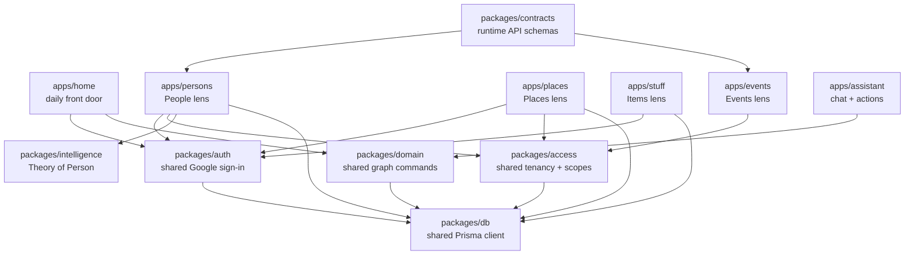
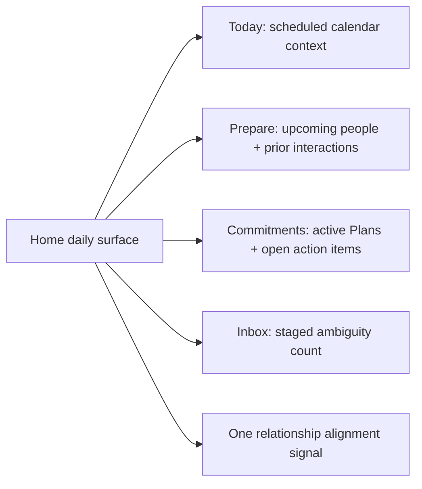
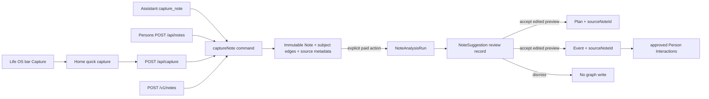
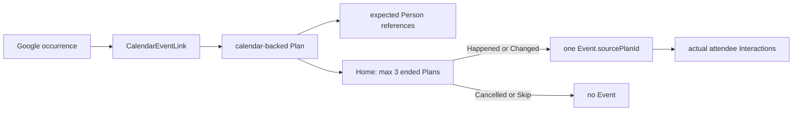

# Life OS App Architecture

Life OS is one private data graph with multiple focused apps on top.

## Shape

## Rules

- Each product surface can stay its own app when the workflow is distinct.
- The database is shared. Apps should not create separate data silos.
- Auth policy lives in `packages/auth`; app-level `auth.ts` files should stay thin wrappers.
- Workspace selection, session-to-user resolution, disabled-user handling, default roles/scopes, and access caching live in `packages/access`; apps provide their Auth.js session adapter and error/audit adapters.
- Runtime request contracts live in `packages/contracts`; route adapters translate schema failures into each app's stable API error envelope.
- Session cookies can be shared across subdomains by setting `AUTH_COOKIE_DOMAIN` or `LIFE_OS_COOKIE_DOMAIN` to the parent domain, for example `.lifeos.example`.
- Production apps must share the same `AUTH_SECRET` or `NEXTAUTH_SECRET`.
- Local development uses a dev-only fallback secret when no secret is present.
- The home, Persons, and Places apps may bypass sign-in for an explicit local review by setting
  `LIFE_OS_LOCAL_REVIEW=1`; this bypass is disabled whenever `NODE_ENV=production`.

## Current Apps

- `apps/home`: Cross-primitive daily front door for orientation, preparation, commitments, review burden, and one prioritized nudge.
- `apps/persons`: People, interactions, inbox, imports, Gmail, Calendar, iMessage, Theory of Person, and graph notes.
- `apps/places`: Places, place profiles, visits, Google location import review.
- `apps/stuff`: Items and inventory.
- `apps/theory-of`: Redirect shell at `context.lacollecteur.com`. Theory lives in Persons.

### Home daily read model

Home is the cross-primitive daily doorway, not another primitive owner. Its
server components read the shared graph in parallel:

Provider-backed future calendar records are currently stored as `Event` by the
existing Google sync paths. Home labels them **Scheduled** rather than implying
that they are confirmed history. The planned migration to calendar-backed
`Plan` records must remain idempotent and must not rewrite historical production
records automatically; see `docs/DAILY_USE_PLAN.md`.

Home uses explicit Prisma field selections so a read remains compatible while
additive provenance migrations are pending in a configured database. Local
review bypass is checked both in `proxy.ts` and the Home page, and is inert in
production.

Home uses Next.js Cache Components as a short-lived read model over the remote
graph. The personalized session/workspace boundary streams behind a page-level
Suspense shell, while Today, Prepare, Communications, reconciliation, Nudges,
and Weekly Review are cached by their workspace and input props for 15–60
seconds. This keeps the first paint immediate and prevents repeat visits from
replaying more than twenty remote database reads. Mutating API routes remain
dynamic; the cache expires within five minutes even if no background refresh
occurs.

### Note-first capture

`@life-os/domain` owns the canonical `captureNote` command. Home's
`POST /api/capture`, the Assistant `capture_note` tool, Persons'
`POST /api/notes`, and the canonical `POST /v1/notes` all enter through this
command. A Note may carry first-class subject edges (`aboutPersonId`,
`aboutPlaceId`, `aboutItemId`, `aboutEventId`, `aboutPlanId`, `aboutGroupId`,
`aboutStateId`) — "this note is about X" — which is not the same as provenance
(`X.sourceNoteId` = "X was derived from this note") and is not an Interaction
(an observation is not something that happened). The assistant searches, then
passes those ids on `capture_note` so Person theory, place pages, and Stuff read the
same Note.

The command validates and trims input, owns source metadata, and supports an
idempotency key. Capture does not depend on AI: a Note is durably stored before
any future entity resolution or graph write is attempted. The Home route
requires a session and active workspace membership in production; only the
explicit non-production local-review path resolves `default-workspace`.

Home's structure action reuses the workspace's encrypted Vercel AI Gateway
credential. The call is never automatic and its model, prompt version, token
usage, returned cost, output, and failure state are retained in
`NoteAnalysisRun`. Only explicit Plan or Event proposals are accepted. The user
can edit title, time, and matched People before approval; `NoteSuggestion`
retains pending, accepted, or dismissed review state. Accepting twice returns
the original derived entity instead of creating a duplicate.

Explicit action capture is the low-ceremony path through this architecture.
When the user selects **Action**, Home calls the shared `captureAction` command,
which atomically writes the original Note and a provenance-linked draft Plan.
It requires no model call or due date. Draft Plans appear in Home's bounded
Action Inbox; choosing Today or Schedule promotes them to active Plans. This
keeps capture cheap without treating every remembered possibility as a promise.

### Calendar prediction and confirmation

The Events app owns the canonical Google Calendar sync. Provider occurrences
are predictions until Joseph confirms what happened:

`externalInstanceId` and `CalendarEventLink.planId` make provider sync
idempotent. Reschedules update the Plan bounds. Provider cancellation abandons
the Plan. A unique `Event.sourcePlanId` prevents duplicate confirmation.
Existing calendar Events are not rewritten or deleted: on a later sync they
are linked to an already-fulfilled Plan as a compatibility bridge.

## Next Layer

Add shared packages only when duplication is real:

- `@life-os/domain`: shared commands and queries across primitives.
- `@life-os/app-shell`: shared app frame, account menu, and navigation.
- `@life-os/ui`: reusable visual components.

The guiding rule: separate apps for separate workflows, shared packages for shared truth.
