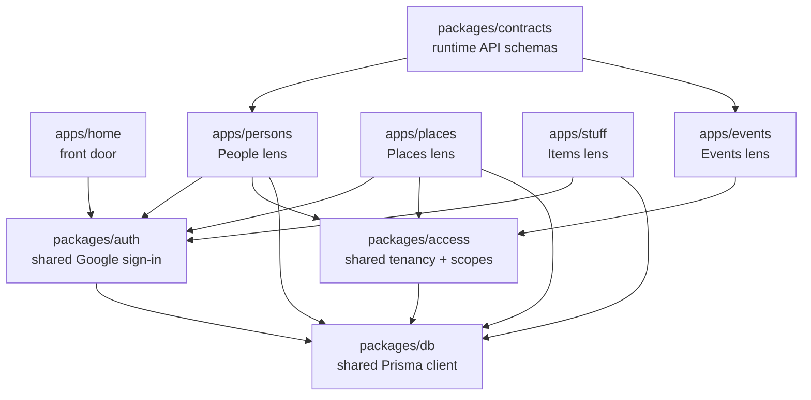

# Life OS App Architecture

Life OS is one private data graph with multiple focused apps on top.

## Shape

## Rules

- Each product surface can stay its own app when the workflow is distinct.
- The database is shared. Apps should not create separate data silos.
- Auth policy lives in `packages/auth`; app-level `auth.ts` files should stay thin wrappers.
- Workspace selection, session-to-user resolution, disabled-user handling, default roles/scopes, and access caching live in `packages/access`; apps provide their Auth.js session adapter and error/audit adapters.
- Runtime request contracts live in `packages/contracts`; route adapters translate schema failures into each app's stable API error envelope.
- Session cookies can be shared across subdomains by setting `AUTH_COOKIE_DOMAIN` or `LIFE_OS_COOKIE_DOMAIN` to the parent domain, for example `.lifeos.example`.
- Production apps must share the same `AUTH_SECRET` or `NEXTAUTH_SECRET`.
- Local development uses a dev-only fallback secret when no secret is present.
- The home, Persons, and Places apps may bypass sign-in for an explicit local review by setting
  `LIFE_OS_LOCAL_REVIEW=1`; this bypass is disabled whenever `NODE_ENV=production`.

## Current Apps

- `apps/home`: Life OS front door.
- `apps/persons`: People, interactions, inbox, admin, imports, Gmail, Calendar, iMessage.
- `apps/places`: Places, place profiles, visits, Google location import review.
- `apps/stuff`: Items and inventory.

## Next Layer

Add shared packages only when duplication is real:

- `@life-os/domain`: shared commands and queries across primitives.
- `@life-os/app-shell`: shared app frame, account menu, and navigation.
- `@life-os/ui`: reusable visual components.

The guiding rule: separate apps for separate workflows, shared packages for shared truth.
