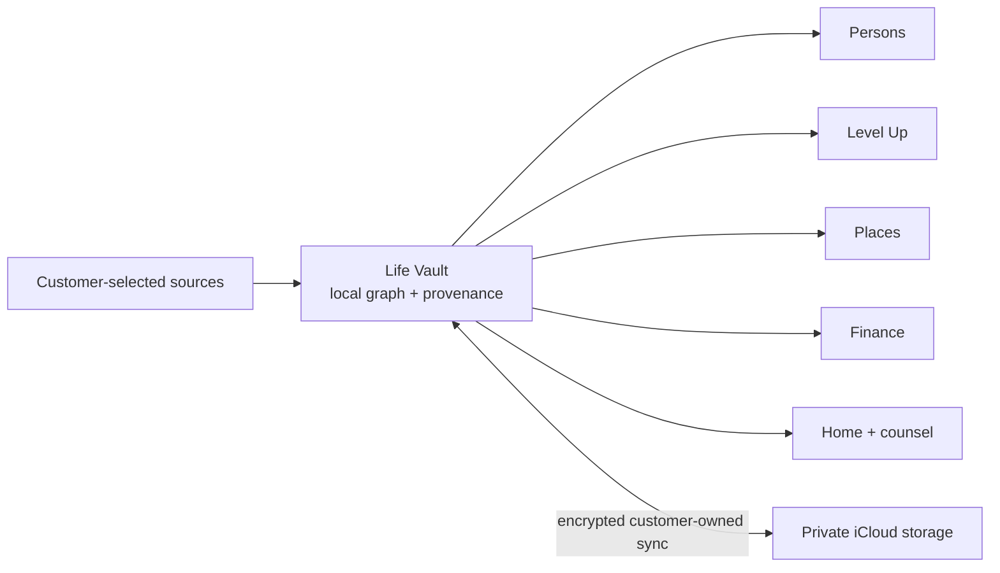
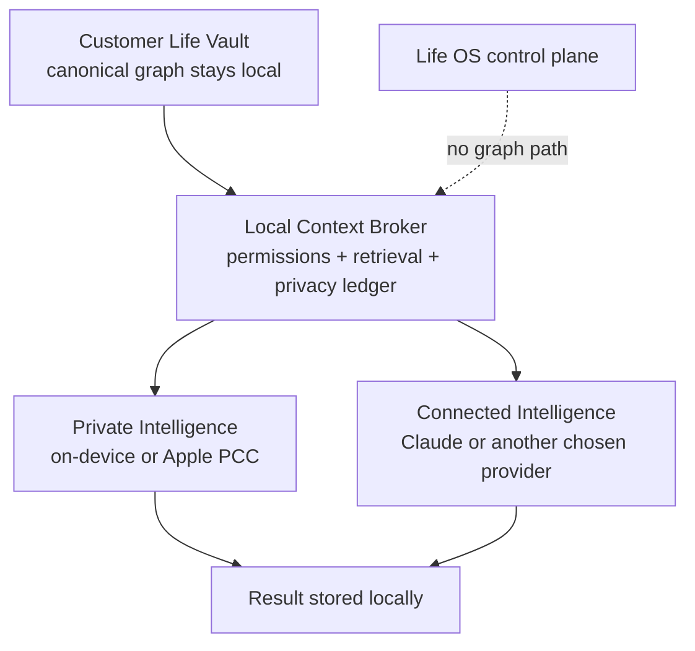

# Life OS ecosystem and privacy strategy

Status: product direction. The storage decision it argues for is recorded in
[ADR 0004](adr/0004-customer-life-vault.md) with status `proposed` — staged behind proof gates and
not yet accepted. This document explains *why* and *what it should feel like*; the ADR is what
governs and what supersedes `docs/IOS_PLATFORM_PLAN.md` §7. Where the two disagree, the ADR wins.
Date: 2026-08-12

## The product

Life OS is not a collection of apps that happen to share an account. It is one
customer-owned life graph with multiple lenses over it.

The graph exists from the moment someone enters the ecosystem. Installing Persons,
Level Up, or a future Finance experience creates the same eight-primitive graph in
the background. Each product adds evidence to that graph and exposes the part of it
that makes sense for the job at hand:

- Persons contributes people, groups, relationship declarations, messages, meetings,
  and follow-through.
- Level Up contributes workouts, health states, recovery signals, and training plans.
- Places contributes visits and the meaning attached to locations.
- Finance contributes transactions and obligations as evidence connected to existing
  people, places, items, events, and plans; it does not create a separate financial
  identity.
- Home and the Assistant reason across all enabled domains. This cross-domain view is
  the digital twin.

Someone may buy only Persons and never see the rest of Life OS. They still own a real
Life OS graph underneath it. Adding another product makes the existing graph richer;
it does not start a new account or data silo.

## The Life Vault

The customer product should be **device-first**, not merely offline-capable. Its
canonical store is a local encrypted database called the Life Vault. The vault holds
the graph, source provenance, declarations, corrections, review state, and derived
claims. Raw databases, recordings, granular location traces, attachments, and other
high-volume source material remain local unless the customer explicitly exports or
shares them.

The app may synchronize the vault through the customer's private iCloud storage so it
works across their Apple devices. CloudKit's private database is a useful transport:
its contents belong to the iCloud user, count against that user's quota, and are not
visible in the developer portal. That alone is not a sufficient zero-access promise.
Standard iCloud protection and end-to-end protection are different, and CloudKit must
retain some structure to synchronize records.

Therefore the preferred high-privacy design is:

1. Generate a vault encryption key on the customer's device.
2. Keep recoverable key material in the customer's iCloud Keychain / trusted-device
   keychain, never in Life OS infrastructure.
3. Encrypt sensitive graph payloads before synchronization. Use CloudKit private
   records or encrypted assets as transport, with only the minimum sync metadata
   exposed.
4. Query, join, index, and derive the graph on the customer's devices.
5. Give the customer a complete decrypted export that they initiate locally.

This deliberately trades server-side querying, web access, background cloud jobs,
and easy support inspection for sovereignty. A web product cannot silently share the
same guarantee: decrypting a vault in an ordinary browser introduces delivery and key
handling risks and should be treated as a later, explicitly weaker mode.

## The company boundary

Life OS, the company, provides:

- the graph schema and migration engine;
- native UI and domain features;
- source connectors that run on the customer's devices;
- deterministic derivations, review workflows, and local automations;
- AI orchestration code and model adapters;
- App Store entitlement validation, release delivery, and privacy-safe operational
  telemetry.

Life OS infrastructure should not receive the customer's graph, raw sources, prompts,
model responses, embeddings, or derived life claims in the private mode. It may hold
the minimum commercial control-plane data required to operate the product: account or
anonymous entitlement identifier, subscription state, app/schema version, aggregate
crash diagnostics, and opt-in support material. Control-plane records must not contain
life-graph identifiers or content.

No remote notification should contain sensitive graph content. The device schedules
and renders private nudges locally. Diagnostics are content-free by default; sharing a
diagnostic bundle or vault excerpt is a deliberate, scoped customer action with a
preview and expiration.

## Two customer-chosen intelligence paths

AI access, Life OS company access, and where the graph is stored are three independent
choices. A customer can keep the canonical graph in their Life Vault while allowing a
cloud model broad access to reason across it. The product must not imply that choosing
stronger intelligence moves ownership of the graph to Life OS.

Life OS should offer two equally *legitimate* paths. Connected Intelligence is not a discouraged
exception or a grudging concession — it is the right choice for someone who knowingly values
frontier model capability more than maximum data isolation, and the product must not shame that
choice or bury it.

Equally legitimate is not the same as equally frictionless, and the plan should be honest about
the gap. Private Intelligence is the default and works with no setup. Connected Intelligence in v1
requires the customer to bring their own provider API key ([ADR 0004](adr/0004-customer-life-vault.md),
decision 5), which is a developer-grade step that most consumers will not take. That is a
deliberate v1 trade — it keeps Life OS out of the content path entirely — not a judgment about
which path a customer *should* pick. Closing that gap without becoming a plaintext proxy is real
future work, not a detail.

### Path A: Private Intelligence

This is the strongest privacy posture:

- Deterministic retrieval, graph calculations, and routine automations run locally.
- Apple's on-device Foundation Models framework, or another installed local model,
  handles extraction, summarization, classification, and bounded counsel tasks.
- Where Apple makes the capability and entitlement available, the customer may use
  Private Cloud Compute directly for enhanced reasoning. It must be labelled as
  Apple-operated off-device processing, not on-device inference.
  **Do not plan a shipping feature on this.** What is dependable today is the on-device
  Foundation Models framework; third-party access to PCC as a directly addressable
  inference path is not something to commit to a roadmap or to customer-facing copy
  until it is verified against the current OS and entitlements. Private Intelligence
  must be a complete, useful path with on-device models alone.
- Prompts, responses, embeddings, and life claims never pass through Life OS
  infrastructure.
- External model providers receive no graph content.

The cost is smaller context windows, weaker reasoning on some tasks, device and OS
requirements, and less continuous background intelligence when the customer's devices
are unavailable.

### Path B: Connected Intelligence

This path lets a customer deliberately connect Claude or another frontier provider and
grant it anything from one-time access to unrestricted read access across the graph.
The provider connection runs from the customer's device through a local **Context
Broker**. Life OS infrastructure does not proxy or log graph content.

"Full graph access" means the provider is authorized to call read tools across every
enabled domain. It does not mean uploading a database dump into every conversation.
The model asks for people, interactions, health trends, plans, transactions, or source
evidence as needed; the broker runs those queries locally and returns the results. This
preserves model capability while reducing unnecessary disclosure, context-window use,
and cost. An explicit full export or whole-vault analysis remains possible, but is a
separate high-disclosure action with an estimate and confirmation.

Joseph's selected personal posture can therefore be:

> Claude may read every domain and all historical evidence in my Life Vault, use it
> for whole-life reasoning, and call any read-only graph tool. It may not send a
> message, move money, delete data, or make another consequential change without my
> confirmation.

The provider sees every result returned to it. Connected Intelligence must never be
described as data staying on-device, even though the canonical vault remains local and
Life OS itself does not receive the content.

### Access is a grant, not one privacy toggle

Each connected model receives an explicit, local `AIGrant` containing:

- provider, product, account, and model family;
- allowed domains: Persons, communications, health, location, finance, plans, items,
  notes, or all current and future domains;
- allowed evidence depth: derived facts only, normalized records, raw source text, or
  attachments;
- time window: current request, session, fixed duration, or until revoked;
- subjects: selected people/groups or the complete life graph;
- operations: search, read, synthesize, propose, or act;
- action ceiling: read-only, safe local writes, review required, or confirm every
  consequential action;
- whether proactive/background counsel is allowed;
- applicable provider retention, training, caching, file-upload, and third-party tool
  policies acknowledged at grant time.

The default Connected grant should be session-scoped and read-only. "All my life,
until revoked" is a legitimate deliberate selection. New data domains do not silently
inherit access unless the customer selected **all current and future domains** and the
new domain's sensitivity disclosure has been acknowledged.

Revoking a grant immediately removes the provider's tools and local credential. It
cannot retract information already disclosed to or retained by the provider; the UI
must say that plainly and offer the provider's deletion path where available.

### Provider connection choices — decided

This was the largest unanswered commercial question in the first draft of this document. It is
settled in [ADR 0004](adr/0004-customer-life-vault.md), decision 5:

- **v1 Connected Intelligence is bring-your-own-key.** A customer-owned commercial API credential
  lives in the device Keychain and requests go device-to-provider. Life OS is never in the content
  path, and the provider's own commercial privacy terms apply directly to the customer. This
  reuses the pattern already in the schema: `AiProviderCredential`
  (`packages/db/prisma/schema.prisma:1401`) already stores an encrypted per-provider API key.
- **Life OS-proxied managed inference is out of scope for v1** and needs its own ADR. If Life OS
  proxies plaintext prompts for authentication, billing, moderation, caching, or observability,
  Life OS processes that content and can no longer claim zero company access. Blind entitlement
  tokens can separate subscription validation from model requests, but that design must be
  independently reviewed before the claim is made.

The accepted cost is real and should not be softened in product copy: BYOK is a developer-grade
onboarding step, so Connected Intelligence is not a mass-market feature at launch. Private
Intelligence is what a customer gets with no setup. This is the right trade while there are zero
customers, and it keeps the expensive decision reversible.

Provider product type matters, and the specific route matters more than the brand. For example,
Anthropic currently says standard commercial API inputs and outputs are normally deleted within 30
days and are not used for model training by default. A separately approved zero-data-retention
arrangement applies only to eligible API traffic and products using that commercial key; Files API,
explicit prompt caching, batch features, web search, consumer Claude products, and other features
can have different retention boundaries. Life OS must display the terms for the exact connected
route, not merely the provider's name. See Anthropic's current
[commercial retention explanation](https://privacy.anthropic.com/en/articles/7996866-how-long-do-you-store-my-organization-s-data)
and [zero-data-retention scope](https://privacy.anthropic.com/en/articles/8956058-i-have-a-zero-data-retention-agreement-with-anthropic-what-products-does-it-apply-to).

**These terms will go stale.** Every provider statement quoted anywhere in Life OS must be
re-verified against the provider's live policy at the time the grant screen is built and again
before each App Store submission, and the disclosure must be sourced from a dated, versioned record
in the app rather than hardcoded prose. A privacy claim that was accurate eighteen months ago and
is displayed as current is a false statement to the customer regardless of intent.

## AI data minimization contract

Regardless of model or grant breadth, the Assistant should not receive the entire vault
in every request. A full-access model is allowed to retrieve anything, but retrieval
remains task-directed unless the customer explicitly initiates whole-vault analysis.
Every request follows this local pipeline:

1. Interpret the request locally.
2. Select the smallest relevant graph subgraph and time window.
3. Prefer computed facts over raw messages, transcripts, or transactions.
4. Enforce the active `AIGrant`; show an evidence preview when the grant or requested
   data requires one.
5. Redact unnecessary names and identifiers where the task allows it.
6. Attach provenance to returned claims.
7. Store the Life OS copy of the response locally; disclose when the connected
   provider separately retains a conversation.
8. Require confirmation for outbound, financial, destructive, identity-sensitive, or
   otherwise consequential actions.

Life OS may never train its own or a third-party model on customer data. A customer may
explicitly connect a provider product whose own terms include opt-in training, but that
choice must be specific and reversible at the provider. Product analytics may measure
that an AI feature ran, its duration, model class, coarse token band, and
success/failure only; it may not capture prompts, outputs, entity names, graph rows,
embeddings, inferred claims, or grant contents.

Every disclosure produces an on-device `AIRequestReceipt`: provider, model, grant,
purpose, queried tools, evidence classes, approximate record and token counts, time,
and outcome. Content is not duplicated into the receipt. The privacy dashboard can
answer "What has Claude seen?" without Life OS receiving the answer.

## The people in the graph

Everything above is written from the account holder's point of view. But a Persons graph is mostly
data *about people who are not the customer* — contacts, message bodies, meeting transcripts,
call history, photographs of other people's faces. Those people never signed up, never saw a
consent screen, and in most cases do not know the graph exists. A privacy strategy that only
protects the buyer is not a privacy strategy; it is a sales position.

This is not a footnote to the vault design. It changes it:

- **Local-first genuinely helps here, and is part of the argument for it.** If Life OS never
  receives the graph, Life OS is not holding a database of third parties' communications. This is
  the strongest practical answer available to the problem, and it is a reason to prefer the vault
  over per-customer cloud storage independent of what the buyer wants for themselves.
- **Connected Intelligence discloses other people's data, and the UI must say that in those
  words.** "Claude may read every domain and all history" means a third-party provider receives
  messages written by named people who are not party to the grant. The grant screen may not
  describe this as sharing *your* data.
- **Per-subject exclusion must exist before Connected Intelligence ships.** A person or group
  marked never-share is excluded from every retrieval, in every domain, by the Context Broker
  rather than by prompt instruction. This is a hard filter at the tool boundary; a model cannot be
  asked politely not to look. Excluding someone must also exclude them from group aggregates that
  would re-identify them.
- **Deletion has to reach the graph, not just the UI.** If someone asks to be removed, the customer
  needs one action that removes that person, their messages, their derived claims, and their
  presence in cached derived reads — locally and in every synced copy. Design for it now; it is far
  harder to retrofit onto an encrypted sync layer than to build in.
- **Sensitive-inference restraint.** A graph that spans messages, location, health, and finance can
  derive things about third parties — relationships, health, religion, immigration status,
  sexuality — that the customer never asked for and the subject never disclosed. Derived claims
  about non-customers should stay minimal, provenance-bearing, and reviewable rather than being
  generated speculatively because the data allows it.

**Legal posture is unresolved and needs counsel, not engineering judgment.** The open questions:
whether the personal-and-household exemption that covers a private address book survives a product
sold as a professional CRM; whether Life OS is a processor, a joint controller, or outside scope
when it never receives the data; what a subject access or erasure request means when the company
cannot read the database it would have to search; and how iMessage/WhatsApp ingestion interacts
with recording and interception rules across jurisdictions. Get this reviewed before App Store
submission, not after the first request arrives. [ADR 0004](adr/0004-customer-life-vault.md) fixes
the engineering requirements that any legal answer will need; it does not pretend to answer them.

## Product promise and honest language

The target promise leads with the customer's choice, not with what Life OS abstains from. Leading
with "Life OS cannot browse or sell your life graph" while a fully supported path streams whatever
a model asks for reads as misdirection, even though both statements are true:

> Your Life Vault lives on your devices and, if you choose, in encrypted storage tied to your Apple
> account. You choose how it is used: **Private Intelligence** keeps reasoning on your device or on
> Apple's private servers and sends nothing to an outside model, or **Connected Intelligence** lets
> a provider you choose — such as Claude — read the parts of your life you authorize, including all
> of it. Whichever you pick, Life OS itself does not receive your graph, cannot browse it, and
> cannot sell it. Life OS shows exactly what each provider can reach, keeps an on-device record of
> what was disclosed, and asks before anything is sent, spent, or deleted.

Two disciplines make that promise survivable:

**Do not overstate encryption.** Avoid claiming simply that "iCloud is end-to-end encrypted" or "we
can never access your data" until the exact field encryption, key recovery, telemetry, AI paths,
export, and support paths have been verified. CloudKit private access, Advanced Data Protection,
application-level encryption, and on-device processing are four separate properties and are
routinely conflated in marketing copy.

**Never describe Connected Intelligence as private.** The moment a customer enables it, the
accurate sentence is that their chosen provider sees what it retrieves and retains it under that
provider's terms. The vault staying local protects against Life OS; it does not protect against the
provider the customer deliberately invited in. Any screen, App Store description, or support answer
that blurs those two is a false claim — including by omission, and including when it is technically
defensible.

## Architectural consequences — what this actually costs

This direction changes the commercial architecture far more deeply than database-per-user Turso
would. The first draft of this document listed the consequences as bullets without sizing any of
them, which made an expensive rewrite read like a configuration change. Stated honestly:

**The domain layer needs a second implementation.** 36 non-test files under `packages/` import
`@life-os/db` directly. `packages/domain`, `packages/automation`, `packages/intelligence`,
`packages/alignment`, and `packages/access` are roughly 7,100 non-test lines written against the
Prisma client — including the `db.$transaction` guarantee that [ADR 0002](adr/0002-graph-event-spine.md)
made load-bearing, where every canonical command writes its records and its `GraphEvent` atomically
and `GraphEventReceipt`'s unique `(event, consumer)` pair *is* the idempotency guarantee. A local
vault does not need a different driver. It needs those semantics reproduced in Swift against GRDB
and kept identical indefinitely. "Portable contracts and test vectors" is the mitigation, not the
size of the job.

**The existing customer-facing web surface goes away.** Persons, Home, Places, Level Up, Events,
Stuff, and Assistant are Next.js apps that read the cloud database directly. Vault-backed
customers cannot use any of them. The saleable product becomes Apple-native or it does not exist —
and decrypting a vault in an ordinary browser is a materially weaker mode, not a port. This is the
single largest thing being given up and it should be said out loud in every discussion of the
trade, not filed under "cross-platform becomes harder."

**Cloud jobs need device-run equivalents.** Gmail, calendar, finance, synthesis and automation
currently run server-side on a schedule. Each needs a device-run equivalent, or must be described
to customers as an optional cloud-processing mode with its own, weaker privacy story.

**New product surface the cloud currently gives free.** Local search, indexing, derived read
models, background processing, storage monitoring, export, repair, and recovery UX all become work
someone has to build and support.

**Migrations get harder in a specific way.** Schema changes must run safely on vaults that have
been offline for months and may be several versions behind, on a device, without a DBA and without
a rollback window.

**Entitlement must work blind.** Subscription and feature checks have to function without the
control plane learning anything about the graph.

**Sequencing consequence.** Joseph's personal Life OS continues on the cloud-backed graph while
this is built — but as the *first* vault tenant, not an indefinite exception (see
[ADR 0004](adr/0004-customer-life-vault.md), decision 3, and Sequencing below). Personal and
customer storage may differ temporarily; primitive semantics, command contracts, provenance, and
feature behavior may not. The goal is convergence on the customer-owned vault, not a permanent
fork where the person who wrote the sovereignty requirement is the only one who never gets it.

**The opportunity cost is the real risk.** There is one developer and one working system that is
used every day. Every week spent on vault architecture is a week not spent on the personal Life OS
or on the five §7 blockers that stand between Persons and a first paying customer — none of which
this direction addresses. [ADR 0004](adr/0004-customer-life-vault.md) names starving the working
system as an explicit abandonment criterion for exactly this reason.

## Validation gates before making the promise

- Demonstrate that a network observer sees no graph content during ordinary local use.
- Prove Life OS servers receive no graph, prompt, response, embedding, or source data.
- Inspect CloudKit records and metadata; document exactly what remains visible.
- Test new-device recovery, lost-device recovery, Keychain reset, iCloud disabled/full,
  offline migration, conflict resolution, and account deletion.
- Verify on-device and PCC model routing independently; fail closed rather than
  silently sending a request to a different model.
- Verify every Connected Intelligence request against the active grant and prove that
  a revoked provider can no longer query the vault.
- Test Joseph's deliberate full-read Claude grant across every domain while preserving
  confirmation gates for outbound, financial, destructive, and identity-sensitive
  actions.
- Red-team indirect prompt injection from emails, documents, calendar descriptions,
  and financial text. A model reading a customer's inbox is reading attacker-controlled
  text; the confirmation gate on consequential actions is the load-bearing defense and
  must be proven to hold under adversarial content, not assumed.
- Make every remote AI request visible in an on-device privacy ledger with destination,
  purpose, evidence classes, time, and outcome.
- Prove the control plane is content-free with a test over its schema, not by review
  discipline — no life-graph identifiers, names, or content in any control-plane record.
- Prove per-subject exclusion holds at the tool boundary: a person or group marked
  never-share is unreachable by any retrieval in any domain, including via group
  aggregates that would re-identify them.
- Prove third-party erasure works end to end: removing a person removes their records,
  their derived claims, and their traces in cached derived reads, locally and in every
  synced copy.
- Prove the two store implementations still agree — the conformance suite passes on both
  `PrismaGraphStore` and `LifeVaultStore` on every release, with no manual reconciliation.
- Have the final customer claims and cryptographic design reviewed independently before
  App Store launch, and have the third-party data obligations reviewed by counsel
  (see "The people in the graph") before submission rather than after.

None of these are self-certifiable. "I tested it and it looked right" is not a pass on any line
above that touches key handling, erasure, or a customer-facing claim.

## Sequencing

Reordered from the first draft, which put validation against Joseph's real graph at step 6 — after
the entire AI stack. That ordering meant the sovereignty architecture would ship to strangers
before the person who wrote the sovereignty requirement had ever run it, and it deferred the only
step that honestly sizes the work. Real data comes early now.

Each step maps to a gate in [ADR 0004](adr/0004-customer-life-vault.md); a step is not finished
until its gate passes.

1. **Extract the contracts first, before any Swift storage code.** Command and read contracts plus
   language-neutral fixtures, with the *current* Prisma implementation passing them unmodified. If
   today's code cannot pass its own extracted contract, the contract is wrong. This step is worth
   doing on its own merits — it is a regression net over `packages/domain` even if the vault never
   ships — and it is the only step that is free to abandon.
2. **One vertical slice against both stores.** `captureNote` → `Note` + `GraphEvent`, identical
   canonical output from `PrismaGraphStore` and a synthetic `LifeVaultStore`. Prove semantic parity
   on the smallest possible surface before widening.
3. **Widen the vault to the eight primitives** with provenance, migrations, local queries, and
   encrypted export, still on synthetic data.
4. **Run Joseph's real graph in shadow mode.** Replay into a local vault and compare canonical rows
   and derived reads against the Turso system, which stays canonical throughout. Nothing existing
   is disabled. This is where the true cost becomes visible, and it is deliberately before the
   expensive AI and sync work rather than after it.
5. **Add encrypted Apple-device sync, then break it on purpose.** New-device restore, lost device,
   Keychain reset, iCloud disabled, iCloud full, offline migration across several schema versions,
   conflict resolution, account deletion — plus written documentation of exactly what CloudKit
   records and metadata remain visible. Recovery failures found here are the ones that cannot be
   fixed after vaults exist in the wild.
6. **Put Persons and Workout feature packages over the proven vault.**
7. **Deterministic and on-device intelligence before any remote model.** Local retrieval and
   evaluation must work and fail closed first.
8. **Add the Context Broker, `AIGrant`, `AIRequestReceipt`, per-subject exclusion, and the privacy
   dashboard** — then Connected Intelligence on top of them, never before.
9. **Only after parity, recovery, and grant enforcement all pass**, and after independent
   cryptographic and legal review, make the Life Vault the commercial foundation and start a small
   design-partner pilot.

Nothing in steps 1–5 requires a single line of the existing personal system to be disabled, and
nothing before step 9 makes a promise to a customer. That is intentional: this plan should be
abandonable at any point up to step 9 with no user-visible damage and no orphaned commitment.
