# Persons Architecture Map

This is the plain-English map of how the Persons app is currently wired.

This is a living document. Codex and Claude should update it whenever the Persons app gains or changes inputs, outputs, APIs, domain command flow, rules/automation behavior, database models, integrations, or deployment/runtime plumbing.

Think of the app as four layers:

1. **Inputs**: places information comes from.
2. **Front doors**: UI pages, APIs, and scripts that receive that information.
3. **Plumbing**: domain commands that decide what should happen.
4. **Memory**: the database tables where Persons stores the result.

## Big Picture

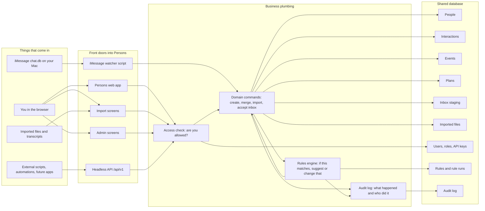

## The Main Flows

### 1. You use the app in the browser

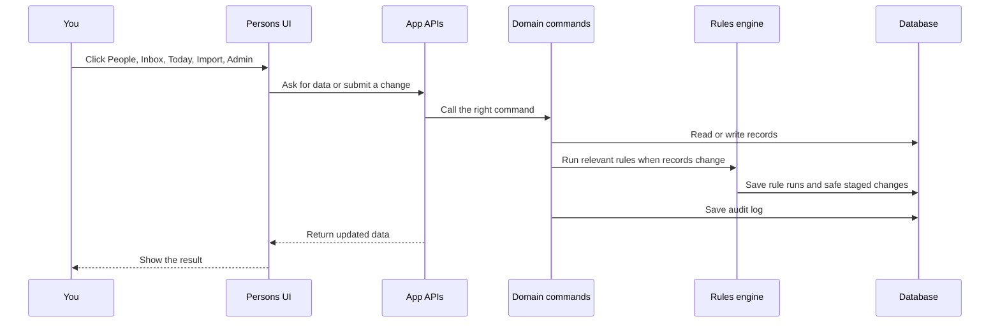

In plain English: the UI does not directly make database decisions. It asks an API, the API calls a command, and the command updates the database.

### 2. iMessage sync

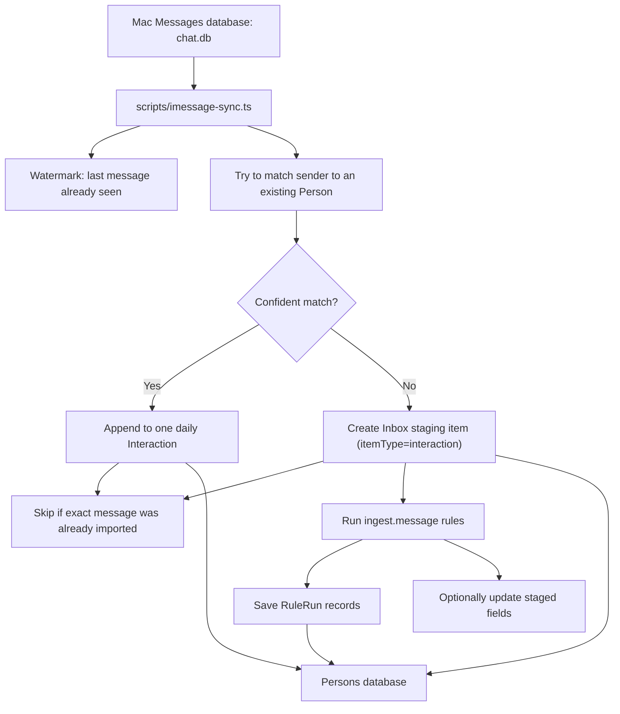

Important idea: unmatched iMessages do not create random new people anymore. They go to the Inbox staging area where you can review them.

### 2b. Staging from any external source

Any external script or automation can push items into the inbox via the API. This is the universal staging path — not limited to iMessage.

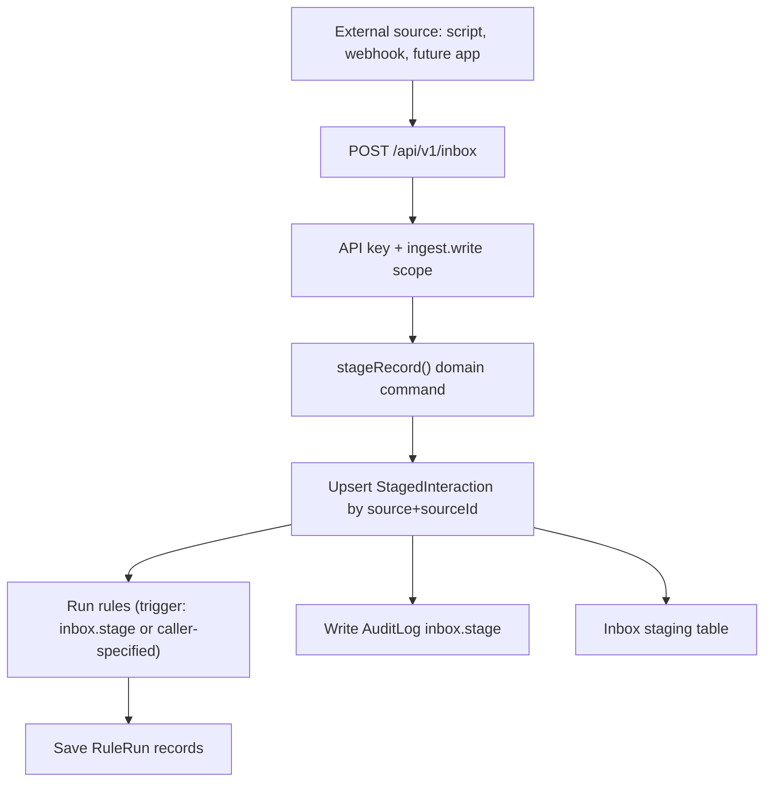

The `itemType` field on the staged record tells the inbox what kind of record to create when accepted (currently `interaction` is the only handled type).

### 3. Import flow

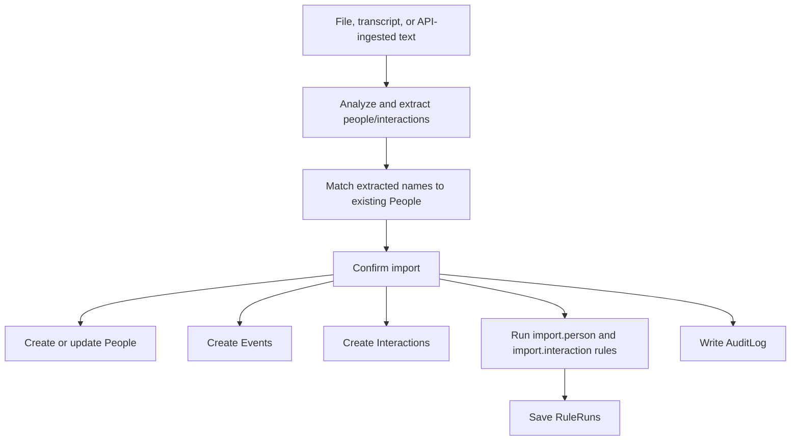

Plain English: import is a bulk way to turn messy text into structured People, Events, and Interactions.

### 4. Inbox review flow

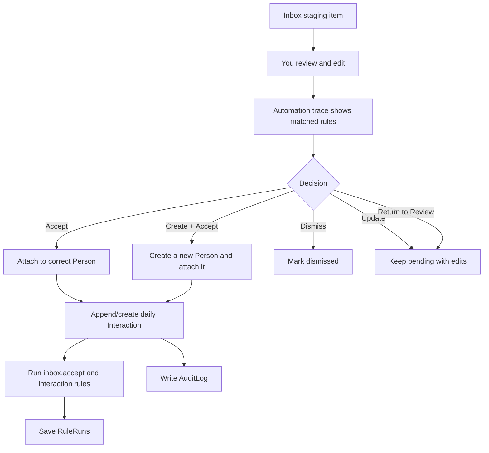

Plain English: Inbox is the human filter between automation and your real CRM memory. If an incoming interaction belongs to someone who is not in People yet, the Inbox can create the Person from the staged name, email, or phone and accept the interaction in the same review step.

### 5. Data cleaning view

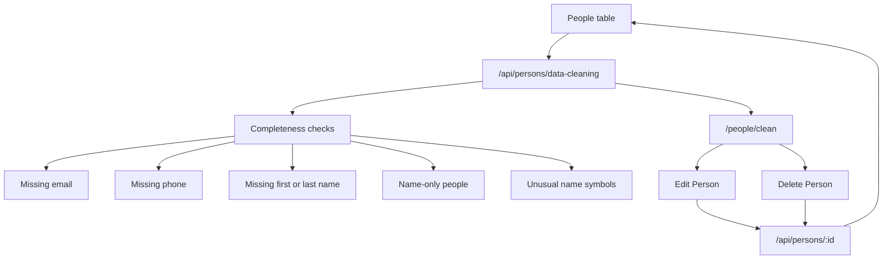

Plain English: the Data Cleaning page is a focused People quality view. It counts sparse records, lets you filter and sort by the kind of cleanup needed, and sends edits or deletes through the same Person APIs used by the rest of the app.

## API Plumbing

There are two API families.

### App APIs

These power the web app itself. They are mostly behind your normal login.

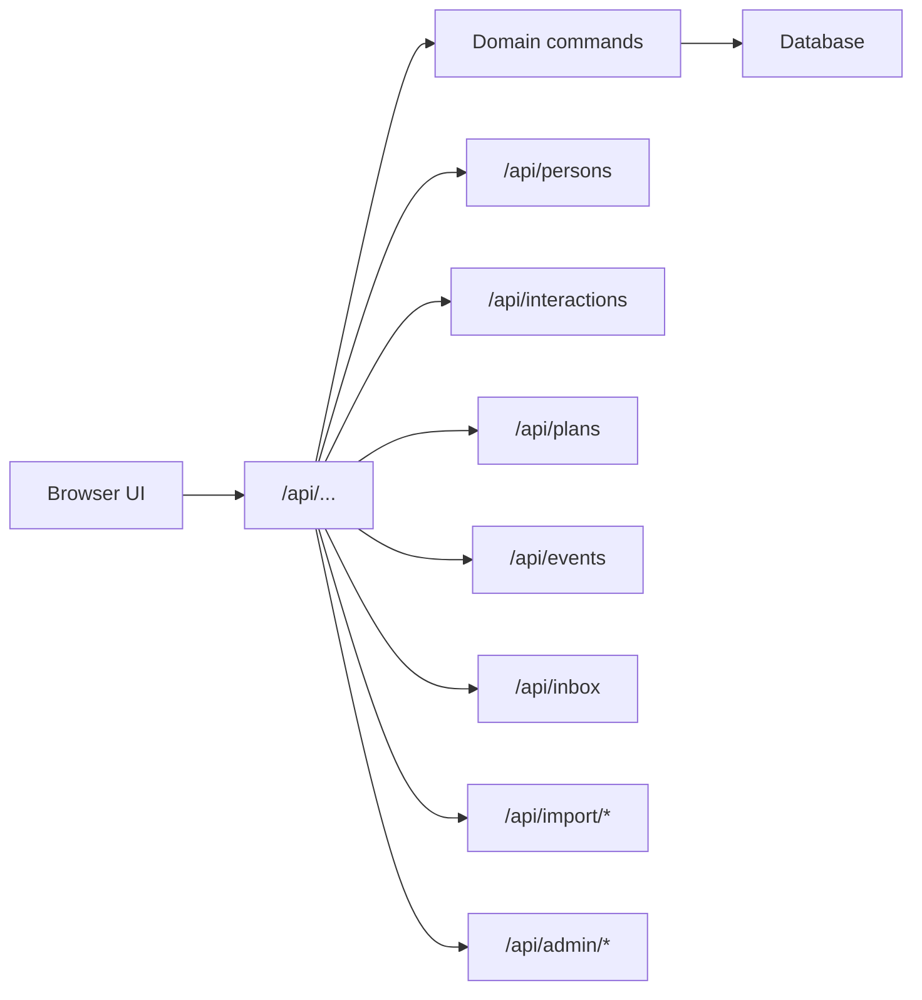

### Headless APIs

These are for scripts, automations, and future apps. They use API keys and scopes.

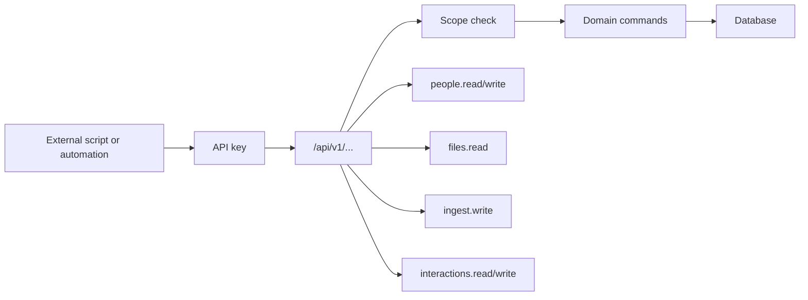

Plain English: the headless API is how Persons can become programmable. Anything the UI can do should eventually have an API-shaped path too.

## Access Control

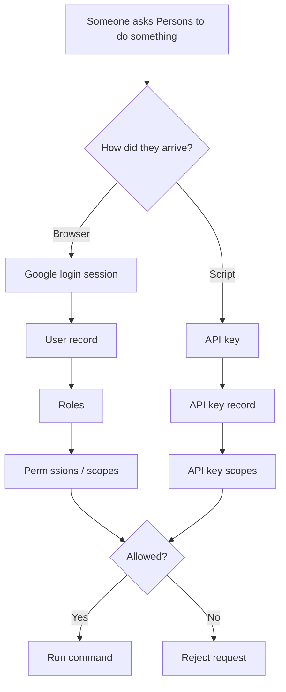

Examples:

- `people.read`: can read People.
- `people.write`: can create or edit People.
- `ingest.write`: can run import/ingest flows.
- `rules.manage`: can create or edit rules.
- `audit.read`: can view the audit log.
- `*`: owner-level access.

### Workspace tenancy

Persons is moving from "Joseph's private CRM" toward "approved people can each have their own private CRM space."

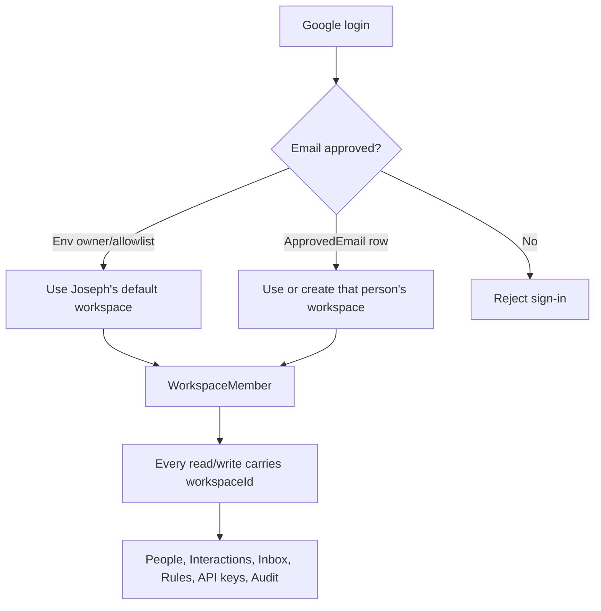

Plain English: a login is allowed only when the email is in `OWNER_EMAILS`, `ADMIN_EMAILS`, `ALLOWED_EMAILS`, is the first user in an empty database, or has an approved `ApprovedEmail` record. Once allowed, the user gets a `WorkspaceMember` record. All core People memory then belongs to that workspace through `workspaceId`.

The current migration preserves existing data in `default-workspace`. Owner and env-allowlisted emails land there. Future approved emails can be attached to a specific workspace or can create their own clean workspace on first sign-in. API keys also carry `workspaceId`, so headless API calls read and write inside the same boundary as browser users.

## Rules Engine

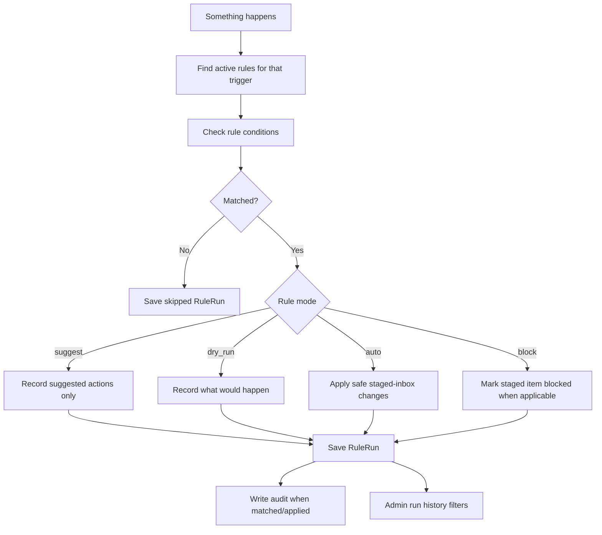

Current triggers include:

- `ingest.message`
- `import.person`
- `import.interaction`
- `interaction.create`
- `interaction.append`
- `inbox.accept`

Current safe auto-apply target:

- Inbox staging items only.

That means rules can safely help triage incoming automation records, without unexpectedly editing your canonical People or Interaction history.

## Database Memory

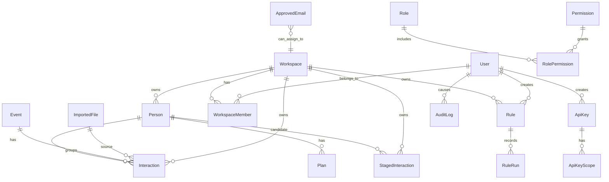

Plain English version:

- **Person**: a human in your CRM.
- **Interaction**: a thing that happened with a person.
- **Event**: a grouping around an interaction, such as a message day, meeting, call, dinner, or imported event.
- **Plan**: what you want to do next with a person.
- **StagedInteraction**: universal inbox item waiting for review. Any source can stage a record here. The `itemType` field (`interaction`, `person`, `event`) indicates what kind of record will be created when accepted.
- **ImportedFile**: source material that was uploaded or ingested.
- **Rule**: an automation decision you configured.
- **RuleRun**: a receipt showing whether a rule matched.
- **AuditLog**: a receipt showing who or what changed something.
- **User, Role, Permission, ApiKey**: access-control system.
- **Workspace, WorkspaceMember, ApprovedEmail**: tenancy system. These decide who can sign in and which private workspace their People data belongs to.

## Outputs

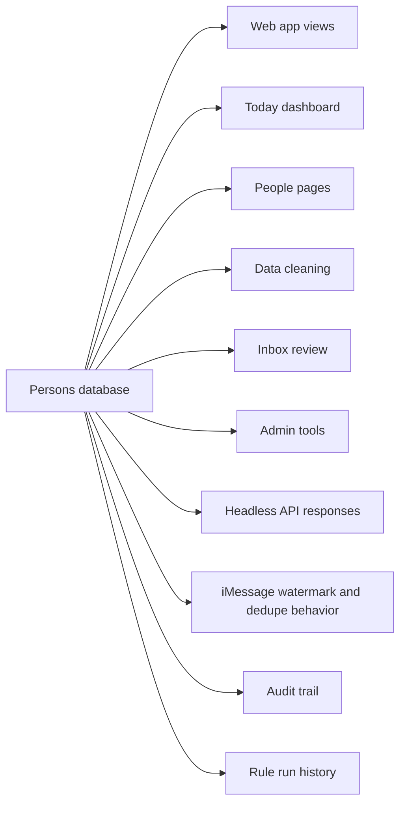

Plain English: the database is the source of truth. The UI, API, admin screens, audit log, and future automations all read from it.

## Mental Model

If you only remember one thing:

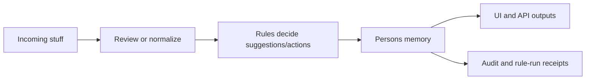

The architecture goal is:

- Automations can bring in lots of data.
- Rules can sort and suggest.
- You stay the filter when confidence is low.
- The database remains clean and traceable.
- APIs make everything programmable later.

## Current Journey

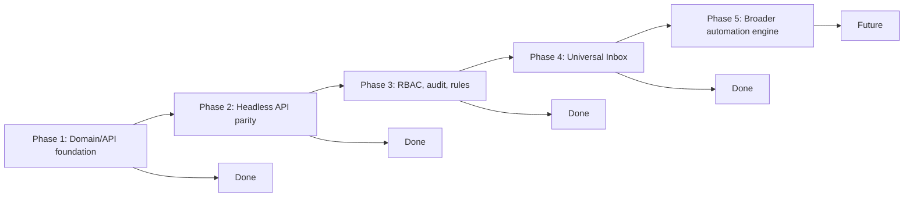

### Done

- Core writes now move through domain commands instead of scattered UI/database calls.
- API keys, roles, permissions, and audit logs exist.
- Rules can be created, tested, run, and recorded.
- iMessage, import, interaction, and inbox acceptance paths now trigger rule evaluation.
- Admin is hidden under the profile menu, and the architecture map is a living document.
- Full headless API parity: all major resources (people, interactions, events, plans, inbox, imports, rules, dedupe, audit) available under `/api/v1/`.
- Universal Inbox: `StagedInteraction` now has an `itemType` field; any external source can stage records via `POST /api/v1/inbox` using the `stageRecord()` domain command. Rules fire automatically on staging.
- Data Cleaning: `/people/clean` highlights People records missing email, phone, names, or broader context, and supports editing or deleting those People from the cleanup view.
- Inbox create-and-accept: an unmatched staged interaction can create a new Person and attach the interaction in one review action.
- Workspace tenancy foundation: approved emails can sign in without inheriting Joseph's data, core browser/API paths carry `workspaceId`, existing data is preserved in `default-workspace`, and API keys are scoped to the workspace that created them.

### Future

The next larger step is the broader automation engine:

- Scheduled jobs and event triggers.
- Notifications or digests.
- Safer action approval flows.
- More rule actions beyond staged inbox fields.
- Multiple `itemType` accept handlers (currently only `interaction` is handled on accept).
- Inbox filtering by `source` and `itemType` in the UI.
- Admin UI for approving emails and choosing whether an approved person gets their own workspace or joins an existing one.
