# Persons Architecture Map

This is the plain-English map of how the Persons app is currently wired.

This is a living document. Codex and Claude should update it whenever the Persons app gains or changes inputs, outputs, APIs, domain command flow, rules/automation behavior, database models, integrations, or deployment/runtime plumbing.

Think of the app as four layers:

1. **Inputs**: places information comes from.
2. **Front doors**: UI pages, APIs, and scripts that receive that information.
3. **Plumbing**: domain commands that decide what should happen.
4. **Memory**: the database tables where Persons stores the result.

## Big Picture

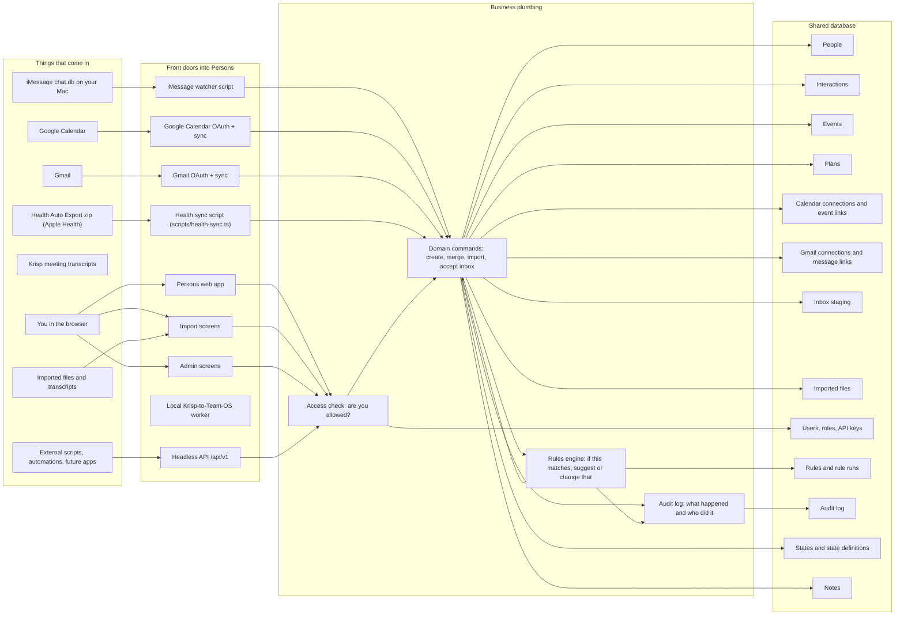
```mermaid
flowchart LR
  subgraph Inputs["Things that come in"]
    Human["You in the browser"]
    IMessages["iMessage chat.db on your Mac"]
    GoogleCalendar["Google Calendar"]
    Gmail["Gmail"]
    Krisp["Krisp meeting transcripts"]
    Files["Imported files and transcripts"]
    ExternalTools["External scripts, automations, future apps"]
    HealthExport["Health Auto Export zip (Apple Health)"]
  end

  subgraph FrontDoors["Front doors into Persons"]
    UI["Persons web app"]
    ImportUI["Import screens"]
    AdminUI["Admin screens"]
    PublicAPI["Headless API /api/v1"]
    Watcher["iMessage watcher script"]
    CalendarOAuth["Google Calendar OAuth + sync"]
    GmailOAuth["Gmail OAuth + sync"]
    KrispWorker["Local Krisp-to-Team-OS worker"]
    HealthSync["Health sync script (scripts/health-sync.ts)"]
  end

  subgraph Plumbing["Business plumbing"]
    Access["Access check: are you allowed?"]
    Commands["Domain commands: create, merge, import, accept inbox"]
    Rules["Rules engine: if this matches, suggest or change that"]
    Audit["Audit log: what happened and who did it"]
  end

  subgraph Memory["Shared database"]
    People["People"]
    Interactions["Interactions"]
    Events["Events"]
    Plans["Plans"]
    CalendarDB["Calendar connections and event links"]
    GmailDB["Gmail connections and message links"]
    Inbox["Inbox staging"]
    FilesDB["Imported files"]
    AccessDB["Users, roles, API keys"]
    RulesDB["Rules and rule runs"]
    AuditDB["Audit log"]
    StatesDB["States and state definitions"]
    NotesDB["Notes"]
  end

  Human --> UI
  Human --> ImportUI
  Human --> AdminUI
  IMessages --> Watcher
  GoogleCalendar --> CalendarOAuth
  Gmail --> GmailOAuth
  Files --> ImportUI
  ExternalTools --> PublicAPI
  HealthExport --> HealthSync

  UI --> Access
  ImportUI --> Access
  AdminUI --> Access
  PublicAPI --> Access
  Watcher --> Commands
  CalendarOAuth --> Commands
  GmailOAuth --> Commands
  HealthSync --> Commands

  Access --> Commands
  Commands --> Rules
  Rules --> Commands
  Commands --> Audit
  Rules --> Audit

  Commands --> People
  Commands --> Interactions
  Commands --> Events
  Commands --> Plans
  Commands --> CalendarDB
  Commands --> GmailDB
  Commands --> Inbox
  Commands --> FilesDB
  Commands --> StatesDB
  Commands --> NotesDB
  Access --> AccessDB
  Rules --> RulesDB
  Audit --> AuditDB
```

## The Main Flows

### 1. You use the app in the browser

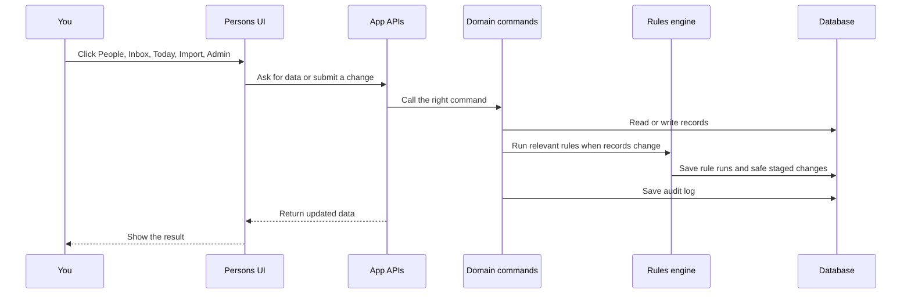
```mermaid
sequenceDiagram
  participant You
  participant UI as Persons UI
  participant API as App APIs
  participant Domain as Domain commands
  participant Rules as Rules engine
  participant DB as Database

  You->>UI: Click People, Inbox, Today, Import, Admin
  UI->>API: Ask for data or submit a change
  API->>Domain: Call the right command
  Domain->>DB: Read or write records
  Domain->>Rules: Run relevant rules when records change
  Rules->>DB: Save rule runs and safe staged changes
  Domain->>DB: Save audit log
  API-->>UI: Return updated data
  UI-->>You: Show the result
```

In plain English: the UI does not directly make database decisions. It asks an API, the API calls a command, and the command updates the database.

The Home app also provides a bounded communications-review surface. It reads pending iMessage and Gmail records from the same `StagedInteraction` inbox and mirrors the Persons Inbox selection model: the owner can select one item, shift-select a range, select all, clear the selection, and dismiss the selection as one optimistic bulk action. It also mirrors the Inbox keyboard loop (`j`/`k` move, `x` selects, `e` dismisses, Enter expands, and Escape closes). For presentation only, Home groups iMessages from the same normalized phone number when their timestamps fall inside one one-hour session; the original staged messages remain separate, auditable records underneath the grouped card. The owner can expand a single item or text session, accept a confidently matched communication, or dismiss it without navigating into Persons. Home's workspace-scoped `/api/communications/bulk` route only dismisses still-pending communication records and writes the same inbox audit entry for every item it changes. Accepting preserves the existing source/day aggregation convention for `Interaction` records. Items without a Person match always open the canonical `persons.lacollecteur.com/inbox` identity-resolution surface; Home never invents a Person.

#### Manually merging two People

From a Person's edit dialog, the owner can choose **Merge with another person**, search the workspace's People through the lightweight `GET /api/persons/search` picker endpoint, and select one duplicate. A second comparison dialog uses `GET /api/persons/merge-preview` to show both records. The owner can swap which Person survives, choose either value field by field, combine both notes, and review the emails, phones, tags, values, Interactions, and Plans that will be combined. Confirmation calls `POST /api/contacts/merge`, using the same field-resolution helpers and `mergePersons()` domain command as the deduplication screen.

The command fills missing profile fields, combines emails, phone numbers, tags, values, and notes, reassigns linked records such as Interactions and Plans, removes the selected duplicate, and writes a `person.merge` audit entry. Both IDs must belong to the current workspace; an ID from another workspace is treated as missing.

### 2. iMessage sync

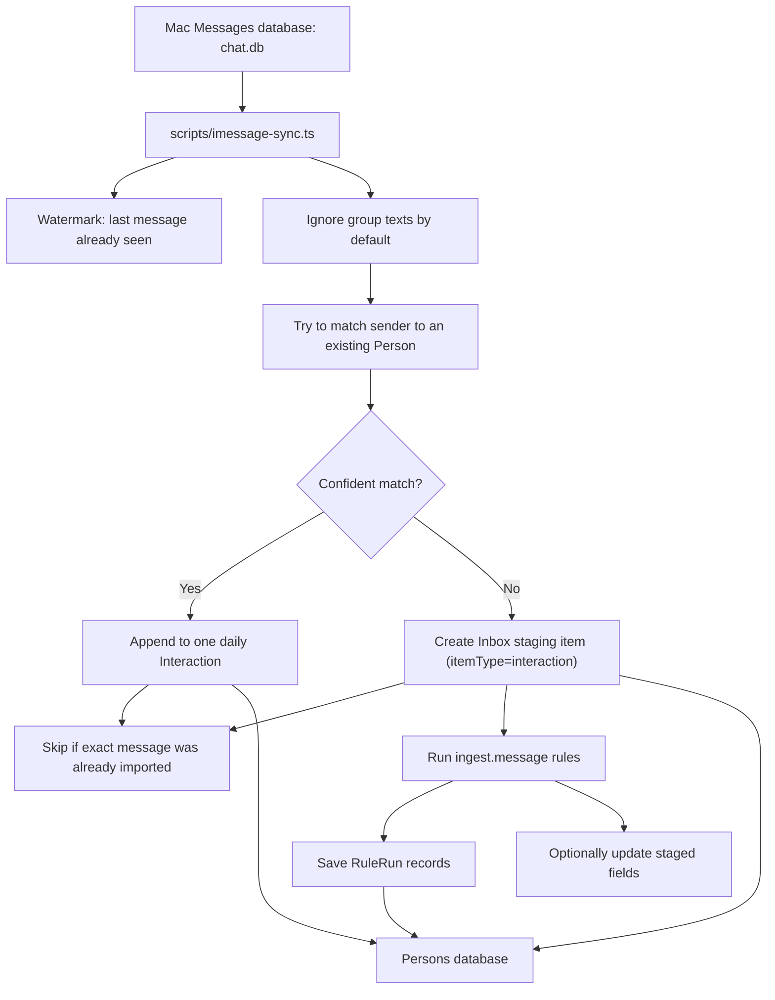
```mermaid
flowchart TD
  ChatDB["Mac Messages database: chat.db"] --> Watcher["scripts/imessage-sync.ts"]
  Watcher --> Watermark["Watermark: last message already seen"]
  Watcher --> GroupFilter["Ignore group texts by default"]

  GroupFilter --> Match["Try to match sender to an existing Person"]
  Match --> Known{"Confident match?"}
  Known -->|Yes| DailyInteraction["Append to one daily Interaction"]
  Known -->|No| StagedInbox["Create Inbox staging item (itemType=interaction)"]

  DailyInteraction --> Dedupe["Skip if exact message was already imported"]
  StagedInbox --> Dedupe

  StagedInbox --> Rules["Run ingest.message rules"]
  Rules --> RuleRuns["Save RuleRun records"]
  Rules --> SafeUpdates["Optionally update staged fields"]

  DailyInteraction --> PersonsDB["Persons database"]
  StagedInbox --> PersonsDB
  RuleRuns --> PersonsDB
```

Important idea: iMessages are person-level Interactions, not Event nodes. Matched iMessages append into one daily message Interaction per Person; unmatched iMessages do not create random new people and instead go to the Inbox staging area where you can review them.

Group texts are intentionally ignored by default before matching or staging. The watcher identifies multi-person chats from the Messages chat participant table, with the chat identifier as a fallback, so noisy group threads do not fill the Persons inbox or get appended to one person's daily interaction log. A one-off backfill can opt in with `--include-group-chats` when that is explicitly useful.

### 2b. Staging from any external source

Any external script or automation can push items into the inbox via the API. This is the universal staging path — not limited to iMessage.

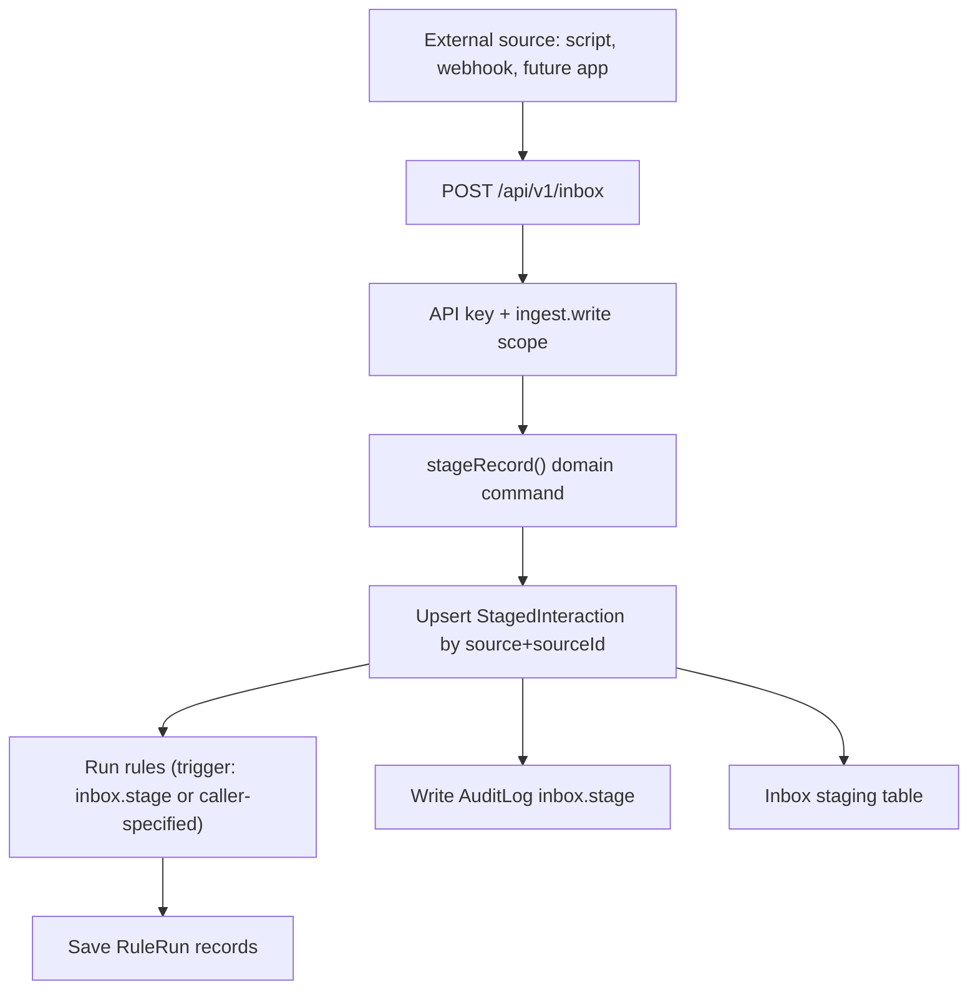
```mermaid
flowchart TD
  External["External source: script, webhook, future app"] --> APIV1["POST /api/v1/inbox"]
  APIV1 --> Auth["API key + ingest.write scope"]
  Auth --> StageRecord["stageRecord() domain command"]
  StageRecord --> Upsert["Upsert StagedInteraction by source+sourceId"]
  Upsert --> Rules["Run rules (trigger: inbox.stage or caller-specified)"]
  Rules --> RuleRuns["Save RuleRun records"]
  Upsert --> Audit["Write AuditLog inbox.stage"]
  Upsert --> InboxDB["Inbox staging table"]
```

The `itemType` field on the staged record tells the inbox what kind of record to create when accepted (currently `interaction` is the only handled type).

### 3. Import flow

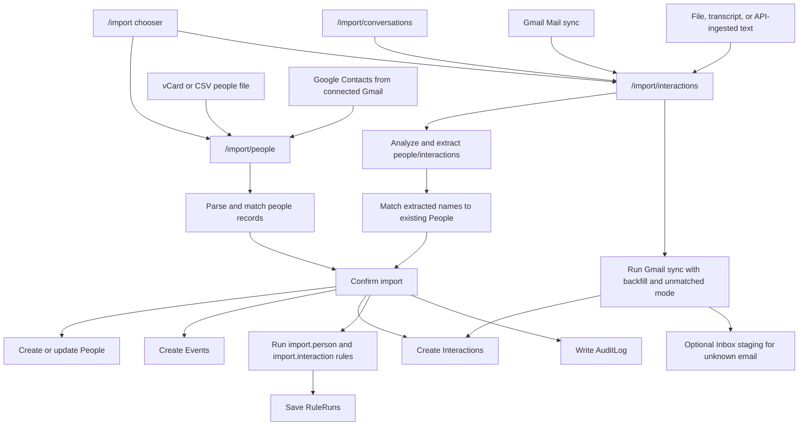
```mermaid
flowchart TD
  ImportHub["/import chooser"] --> PeopleImport["/import/people"]
  ImportHub --> InteractionImport["/import/interactions"]
  LegacyConversation["/import/conversations"] --> InteractionImport
  PeopleFile["vCard or CSV people file"] --> PeopleImport
  GoogleContacts["Google Contacts from connected Gmail"] --> PeopleImport
  GmailMail["Gmail Mail sync"] --> InteractionImport
  File["File, transcript, or API-ingested text"] --> InteractionImport
  InteractionImport --> Analyze["Analyze and extract people/interactions"]
  InteractionImport --> GmailSync["Run Gmail sync with backfill and unmatched mode"]
  PeopleImport --> ParsePeople["Parse and match people records"]
  ParsePeople --> Confirm
  Analyze --> MatchPeople["Match extracted names to existing People"]
  GmailSync --> Interactions
  GmailSync --> Inbox["Optional Inbox staging for unknown email"]
  MatchPeople --> Confirm["Confirm import"]
  Confirm --> People["Create or update People"]
  Confirm --> Events["Create Events"]
  Confirm --> Interactions["Create Interactions"]
  Confirm --> Rules["Run import.person and import.interaction rules"]
  Rules --> RuleRuns["Save RuleRuns"]
  Confirm --> Audit["Write AuditLog"]
```

Plain English: import is a bulk way to turn source material into structured People, Events, and Interactions. `/import` is the chooser, `/import/people` handles vCard/CSV people files plus Google Contacts from the connected Gmail account, and `/import/interactions` handles Gmail Mail, transcripts, notes, and message exports. `/import/conversations` remains as a redirect for older links.

The Google Contacts import does not save records immediately. `/api/import/gmail-contacts` reads the connected Google account through the People API, maps names, emails, phone numbers, organizations, birthdays, addresses, URLs, and notes into the same review shape as a vCard/CSV import, and then the regular People import review decides what to create, update, or skip.

Birthdays preserve useful month/day information even when the birth year is unknown. Full dates use `YYYY-MM-DD`; yearless birthdays use `--MM-DD`. Both formats drive Today-page birthday reminders without inventing a year.

For local recovery review only, `LIFE_OS_LOCAL_REVIEW=1` bypasses Google OAuth when the app is not running in production. It resolves the existing owner and default workspace read-only instead of creating authentication records; production explicitly ignores this flag.

### 3b. Google Calendar sync

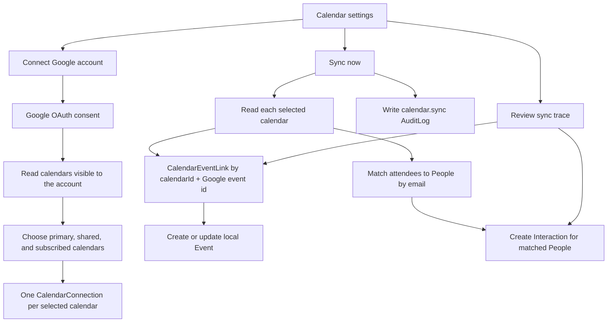
```mermaid
flowchart TD
  Admin["Calendar settings"] --> Connect["Connect Google account"]
  Connect --> OAuth["Google OAuth consent"]
  OAuth --> Discover["Read calendars visible to the account"]
  Discover --> Select["Choose primary, shared, and subscribed calendars"]
  Select --> Connection["One CalendarConnection per selected calendar"]
  Admin --> Sync["Sync now"]
  Sync --> GoogleEvents["Read each selected calendar"]
  GoogleEvents --> Link["CalendarEventLink by calendarId + Google event id"]
  Link --> Event["Create or update local Event"]
  GoogleEvents --> Match["Match attendees to People by email"]
  Match --> Interaction["Create Interaction for matched People"]
  Sync --> Audit["Write calendar.sync AuditLog"]
  Admin --> Trace["Review sync trace"]
  Trace --> Link
  Trace --> Interaction
```

Plain English: Google Calendar remains the source of truth, but the Events app now owns synchronization and confirmation. Persons keeps its historical connection/status surfaces for compatibility, while its former write endpoint `/api/calendar/google/sync` returns a permanent ownership response pointing to Events settings. The canonical Events sync creates calendar-backed Plans and expected Person references; only Home confirmation creates Events and attendee Interactions. This prevents two apps from interpreting the same provider occurrence differently.

To keep first-time imports from hogging resources, the Calendar settings screen asks for a backfill range before syncing. The server processes selected calendars sequentially, fetches each one in restrained pages, and writes events in small batches rather than holding one giant event list in memory. Each calendar keeps its own incremental sync token, error, and last-synced time, so one failing calendar does not hide the status of the others. Once Google gives Life OS an incremental sync token, later syncs ignore the historical backfill range and only ask that calendar for changed events.

The Calendar settings screen also has a combined sync trace. It reads recent `calendar.sync` audit rows plus `CalendarEventLink`, `Event`, and `Interaction` records across every connected calendar so an operator can see which Google events landed locally and which People were linked.

Runtime configuration:

- `GOOGLE_CALENDAR_CLIENT_ID` and `GOOGLE_CALENDAR_CLIENT_SECRET`, or the existing `GOOGLE_CLIENT_ID` and `GOOGLE_CLIENT_SECRET` if that OAuth client has Calendar API access.
- The Google OAuth redirect URI must include `/api/calendar/google/callback` on the deployed app origin.
- `GOOGLE_CALENDAR_REDIRECT_URI` can pin the callback to one exact production URL, avoiding mismatches when someone opens a preview deployment or alternate Vercel alias.
- The first sync reads the selected bounded window around the present; later syncs use Google's sync token when available.

### 3c. Gmail sync

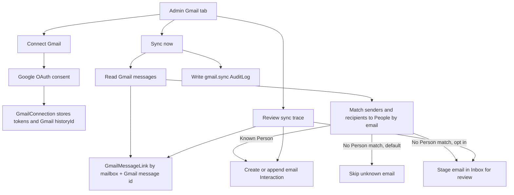
```mermaid
flowchart TD
  Admin["Admin Gmail tab"] --> Connect["Connect Gmail"]
  Connect --> OAuth["Google OAuth consent"]
  OAuth --> Connection["GmailConnection stores tokens and Gmail historyId"]
  Admin --> Sync["Sync now"]
  Sync --> GmailMessages["Read Gmail messages"]
  GmailMessages --> Link["GmailMessageLink by mailbox + Gmail message id"]
  GmailMessages --> Match["Match senders and recipients to People by email"]
  Match -->|Known Person| Interaction["Create or append email Interaction"]
  Match -->|No Person match, default| Skip["Skip unknown email"]
  Match -->|No Person match, opt in| Inbox["Stage email in Inbox for review"]
  Sync --> Audit["Write gmail.sync AuditLog"]
  Admin --> Trace["Review sync trace"]
  Trace --> Link
  Trace --> Interaction
  Trace --> Inbox
```

Plain English: Gmail remains read-only. Persons imports messages into Interactions when a sender or recipient already matches a Person email in the current workspace. The default sync mode is "Known People only": unknown senders and recipients are skipped and do not enter Inbox. The user can explicitly switch to "Stage unmatched in Inbox" when they want to review unknown emails and attach or create People later. First-time sync uses the selected Admin backfill range, defaults to 30 days, includes an all-time option, and processes messages in small batches. Later syncs use Gmail's history API via `GmailConnection.historyId`; if Gmail says that history cursor is too old, Persons falls back to a bounded full sync.

The Admin Gmail tab includes a sync trace. It combines recent `gmail.sync` audit rows with `GmailMessageLink`, email Interactions, and staged Inbox records so an operator can see whether each message matched a Person, was staged for review, was skipped by Known People only mode, or was marked deleted.

The same Gmail sync can also be launched from `/import/interactions` as "Import Gmail Mail." That screen keeps the same conservative default as Admin: a 30-day backfill and Known People only mode, with an opt-in control to stage unmatched email in Inbox.

Runtime configuration:

- `GOOGLE_GMAIL_CLIENT_ID` and `GOOGLE_GMAIL_CLIENT_SECRET`, or the existing `GOOGLE_CLIENT_ID` and `GOOGLE_CLIENT_SECRET` if that OAuth client has Gmail API access.
- The Google OAuth redirect URI must include `/api/gmail/google/callback` on the deployed app origin.
- `GOOGLE_GMAIL_REDIRECT_URI` can pin the callback to one exact production URL.
- People import from Google Contacts uses the same Gmail connection but also needs the Google People API enabled and the `https://www.googleapis.com/auth/contacts.readonly` scope. Older Gmail connections that only granted Gmail read access must reconnect before `/import/people` can pull Google Contacts.

### 3d. Krisp transcript processing

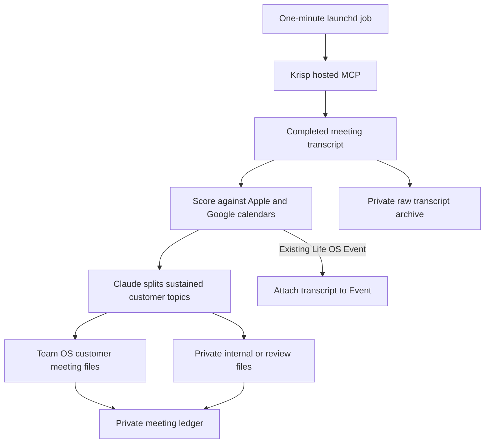
```mermaid
flowchart TD
  Launchd["One-minute launchd job"] --> KrispMCP["Krisp hosted MCP"]
  KrispMCP --> Transcript["Completed meeting transcript"]
  Transcript --> Calendar["Score against Apple and Google calendars"]
  Calendar --> Split["Claude splits sustained customer topics"]
  Split --> Customer["Team OS customer meeting files"]
  Split --> Private["Private internal or review files"]
  Customer --> Ledger["Private meeting ledger"]
  Private --> Ledger
  Transcript --> Archive["Private raw transcript archive"]
  Calendar -->|Existing Life OS Event| EventTranscript["Attach transcript to Event"]
```

Plain English: `scripts/krisp/sync.ts` polls meetings owned by Joseph through
Krisp MCP. It deduplicates by Krisp meeting ID and URL, tries to identify the
corresponding calendar event, and requires transcript evidence before publishing
a customer-specific file. Mixed meetings can produce several customer files plus
one private internal note. Low-confidence mappings are held in Team OS's private
`personal-drawer/meeting-review/` folder rather than guessed.

The job is local because Team OS's `personal-drawer` is intentionally gitignored.
Its launch agent is `com.lifeos.krisp`; state lives in
`~/.life-os/krisp-team-os-state.json`. Every output is also indexed in
`team-os/personal-drawer/meeting-ledger.md` so later report generators can find
the relevant meeting notes without rescanning every transcript. See
`docs/KRISP_TEAM_OS_AUTOMATION.md` for setup and operating commands.

### 3e. Health Auto Export sync

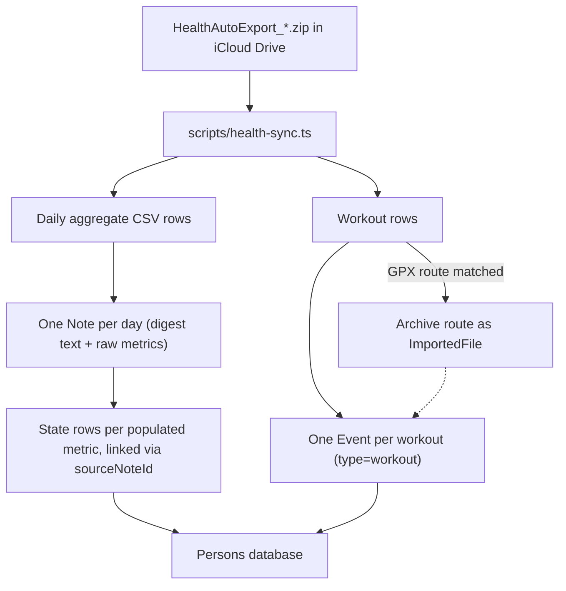
```mermaid
flowchart TD
  Zip["HealthAutoExport_*.zip in iCloud Drive"] --> Sync["scripts/health-sync.ts"]
  Sync --> Daily["Daily aggregate CSV rows"]
  Sync --> Workouts["Workout rows"]

  Daily --> DayNote["One Note per day (digest text + raw metrics)"]
  DayNote --> States["State rows per populated metric, linked via sourceNoteId"]

  Workouts --> WorkoutEvent["One Event per workout (type=workout)"]
  Workouts -->|GPX route matched| RouteFile["Archive route as ImportedFile"]
  RouteFile -.-> WorkoutEvent

  States --> PersonsDB["Persons database"]
  WorkoutEvent --> PersonsDB
```

Plain English: `npm run health:sync` (or `scripts/health-sync.ts` directly)
parses an Apple Health "Health Auto Export" zip and attaches the data to one
self Person (`--person-id`, or `$HEALTH_SYNC_PERSON_ID`, or a built-in
default — the script refuses to guess or auto-create this Person). Daily
metrics (steps, heart rate, sleep, etc.) become **State** rows against that
Person, one **Note** per day holding the full digest text as provenance.
Workouts become **Event** rows (with matched GPX routes archived as
`ImportedFile`) — deliberately *not* Interactions. A solo workout isn't a
relationship touchpoint the way a call or message is, and earlier versions
that logged every workout as an Interaction drowned a real Interaction log
under hundreds of walks. Both the sync script and every write it makes are
idempotent: re-running with the same zip upserts by a `sourceMarker` in each
row's metadata rather than duplicating.

The Person detail page renders a "Health" card (only when a Person has
`health_metric` States) showing the latest day's highlight metrics plus an
expandable log of recent daily digest Notes — see
`apps/persons/server/domain/health.ts`.

### 4. Inbox review flow

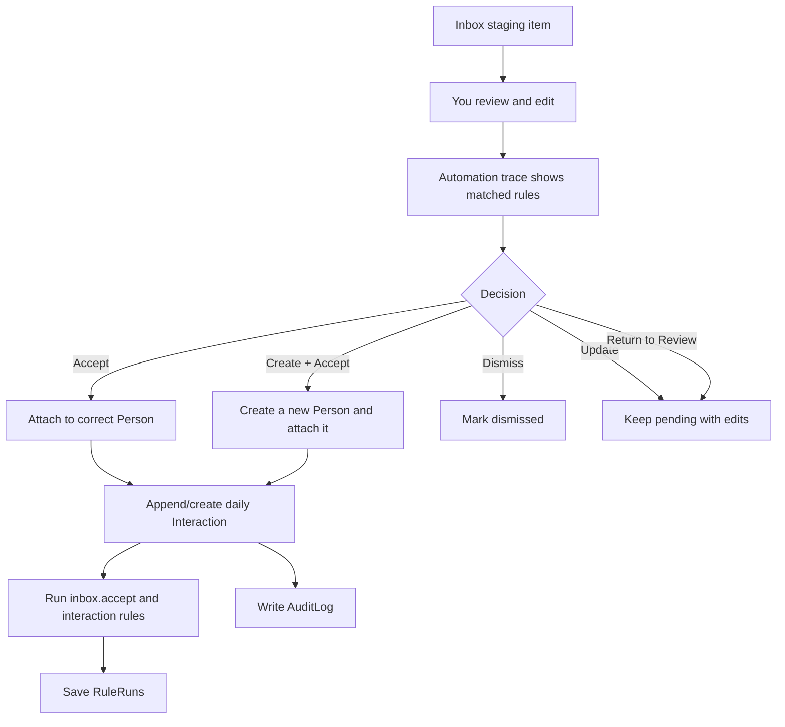
```mermaid
flowchart TD
  Inbox["Inbox staging item"] --> Review["You review and edit"]
  Review --> Trace["Automation trace shows matched rules"]
  Trace --> Choice{"Decision"}
  Choice -->|Accept| Person["Attach to correct Person"]
  Choice -->|Create + Accept| NewPerson["Create a new Person and attach it"]
  Choice -->|Dismiss| Dismissed["Mark dismissed"]
  Choice -->|Update| Pending["Keep pending with edits"]
  Choice -->|Return to Review| Pending

  Person --> DailyInteraction["Append/create daily Interaction"]
  NewPerson --> DailyInteraction
  DailyInteraction --> Rules["Run inbox.accept and interaction rules"]
  Rules --> RuleRuns["Save RuleRuns"]
  DailyInteraction --> Audit["Write AuditLog"]
```

Plain English: Inbox is the human filter between automation and your real CRM memory. If an incoming interaction belongs to someone who is not in People yet, the Inbox can create the Person from the staged name, email, or phone and accept the interaction in the same review step.

### 5. Data cleaning view

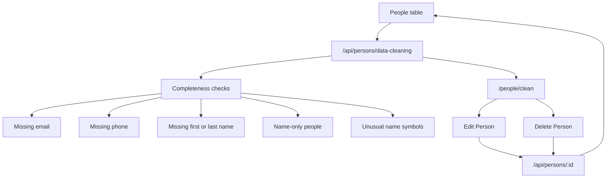
```mermaid
flowchart TD
  PeopleDB["People table"] --> QualityAPI["/api/persons/data-cleaning"]
  QualityAPI --> Checks["Completeness checks"]
  Checks --> MissingEmail["Missing email"]
  Checks --> MissingPhone["Missing phone"]
  Checks --> MissingName["Missing first or last name"]
  Checks --> NameOnly["Name-only people"]
  Checks --> Symbols["Unusual name symbols"]

  QualityAPI --> CleanUI["/people/clean"]
  CleanUI --> Edit["Edit Person"]
  CleanUI --> Delete["Delete Person"]
  Edit --> PersonAPI["/api/persons/:id"]
  Delete --> PersonAPI
  PersonAPI --> PeopleDB
```

Plain English: the Data Cleaning page is a focused People quality view. It counts sparse records, lets you filter and sort by the kind of cleanup needed, and sends edits or deletes through the same Person APIs used by the rest of the app.

## API Plumbing

There are two API families.

Mutation routes validate untrusted JSON at the HTTP boundary with shared Zod
schemas from `packages/contracts`. Persons' `server/api/contracts.ts` adapter
turns schema failures into the same structured `bad_request` envelope as other
domain validation errors. Bulk People changes, merges, access administration,
and import confirmation therefore reject malformed or oversized requests before
they reach Prisma or domain commands.

### App APIs

These power the web app itself. They are mostly behind your normal login.

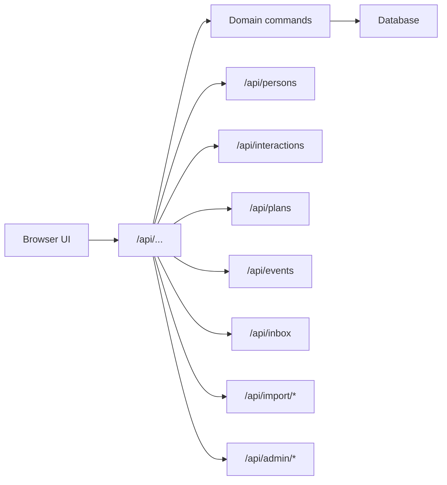
```mermaid
flowchart LR
  Browser["Browser UI"] --> AppAPI["/api/..."]
  AppAPI --> Domain["Domain commands"]
  Domain --> DB["Database"]

  AppAPI --> PeopleAPI["/api/persons"]
  AppAPI --> InteractionsAPI["/api/interactions"]
  AppAPI --> PlansAPI["/api/plans"]
  AppAPI --> EventsAPI["/api/events"]
  AppAPI --> InboxAPI["/api/inbox"]
  AppAPI --> ImportAPI["/api/import/*"]
  AppAPI --> AdminAPI["/api/admin/*"]
```

### Headless APIs

These are for scripts, automations, and future apps. They use API keys and scopes.

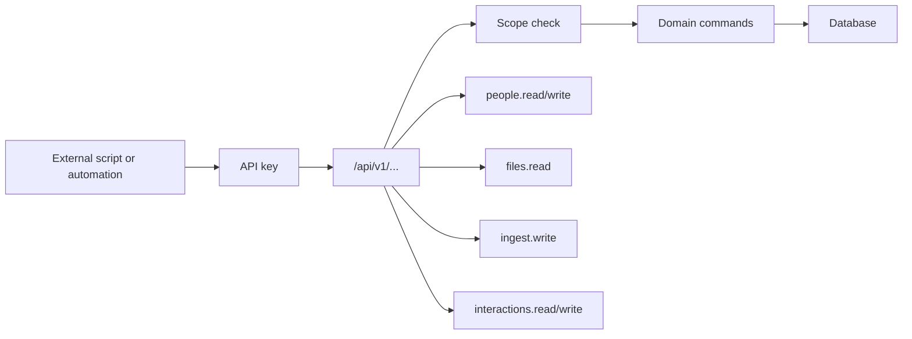
```mermaid
flowchart LR
  Script["External script or automation"] --> Key["API key"]
  Key --> V1["/api/v1/..."]
  V1 --> Scope["Scope check"]
  Scope --> Domain["Domain commands"]
  Domain --> DB["Database"]

  V1 --> PeopleScope["people.read/write"]
  V1 --> Files["files.read"]
  V1 --> Ingest["ingest.write"]
  V1 --> Interactions["interactions.read/write"]
```

Plain English: the headless API is how Persons can become programmable. Anything the UI can do should eventually have an API-shaped path too.

## Access Control

Browser auth is shared across Life OS apps. Persons keeps a local `apps/persons/auth.ts`
wrapper, but the actual Google sign-in policy now lives in `packages/auth`.
The next authorization step is also shared: `packages/access` is the canonical
session-to-user, workspace-selection, disabled-user, role/scope, and short-lived
cache policy used by Persons, Places, and Events. Each app supplies its local
Auth.js session function plus compatible error and audit adapters; app-local
access modules retain only their existing admin-management surface while that
larger UI is decomposed.
Home, Persons, Places, and Stuff can share the same session when deployed on a
common parent domain and configured with the same `AUTH_SECRET` plus
`AUTH_COOKIE_DOMAIN` or `LIFE_OS_COOKIE_DOMAIN`.

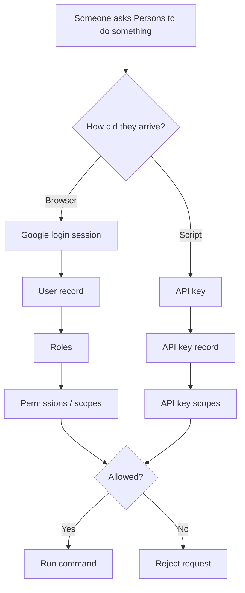
```mermaid
flowchart TD
  Request["Someone asks Persons to do something"] --> AuthType{"How did they arrive?"}
  AuthType -->|Browser| Login["Google login session"]
  AuthType -->|Script| APIKey["API key"]

  Login --> User["User record"]
  APIKey --> KeyRecord["API key record"]

  User --> Roles["Roles"]
  Roles --> Permissions["Permissions / scopes"]
  KeyRecord --> KeyScopes["API key scopes"]

  Permissions --> Allowed{"Allowed?"}
  KeyScopes --> Allowed

  Allowed -->|Yes| Command["Run command"]
  Allowed -->|No| Stop["Reject request"]
```

Examples:

- `people.read`: can read People.
- `people.write`: can create or edit People.
- `ingest.write`: can run import/ingest flows.
- `rules.manage`: can create or edit rules.
- `audit.read`: can view the audit log.
- `*`: owner-level access.

### Workspace tenancy

Persons is moving from "Joseph's private CRM" toward "approved people can each have their own private CRM space."

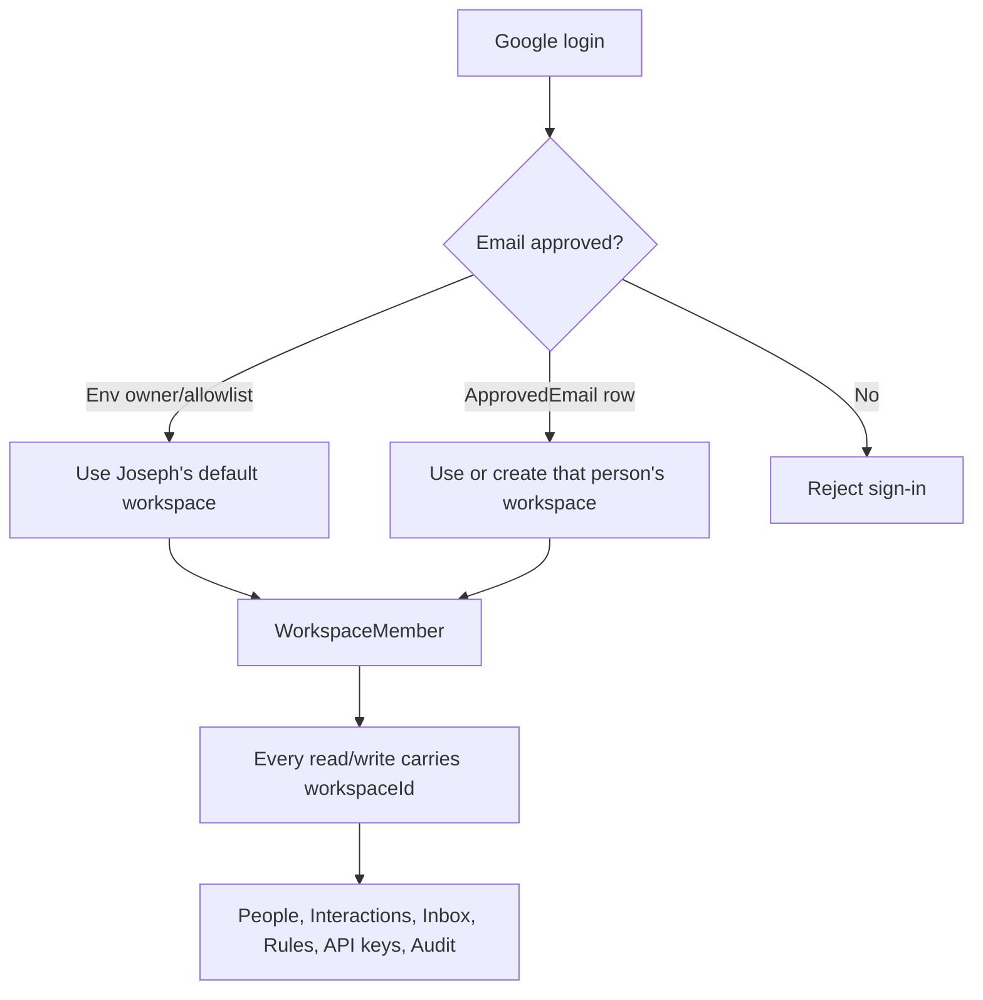
```mermaid
flowchart TD
  Login["Google login"] --> Gate{"Email approved?"}
  Gate -->|Env owner/allowlist| DefaultWorkspace["Use Joseph's default workspace"]
  Gate -->|ApprovedEmail row| UserWorkspace["Use or create that person's workspace"]
  Gate -->|No| Reject["Reject sign-in"]

  DefaultWorkspace --> Member["WorkspaceMember"]
  UserWorkspace --> Member
  Member --> Scope["Every read/write carries workspaceId"]
  Scope --> PeopleDB["People, Interactions, Inbox, Rules, API keys, Audit"]
```

Plain English: a login is allowed only when the email is in `OWNER_EMAILS`, `ADMIN_EMAILS`, `ALLOWED_EMAILS`, is the first user in an empty database, or has an approved `ApprovedEmail` record. Once allowed, the user gets a `WorkspaceMember` record. All core People memory then belongs to that workspace through `workspaceId`.

If a user belongs to more than one active workspace, the shared access policy
refuses to guess: the caller must provide the intended workspace. Cache entries
are keyed by both email and requested workspace, disabled users are rejected
without being silently reactivated, and explicit workspace requests must match
an active membership.

The current migration preserves existing data in `default-workspace`. Owner and env-allowlisted emails land there. Future approved emails can be attached to a specific workspace or can create their own clean workspace on first sign-in. API keys also carry `workspaceId`, so headless API calls read and write inside the same boundary as browser users.

## Rules Engine

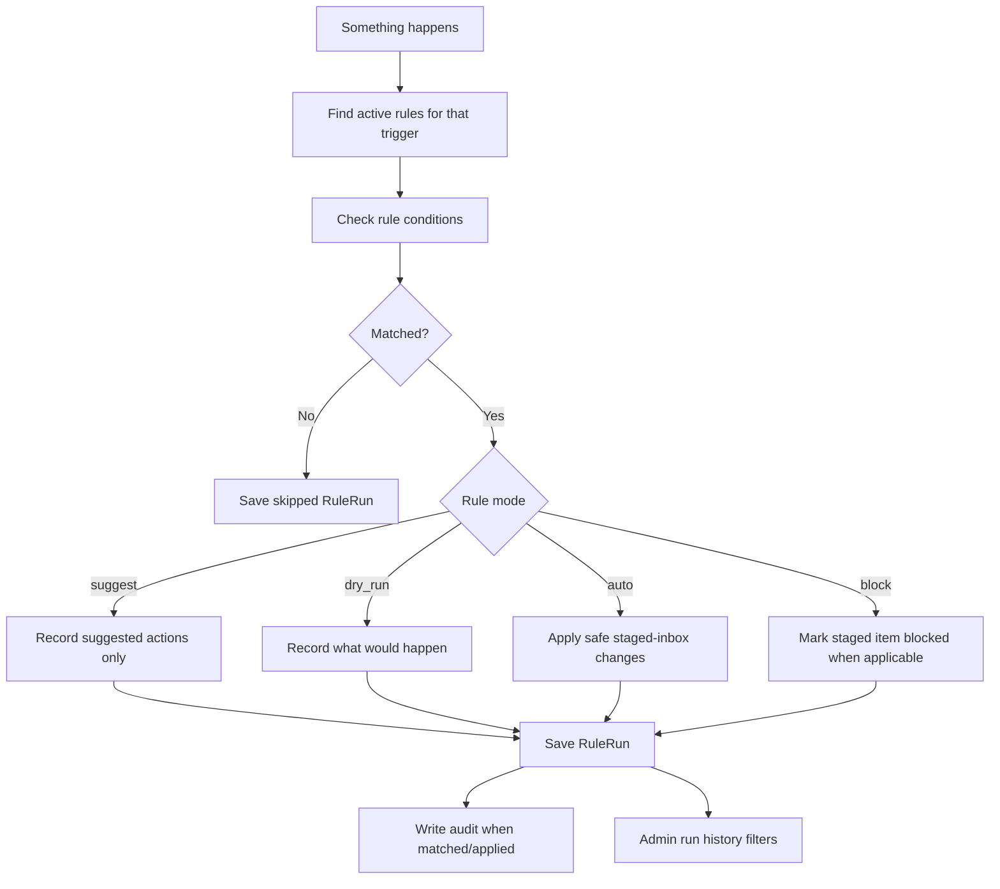
```mermaid
flowchart TD
  Trigger["Something happens"] --> LoadRules["Find active rules for that trigger"]
  LoadRules --> Check["Check rule conditions"]
  Check --> Match{"Matched?"}

  Match -->|No| SaveSkip["Save skipped RuleRun"]
  Match -->|Yes| Mode{"Rule mode"}

  Mode -->|suggest| Suggest["Record suggested actions only"]
  Mode -->|dry_run| DryRun["Record what would happen"]
  Mode -->|auto| Auto["Apply safe staged-inbox changes"]
  Mode -->|block| Block["Mark staged item blocked when applicable"]

  Suggest --> SaveRun["Save RuleRun"]
  DryRun --> SaveRun
  Auto --> SaveRun
  Block --> SaveRun
  SaveRun --> Audit["Write audit when matched/applied"]
  SaveRun --> AdminHistory["Admin run history filters"]
```

Current triggers include:

- `ingest.message`
- `import.person`
- `import.interaction`
- `interaction.create`
- `interaction.append`
- `inbox.accept`

Current safe auto-apply target:

- Inbox staging items only.

That means rules can safely help triage incoming automation records, without unexpectedly editing your canonical People or Interaction history.

## Database Memory

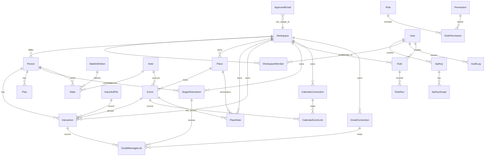
```mermaid
erDiagram
  Person ||--o{ Interaction : has
  Event ||--o{ Interaction : groups
  Person ||--o{ Plan : has
  Person ||--o{ StagedInteraction : candidate
  ImportedFile ||--o{ Interaction : source
  Person ||--o{ State : tracks
  StateDefinition ||--o{ State : defines
  Note ||--o{ State : sources
  Note ||--o{ Event : sources

  Workspace ||--o{ WorkspaceMember : has
  Workspace ||--o{ Person : owns
  Workspace ||--o{ Place : owns
  Workspace ||--o{ PlaceNote : owns
  Workspace ||--o{ Interaction : owns
  Workspace ||--o{ StagedInteraction : owns
  Workspace ||--o{ Rule : owns
  Workspace ||--o{ CalendarConnection : owns
  CalendarConnection ||--o{ CalendarEventLink : maps
  Event ||--o{ CalendarEventLink : source
  Place ||--o{ Event : hosts
  Place ||--o{ PlaceNote : remembers
  Event ||--o{ PlaceNote : can_anchor
  Workspace ||--o{ GmailConnection : owns
  GmailConnection ||--o{ GmailMessageLink : maps
  Interaction ||--o{ GmailMessageLink : source
  StagedInteraction ||--o{ GmailMessageLink : reviews
  ApprovedEmail }o--|| Workspace : can_assign_to
  User ||--o{ ApiKey : creates
  User ||--o{ WorkspaceMember : belongs_to
  User ||--o{ AuditLog : causes
  User ||--o{ Rule : creates
  Role ||--o{ RolePermission : includes
  Permission ||--o{ RolePermission : grants
  ApiKey ||--o{ ApiKeyScope : has
  Rule ||--o{ RuleRun : records
```

Plain English version:

- **Person**: a human in your CRM.
- **Place**: a location at any scale, from a city to a room or shelf. Places are shown through `/places` and `/places/[id]`.
- **PlaceNote**: a memory note attached to a Place, optionally anchored to one Event at that Place.
- **Interaction**: a thing that happened with a person.
- **Event**: a real-world occurrence such as a meeting, call, dinner, trip, or imported calendar event. Message-only imports stay as Interactions and should not create Event nodes.
- **Plan**: what you want to do next with a person.
- **StagedInteraction**: universal inbox item waiting for review. Any source can stage a record here. The `itemType` field (`interaction`, `person`, `event`) indicates what kind of record will be created when accepted.
- **ImportedFile**: source material that was uploaded or ingested.
- **Rule**: an automation decision you configured.
- **RuleRun**: a receipt showing whether a rule matched.
- **AuditLog**: a receipt showing who or what changed something.
- **User, Role, Permission, ApiKey**: access-control system.
- **Workspace, WorkspaceMember, ApprovedEmail**: tenancy system. These decide who can sign in and which private workspace their People data belongs to.
- **CalendarConnection, CalendarEventLink**: Google Calendar integration state. Connections store OAuth/sync state; event links make imports repeatable without duplicating Events.
- **GmailConnection, GmailMessageLink**: Gmail integration state. Connections store OAuth/history state; message links make email imports repeatable and tie Gmail messages to Interactions or Inbox items.
- **State, StateDefinition**: a timestamped condition on any entity (currently: health metrics on a self Person). `StateDefinition` is the taxonomy entry (key + unit/description); `State` is one dated reading, optionally tracing back to the Note it was derived from via `sourceNoteId`.
- **Note**: raw captured input — currently the daily digest text the health sync writes per day, with the day's metrics as its `raw` metadata and States as its structured children. Not yet shown generically in the UI; the Person page's Health card is the first place Notes surface.

## Outputs

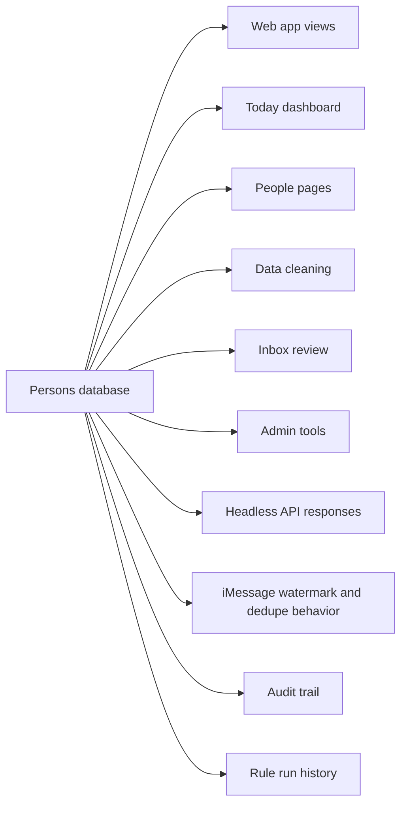
```mermaid
flowchart LR
  DB["Persons database"] --> UI["Web app views"]
  DB --> Today["Today dashboard"]
  DB --> People["People pages"]
  DB --> Cleanup["Data cleaning"]
  DB --> Inbox["Inbox review"]
  DB --> Admin["Admin tools"]
  DB --> API["Headless API responses"]
  DB --> WatcherState["iMessage watermark and dedupe behavior"]
  DB --> Audit["Audit trail"]
  DB --> RuleHistory["Rule run history"]
```

Plain English: the database is the source of truth. The UI, API, admin screens, audit log, and future automations all read from it.

## Critical-Path Verification

The repository-level Playwright suite (`tests/e2e/persons-critical.spec.ts`) starts
Persons with local-review access and a disposable SQLite database under
`/private/tmp`. The fixture database is rebuilt by applying the real migration
history, then seeded with only synthetic records. It verifies browser-level
People creation, API read/update/delete, workspace isolation, relationship-safe
merging, staged Inbox acceptance, and stable request-contract errors. CI runs
this suite without production OAuth credentials or production database access.

## Mental Model

If you only remember one thing:

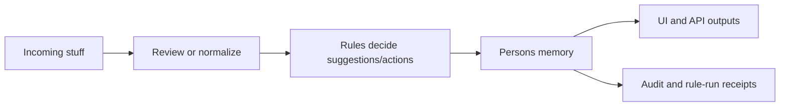
```mermaid
flowchart LR
  Incoming["Incoming stuff"] --> Staging["Review or normalize"]
  Staging --> Rules["Rules decide suggestions/actions"]
  Rules --> Memory["Persons memory"]
  Memory --> Views["UI and API outputs"]
  Memory --> Receipts["Audit and rule-run receipts"]
```

The architecture goal is:

- Automations can bring in lots of data.
- Rules can sort and suggest.
- You stay the filter when confidence is low.
- The database remains clean and traceable.
- APIs make everything programmable later.

The Admin UI's browser requests are centralized in
`app/admin/api-client.ts`. It owns JSON request construction and the stable
error-message boundary for access, rules, audit, Calendar, and Gmail panels;
typed components under `app/admin/tabs/` own feature presentation. Permissions,
Calendar, Audit, Workspace access management, API Keys, Roles, Rules, and Gmail
no longer depend on the full Admin controller component. The controller owns
orchestration and mutation state; each tab receives a typed view model and
callbacks and can evolve independently.

People import matching is isolated in `app/import/people/matching.ts`. It is a
pure, fixture-tested boundary for email and normalized-phone identity, fuzzy
name/company similarity, safe fillable-field calculation, inferred names,
review status, sorting, and quality counts. The import page orchestrates parsing,
human review, and confirmed writes without reimplementing match policy.

Stored JSON crosses a typed boundary in `@life-os/contracts`. Person contact
lists, rule conditions/actions, and Google message/event metadata are decoded
with named schemas instead of scattered `JSON.parse` calls. Malformed persisted
structures identify the field and fail predictably rather than silently becoming
empty state. Stable database vocabularies continue to use the existing Prisma
enums; free-form domain values remain strings until their vocabulary is proven.

Google integrations share `server/integrations/google/client.ts` for bearer
transport and OAuth token exchange. The transport accepts an injected fetch
implementation for fixture tests. Gmail payload interpretation lives in
`gmail-message-parser.ts`, separate from token lifecycle, pagination, matching,
persistence, audit, and sync orchestration. Calendar event interpretation lives
in `calendar-event-parser.ts`, while `calendar-client.ts` owns provider paging,
incremental sync tokens, and bounded full-sync fallback when Google expires a
token. Those provider paths run against fixtures without a live Google account;
the domain modules retain Life OS persistence, matching, audit, and trace flow.
Each Gmail and Calendar sync also emits a structured `workflow.run` start and
terminal record with a correlation ID, duration, counters, terminal status, and
error when present. Sync responses return that run ID, while status responses
include sync age, staleness, and failure state so operators can diagnose a
partial or failed ingestion without first reproducing it locally.

## Current Journey

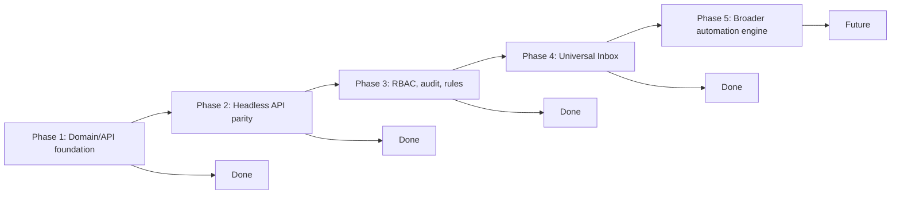
```mermaid
flowchart LR
  P1["Phase 1: Domain/API foundation"] --> P2["Phase 2: Headless API parity"]
  P2 --> P3["Phase 3: RBAC, audit, rules"]
  P3 --> P4["Phase 4: Universal Inbox"]
  P4 --> P5["Phase 5: Broader automation engine"]

  P1 --> Done1["Done"]
  P2 --> Done2["Done"]
  P3 --> Done3["Done"]
  P4 --> Done4["Done"]
  P5 --> Future["Future"]
```

### Done

- Core writes now move through domain commands instead of scattered UI/database calls.
- API keys, roles, permissions, and audit logs exist.
- Rules can be created, tested, run, and recorded.
- iMessage, import, interaction, and inbox acceptance paths now trigger rule evaluation.
- Admin is hidden under the profile menu, and the architecture map is a living document.
- Full headless API parity: all major resources (people, interactions, events, plans, inbox, imports, rules, dedupe, audit) available under `/api/v1/`.
- Universal Inbox: `StagedInteraction` now has an `itemType` field; any external source can stage records via `POST /api/v1/inbox` using the `stageRecord()` domain command. Rules fire automatically on staging.
- Data Cleaning: `/people/clean` highlights People records missing email, phone, names, or broader context, and supports editing or deleting those People from the cleanup view.
- Inbox create-and-accept: an unmatched staged interaction can create a new Person and attach the interaction in one review action.
- Workspace tenancy foundation: approved emails can sign in without inheriting Joseph's data, core browser/API paths carry `workspaceId`, existing data is preserved in `default-workspace`, and API keys are scoped to the workspace that created them.
- Google Calendar foundation: Admin can connect Google Calendar, sync read-only events into Events, and create Interactions for attendees matched to existing People by email.
- Google Calendar traceability: Admin can inspect recent Calendar sync runs, imported events, Google event IDs, attendees, and linked People.
- Gmail foundation: Admin can connect Gmail, sync read-only messages into Interactions for matched People, and stage unmatched emails in Inbox.
- Gmail traceability: Admin can inspect recent Gmail sync runs, message IDs, threads, matched People, staged Inbox records, skipped messages, and deleted markers.
- Google Contacts import: `/import/people` can pull People candidates from the connected Gmail account's Google Contacts and review them with the same create/update/skip flow as vCard and CSV imports.
- Gmail Mail import: `/import/interactions` can launch the same batched Gmail sync from the import area, defaulting to a 30-day Known People only import.
- Krisp transcript automation: a local scheduled worker archives completed transcripts, maps them to calendar context, splits mixed customer discussions, and writes Team OS meeting records with a private ambiguity queue.
- Health Auto Export sync: `scripts/health-sync.ts` attaches Apple Health data to a self Person as States (daily metrics) and Notes (daily digests), and workouts as Events — not Interactions, so the relationship-tracking Interaction log stays uncluttered. The Person detail page surfaces this via a Health card (`apps/persons/server/domain/health.ts`).

### Future

The next larger step is the broader automation engine:

- Scheduled jobs and event triggers.
- Notifications or digests.
- Safer action approval flows.
- More rule actions beyond staged inbox fields.
- Multiple `itemType` accept handlers (currently only `interaction` is handled on accept).
- Inbox filtering by `source` and `itemType` in the UI.
- Admin UI for approving emails and choosing whether an approved person gets their own workspace or joins an existing one.
- Background/scheduled Google Calendar sync and optional review queue for unmatched calendar attendees.
- Background/scheduled Gmail sync.
