# Persons Architecture Map

This is the plain-English map of how the Persons app is currently wired.

This is a living document. Codex and Claude should update it whenever the Persons app gains or changes inputs, outputs, APIs, domain command flow, rules/automation behavior, database models, integrations, or deployment/runtime plumbing.

Think of the app as four layers:

1. **Inputs**: places information comes from.
2. **Front doors**: UI pages, APIs, and scripts that receive that information.
3. **Plumbing**: domain commands that decide what should happen.
4. **Memory**: the database tables where Persons stores the result.

## Big Picture

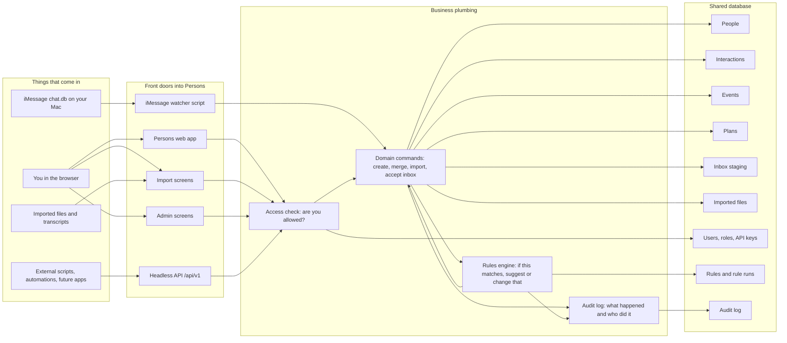

## The Main Flows

### 1. You use the app in the browser

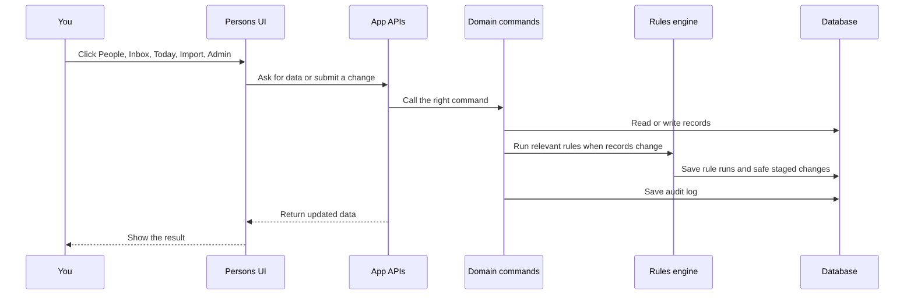

In plain English: the UI does not directly make database decisions. It asks an API, the API calls a command, and the command updates the database.

### 2. iMessage sync

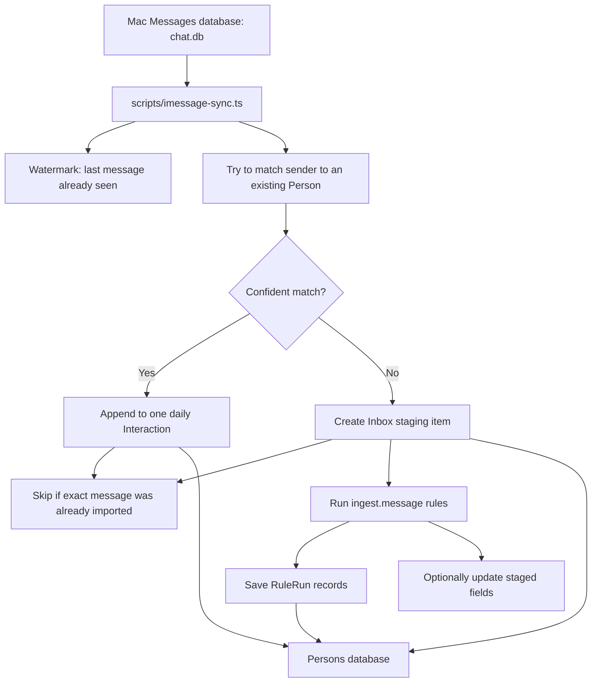

Important idea: unmatched iMessages do not create random new people anymore. They go to the Inbox staging area where you can review them.

### 3. Import flow

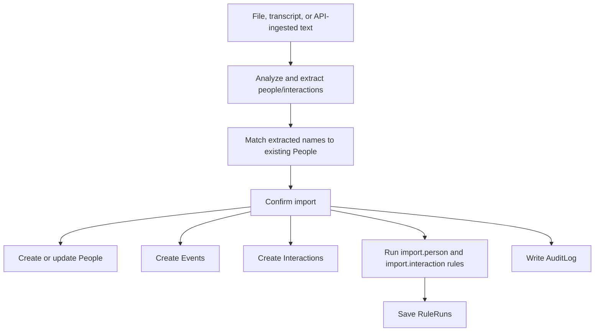

Plain English: import is a bulk way to turn messy text into structured People, Events, and Interactions.

### 4. Inbox review flow

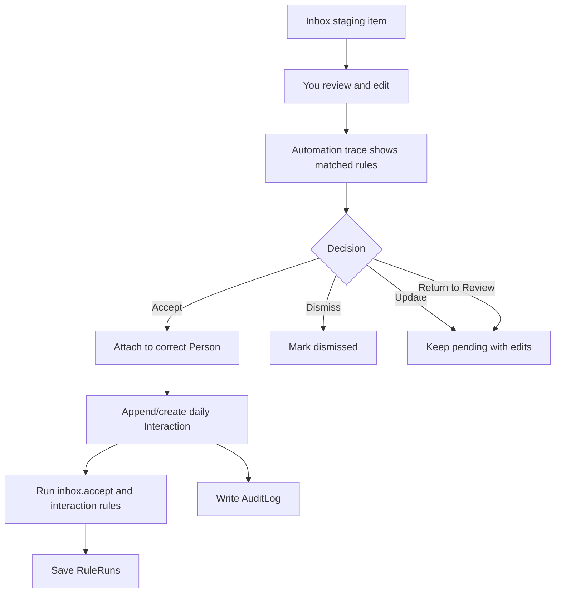

Plain English: Inbox is the human filter between automation and your real CRM memory.

## API Plumbing

There are two API families.

### App APIs

These power the web app itself. They are mostly behind your normal login.

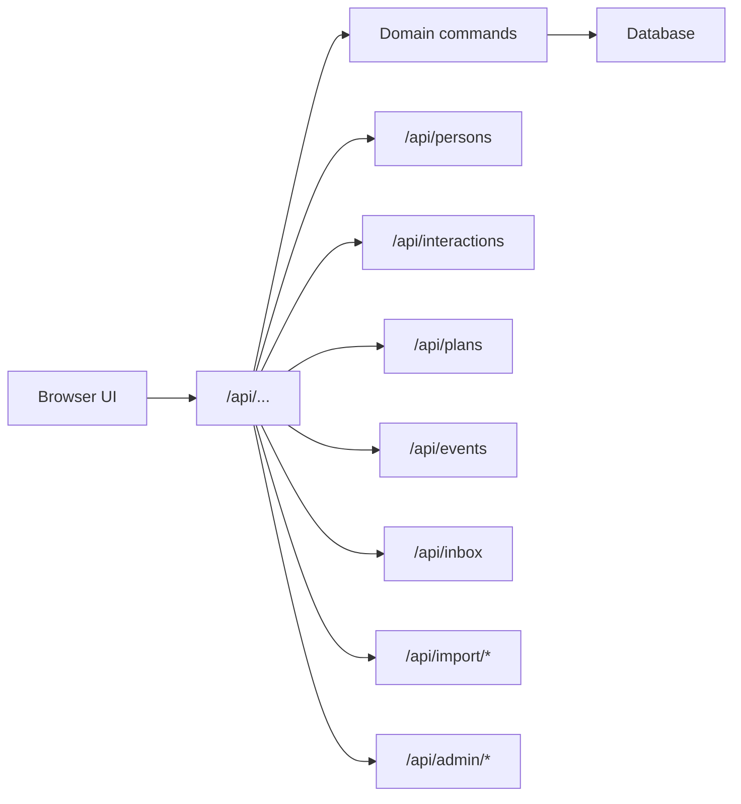

### Headless APIs

These are for scripts, automations, and future apps. They use API keys and scopes.

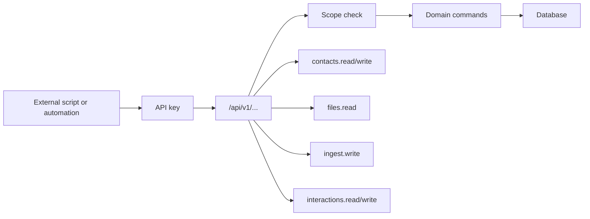

Plain English: the headless API is how Persons can become programmable. Anything the UI can do should eventually have an API-shaped path too.

## Access Control

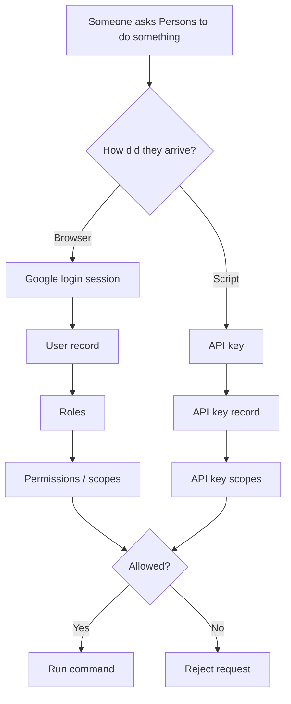

Examples:

- `contacts.read`: can read People.
- `contacts.write`: can create or edit People.
- `ingest.write`: can run import/ingest flows.
- `rules.manage`: can create or edit rules.
- `audit.read`: can view the audit log.
- `*`: owner-level access.

## Rules Engine

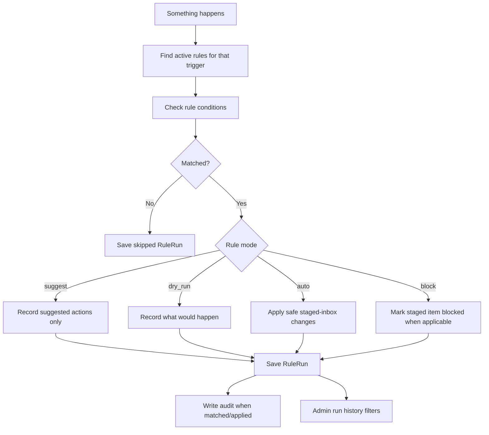

Current triggers include:

- `ingest.message`
- `import.person`
- `import.interaction`
- `interaction.create`
- `interaction.append`
- `inbox.accept`

Current safe auto-apply target:

- Inbox staging items only.

That means rules can safely help triage incoming automation records, without unexpectedly editing your canonical People or Interaction history.

## Database Memory

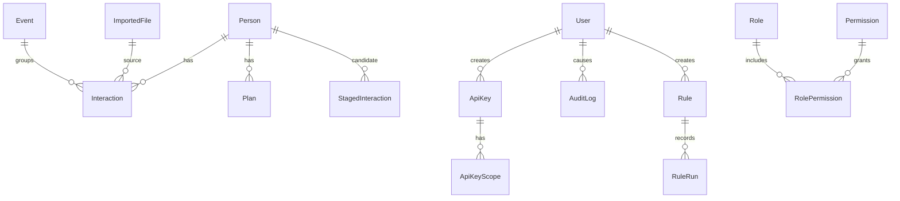

Plain English version:

- **Person**: a human in your CRM.
- **Interaction**: a thing that happened with a person.
- **Event**: a grouping around an interaction, such as a message day, meeting, call, dinner, or imported event.
- **Plan**: what you want to do next with a person.
- **StagedInteraction**: automation inbox item waiting for review.
- **ImportedFile**: source material that was uploaded or ingested.
- **Rule**: an automation decision you configured.
- **RuleRun**: a receipt showing whether a rule matched.
- **AuditLog**: a receipt showing who or what changed something.
- **User, Role, Permission, ApiKey**: access-control system.

## Outputs

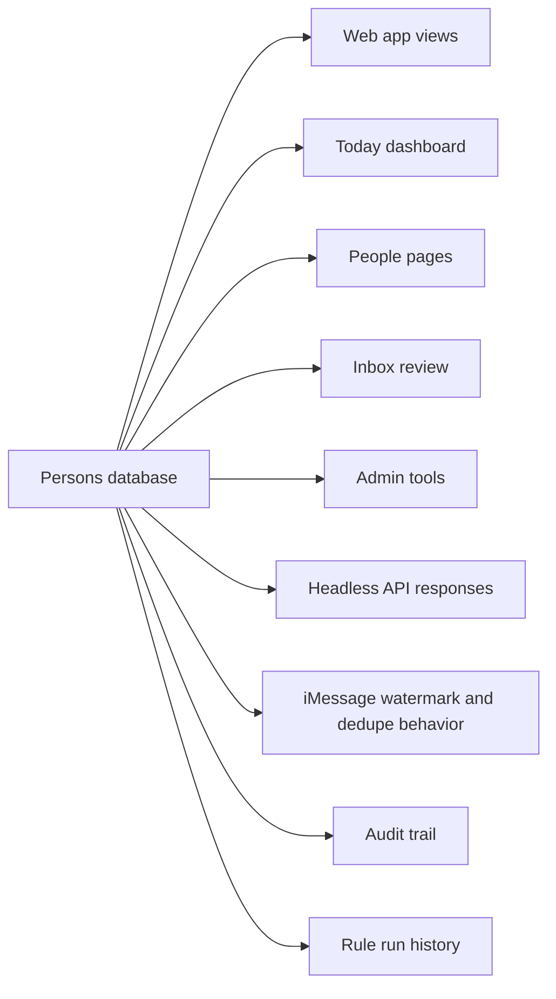

Plain English: the database is the source of truth. The UI, API, admin screens, audit log, and future automations all read from it.

## Mental Model

If you only remember one thing:

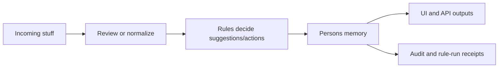

The architecture goal is:

- Automations can bring in lots of data.
- Rules can sort and suggest.
- You stay the filter when confidence is low.
- The database remains clean and traceable.
- APIs make everything programmable later.

## Current Journey

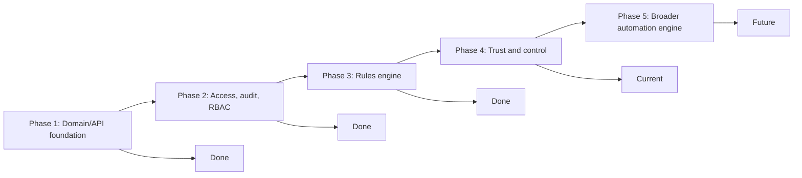

### Done

- Core writes now move through domain commands instead of scattered UI/database calls.
- API keys, roles, permissions, and audit logs exist.
- Rules can be created, tested, run, and recorded.
- iMessage, import, interaction, and inbox acceptance paths now trigger rule evaluation.
- Admin is hidden under the profile menu, and the architecture map is a living document.

### Current

This phase is about trust and control:

- Rules should be easier to create with templates and known triggers.
- Inbox review should show why automation did something.
- Rule runs should act like receipts beside the records they affected.
- Low-confidence automation should stay reviewable instead of silently creating canonical records.
- Admins can filter rule-run history by rule, trigger, outcome, and status.
- Blocked Inbox records can be dismissed or returned to normal review after edits.

### Future

The next larger step is the broader automation engine:

- Scheduled jobs and event triggers.
- Notifications or digests.
- Safer action approval flows.
- More rule actions beyond staged inbox fields.
- APIs for every meaningful UI operation.
