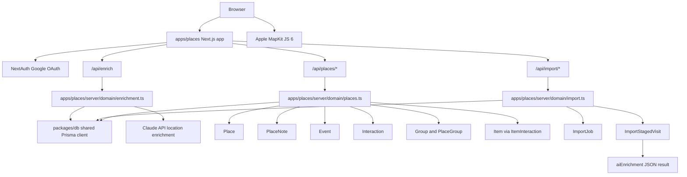
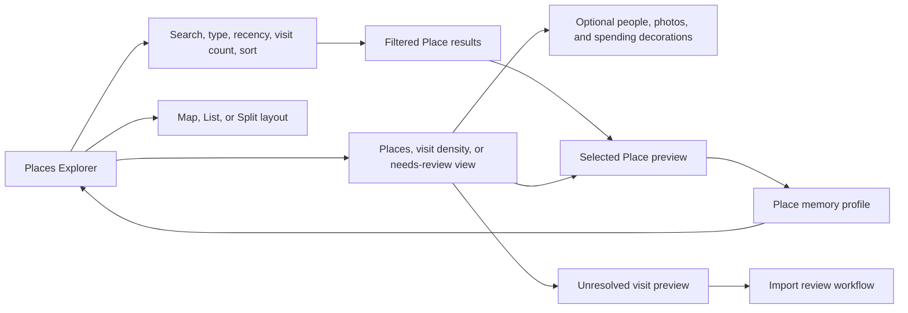

# Places Architecture Map

Places is the standalone LifeOS app for the Place primitive. It lives in `apps/places`, uses the shared database in `packages/db`, and does not live inside the Persons app.

## Flow

## Rules

- Place stats are derived, never stored.
- `stats.totalSpend` comes from `Interaction.amount` on Events at each Place.
- Apple MapKit JS clusters nearby Places and unresolved observations as the
  camera moves; individual LifeOS markers retain their semantic colors and
  derived enrichment badges.
- Places uses the same Google OAuth env vars as Persons and Stuff.
- All reads and writes carry `workspaceId`.
- Google Maps imports create `ImportJob` records, auto-create high-confidence Place + Event records, and stage ambiguous visits in `ImportStagedVisit`.
- Import confidence is conservative: 70%+ can become graph data automatically, 30%-69% waits for review, and lower-confidence noise is discarded.
- Device Timeline exports may only contain Google place IDs. The importer does not call Google Places API by default; unnamed visits are staged for human review instead of creating noisy places.
- Newer flat Google Timeline exports are supported as `timeline_records`. Preview reads only `visit` records, ignores `activity`, `timelinePath`, and `timelineMemory`, and shows estimated auto-create/stage/skip counts before anything is written.
- Unnamed visits are staged even when they have coordinates. Auto-create is reserved for high-confidence visits with a usable name such as Home, Work, Searched Address, or future place-enrichment labels.
- The map has three mutually exclusive base views: trusted Places, visit density,
  and unresolved observations. People, photos, and spending are optional
  decorations on trusted Places and are shown only when backing data exists.
- Claude location enrichment runs asynchronously after imports and through `POST /api/enrich`. It writes only to `ImportStagedVisit.aiEnrichment` and uses conservative batch processing so import uploads are not blocked.

## Explorer product flow

The `/places` experience is organized around trusted exploration and unresolved
review rather than five independent map layers.

Explorer state is serialized through `apps/places/components/map/explorer-state.ts`.
The current URL contract is:

| Parameter | Meaning | Default |
| --- | --- | --- |
| `mode` | `explore` or `review` | `explore` |
| `view` | `split`, `map`, or `list` | `split` |
| `q` | Name/address search | empty |
| `sort` | `recent`, `visits`, or `name` | `recent` |
| `type` | Exact Place type | `all` |
| `recency` | `any`, `30d`, `1y`, or `older` | `any` |
| `first` | First-visit range: `any`, `30d`, `1y`, or `older` | `any` |
| `minVisits` | Minimum derived visit count | `0` |
| `bounds` | Explicit west, south, east, north map-area filter | none |
| `place` | Selected Place ID | none |
| `mapView` | `places`, `density`, or `unresolved` | `places` |
| `show` | Optional `people`, `photos`, and `spending` decorations | none |
| `legend` | `collapsed` when map controls are minimized | expanded |
| `lat`, `lng`, `z` | Debounced map camera center and zoom | fitted camera |

Map views are mutually exclusive base visualizations. Enrichments decorate
trusted Place markers and cannot hide the base map. Controls with no backing
data are omitted. Cluster clicks only zoom; Place marker and result-row clicks
select. When opening a Place profile, the Explorer query is carried in `from`
so the back link restores the result context.

Map movement does not silently change result membership. “Search this area”
captures the current viewport as the `bounds` filter, and the removable Map area
chip clears it. Selected Places open in a map-overlay drawer on desktop and the
same surface becomes a bottom sheet on small screens. MapKit JS owns native
pointer, touch, and keyboard map interaction.

The Place profile is visit-led: it uses a compact identity/location header and
groups the memory thread by month. Empty enrichments remain secondary, and all
summary language is deterministic.

The profile derives visit cadence, reliable duration, and gaps from stored Event
timestamps. Each visit embeds its connected people, groups, photo identities,
spending, and visit-specific Place Note, with Events and Persons linked to their
owning LifeOS apps. `PlaceNote.eventId` distinguishes a general Place memory
from a visit memory. `Place.meaning` is the explicit user-authored “Why this
place matters” field and is never generated. Its update is workspace-scoped,
length-validated, and audited through `PATCH /api/places/[id]`.

When a profile is opened from Explorer, the serialized `from` query is reapplied
to the current Place collection and sort order. The profile then exposes
previous/next navigation plus its position in that exact result set. Note and
meaning drafts warn before page unload; successful mutations update local
profile state from confirmed API results and retain drafts on failure.

Financial map-layer queries are workspace-scoped across accepted Interactions,
Places, and staged Era records.

The import-review route treats staged observations as provisional evidence. It
groups repeated nearby observations, ranks nearby trusted Places, and requires
an explicit choice to merge into an existing Place or create a named Place.
Merging records the exact `resolvedPlaceId` and `resolvedEventId`, reuses an
existing visit Event when one already matches, and preserves Google Maps source
metadata on new Events. Rejected observations remain available in a separate
queue and can be restored to pending review; merge, accept, reject, and restore
actions are audited.

Review progress is calculated from all staged statuses for the import job and
travels with every paginated queue response, so pending, accepted, dismissed,
and total counts update after confirmed actions without guessing.

## Renderer and performance boundary

The map uses Apple MapKit JS 6 through Apple's `@apple/mapkit-loader`, loading
only the `full-map` library. MapKit owns basemap tiles, attribution, camera
gestures, controls, label collision, and clustering. LifeOS owns the
renderer-neutral `lat`/`lng`/`z` URL contract, explicit map-area bounds,
selection, Place/review annotations, and Still-styled enrichment badges. The
conversion between MapKit coordinate regions and the LifeOS camera contract is
isolated in `components/map/apple-map-camera.ts`.

The server reads `APPLE_MAPS_TOKEN` and passes it only to the Places client that
initializes MapKit. The token is necessarily visible to MapKit in the browser
and therefore must be restricted to the production Places domain (and any
explicit local-review domains) in the Apple Developer portal. Missing or
rejected tokens produce an actionable map state rather than silently falling
back to a second tile provider.

The initial map payload is summary-only. People enrichment contains a per-Place
Interaction count, and finance contains transaction count plus aggregate amount.
Individual people, Interaction summaries, merchants, and transaction dates are
loaded only through the Place profile rather than serialized into every map
visit. The historical deterministic 2,000-Place custom-renderer benchmark
remains in `apps/places/scripts/benchmark-map.ts` for regression context; it is
not a benchmark of MapKit's remotely loaded renderer.

Map color is semantic and centralized in Places CSS variables. Cognac and warm
food tones identify hospitality; green identifies retail/nature and spending;
blue identifies home/travel; violet identifies nightlife/photos; and the
success/warning/error ramp communicates enrichment confidence. Selected state
is always reinforced by outline, size, and label rather than color alone.
