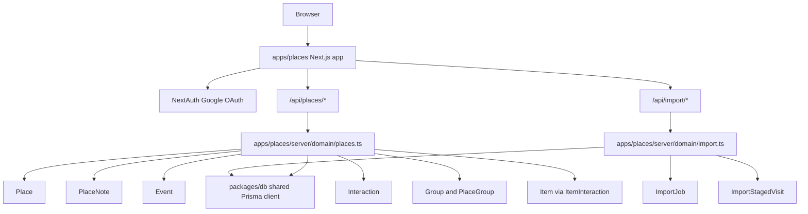

# Places Architecture Map

Places is the standalone Life OS app for the Place primitive. It lives in `apps/places`, uses the shared database in `packages/db`, and does not live inside the Persons app.

## Flow

## Rules

- Place stats are derived, never stored.
- `stats.totalSpend` comes from `Interaction.amount` on Events at each Place.
- Low map zoom rolls up affiliated Groups, mid zoom clusters nearby Places, and max zoom resolves individual Place pins.
- Places uses the same Google OAuth env vars as Persons and Stuff.
- All reads and writes carry `workspaceId`.
- Google Maps imports create `ImportJob` records, auto-create high-confidence Place + Event records, and stage ambiguous visits in `ImportStagedVisit`.
- Import confidence is conservative: 70%+ can become graph data automatically, 30%-69% waits for review, and lower-confidence noise is discarded.
- Device Timeline exports may only contain Google place IDs. The importer does not call Google Places API by default; unnamed visits are staged for human review instead of creating noisy places.
