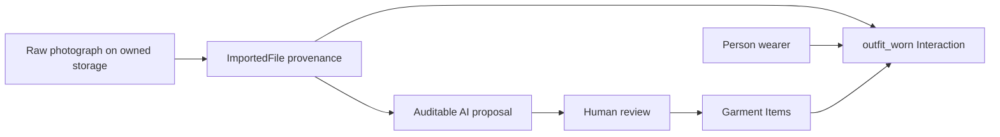

# Wardrobe in LifeOS

Wardrobe is a lens inside the Stuff app. It does not introduce a new LifeOS
primitive and it was designed from product behavior rather than copied source,
schema, wording, or visual design from another application.

## The plain-English model

- A garment is an **Item**.
- Wearing clothes is a time-bounded **Interaction** with type `outfit_worn`.
- The wearer is a **Person** participant with role `wearer`.
- Every garment in that outfit is an **Item** participant with role `worn`.
- A location can join as a **Place** participant.
- The photograph is raw evidence archived outside the graph. Its
  `ImportedFile` record supplies provenance to the Interaction and representative
  imagery to reviewed garment Items.
- Wear count, last worn, and cost per wear are derived from `ItemInteraction`
  history. They are not stored aggregates.



## Local media storage

The file bytes do not live in the database or the Git repository. The default
directory is:

```text
~/Library/Application Support/LifeOS/media/
```

Set `LIFE_OS_MEDIA_DIR` to override it. `ImportedFile` stores a provider,
storage key, path, MIME type, checksum, byte size, and capture time. This makes
the graph storage-neutral: a future private object-storage adapter can retain
the same record contract.

The media route checks workspace access before reading bytes. Current local
storage is suitable for Mac-hosted LifeOS. A cloud deployment needs durable
private object storage because a function filesystem is ephemeral.

## Garment analysis

Garment analysis is optional. Manual wardrobe use and wear logging do not
depend on AI.

The first provider is Vercel AI Gateway using a workspace-supplied key and a
configurable vision-capable model. The key is encrypted at rest using the
existing `ENCRYPTION_KEY` envelope encryption. The browser can replace a key
but cannot read it back.

Every request creates an `AiAnalysisRun` with:

- provider and model;
- source photograph;
- prompt version;
- status and error;
- raw structured proposal;
- input/output token usage when returned by the provider;
- provider-reported estimated cost when available.

AI output is only a proposal. A person can edit or remove every detected
garment before Item creation. Accepted garment details are stored in the Item's
user-correctable `attributes` JSON; the raw analysis remains auditable.

## Routes

| Route | Purpose |
| --- | --- |
| `POST /api/wardrobe/media` | Validate and archive one photograph |
| `GET /api/wardrobe/media/[id]` | Serve authorized private media |
| `GET/PUT /api/wardrobe/settings` | Inspect or replace the encrypted Gateway connection |
| `POST /api/wardrobe/analyze` | Produce an auditable garment proposal |
| `POST /api/wardrobe/garments` | Create Items from human-reviewed proposals |
| `POST /api/wardrobe/wears` | Record the time-based wearing Interaction |

## Schema support

Migration `20260724010000_add_wardrobe_support` adds:

- storage-neutral metadata to `ImportedFile`;
- `Item.primaryImageFileId` and flexible `Item.attributes`;
- `AiProviderCredential`;
- `AiAnalysisRun`.

These are support records around existing primitives. They do not change the
eight-primitive ontology.

For the hosted database, apply the committed migration only after confirming
the target:

```bash
DATABASE_URL=<production> npm run migrate:deploy -w @life-os/db
```

## Deliberately deferred

The first vertical slice does not yet include outfit recommendations, weather,
laundry state, background removal, family wardrobe permissions, scheduled
suggestions, preference learning, or pairing analytics. Those should be built
from actual Items, States, Plans, Places, Events, and Interactions after this
capture-and-wear loop has real usage.
